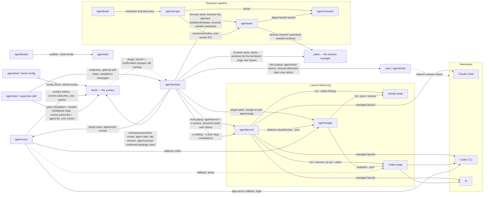
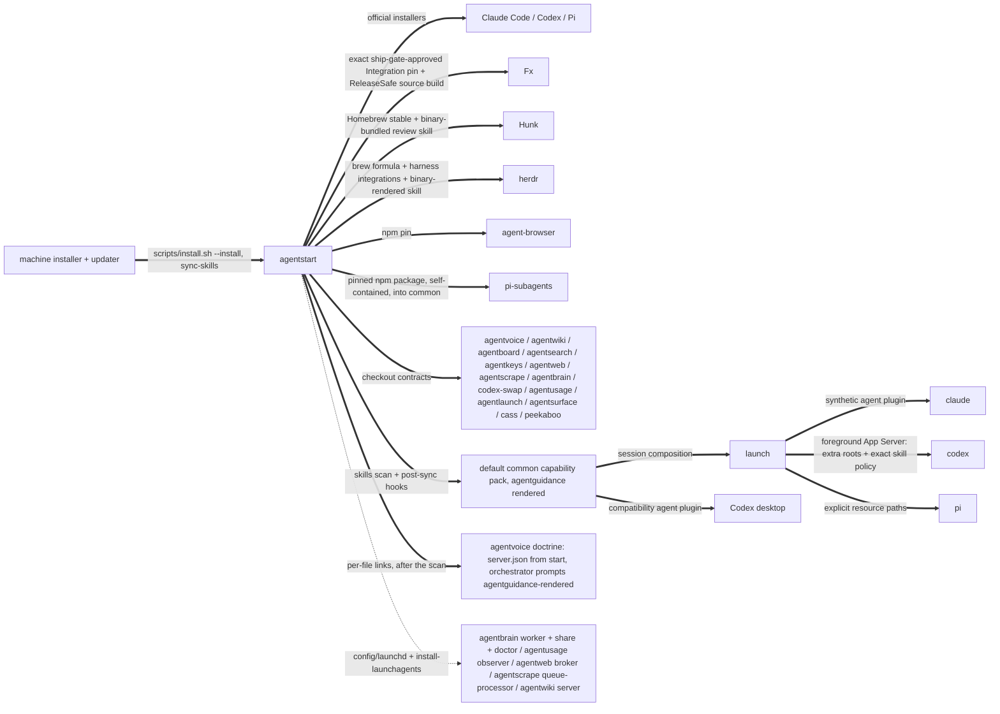
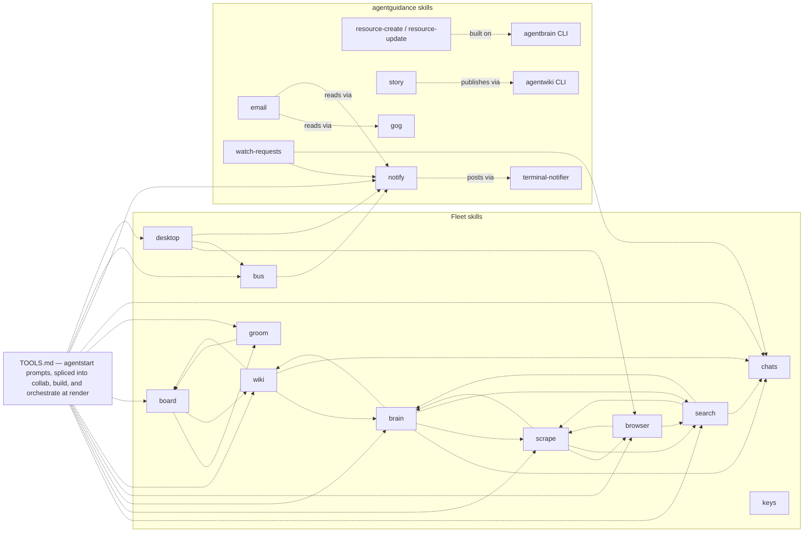

# The fleet map

Every known dependency between the agent apps in `~/code`, with evidence.
Four kinds of edge:

- **calls** (solid): a runtime subprocess invocation of another tool's CLI.
  Breaking the callee's flags or output breaks the caller.
- **routes** (dashed): a skill deliberately handing work to another skill.
  Breaking the target skill strands the routing.
- **serves** (dotted): a launchd service running fleet code, or a tool
  reading another's data on disk. Every fleet service is agentstart's; the
  machine's own reverse-DNS services are outside the fleet.
- **pins**: a binary installed at an exact version because a consumer locks
  or resolves it by contract.

## Runtime call graph

## Install and service layer

## Skill routing

An edge `X -.-> Y` means X's runbook names the `Y` skill and routes work to
it. Extracted from the SKILL.md files themselves.

The TOOLS.md node is the widest fan-out in the fleet and this repository is
its origin: `agentguidance/scripts/render` splices
`prompts/agentguidance/TOOLS.md`
into the collab, build, and orchestrate skills at their
`<!-- extension-prompt: TOOLS.md -->`
markers, so those skills route to all advertised tools without
their templates naming any of them. That is why the tool-advertisement
policy (the `tool-advertisement-policy` wiki page) governs a real graph
edge, not just prose.

`keys` references no other skill and none reference it — the standalone
shape behind the decision not to advertise it in TOOLS.md. `email` is
unadvertised on the same policy but is not standalone: it routes to
`notify`, so mail work that stalls still reaches the human.

A trap this section has already caught twice: a project's *own* `search`
subcommand (agentboard's and agentwiki's) reads exactly like a reference to
the `search` skill in a bare name-grep. Verify a routing edge from the
sentence around the match, never from the name alone.

## Edges with evidence

### calls

| Caller | Callee | What | Evidence |
| --- | --- | --- | --- |
| agentstart | agentusage | `install-agent-clis` invokes the checkout's `scripts/install.sh --install`, which installs the claude-swap provider before installing the observer. It no longer writes a `codex-swap` shim, and no longer maintains the fork — both have one owner now | `agentstart/scripts/install-agent-clis`; `agentusage/scripts/install-providers.sh` |
| agentusage | cswax | `scripts/install-providers.sh` invokes `~/code/cswax/scripts/install.sh --install --published` and does nothing else about the claude-swap fork. It previously rebased, gated, and force-pushed `integration` on every unattended converge; that moved to the workshop on 2026-08-25 | `agentusage/scripts/install-providers.sh`; `cswax/MAINTAIN.md` (Consumer); asserted by `cswax/tests/validate.sh` |
| cswax | claude-swap | binds `~/src/claude-swap` to a published `fork/integration` commit and installs it with `uv tool install --force`, refusing a foreign fork remote, a dirty tree, or an unpublished commit, and reporting when integration trails upstream. `/maintain` separately composes the carry heads, gates, and publishes | `cswax/scripts/install.sh`; `cswax/MAINTAIN.md`; `cswax/scripts/reconcile-branches.sh` |
| agentstart | codex-swap | `install-agent-clis` invokes `scripts/install.sh --install`, which writes the `codex-swap` command as a source shim into the checkout and installs the exact stock codex-multi-auth npm pin | `agentstart/scripts/install-agent-clis`; `codex-swap/scripts/install.sh` |
| agentstart | agentlaunch | `install-agent-clis` invokes `scripts/install.sh --install` after `agentusage`; `scripts/install-agentlaunch-shims` is the external shim contract for bare `claude`/`codex`/`pi` | `agentstart/scripts/install-agent-clis`; `agentstart/scripts/install-agentlaunch-shims` |
| agentstart | agentlaunch / Codex desktop | builds the default `common` capability pack, renders the session-only Claude `agent` plugin input and Codex desktop compatibility plugin, and leaves portable skill manifests bare. AgentLaunch composes per-session projections for all three harnesses and enumerates the compatibility copy's qualified skill names for managed-session suppression; the full installer removes only AgentStart-managed entries from retired compatibility roots, while the six-hour sync remains unattended-safe | `agentstart/scripts/sync-skills`; `agentstart/scripts/render-capabilities`; `agentstart/config/capabilities/common/*`; `agentstart/docs/adr/0002-compose-capabilities-without-moving-native-stores.md`; `agentlaunch/src/capabilities.ts` |
| agentlaunch | Claude Code / Codex / Pi | resolves `common` plus repeatable session packs, rejects resource conflicts, and content-addresses immutable projections. Claude receives a synthetic plugin named `agent`; Codex is launched as a remote TUI against a caller-owned foreground App Server after `skills/extraRoots/set` plus session-flag `skills.config` that name-disables every compatibility `$agent:<skill>` alias and path-enables the exact selected bare manifests (with a client-only no-auth provider preventing false onboarding); every `-c` it emits follows the subcommand, because codex-swap appends its own after them and a subcommand's flags discard the global ones; Pi receives explicit skill, extension, and prompt-template paths with ambient discovery disabled. Native stores remain in place, and a receipt keyed by native session id restores non-default packs on resume | `agentlaunch/src/capabilities.ts`; `agentlaunch/src/codex-app-server.ts`; `agentlaunch/src/launch.ts`; `agentlaunch/docs/adr/0030-compose-capabilities-around-native-stores.md` |
| agentvoice | agentstart / codex | registers `packs/common/skills` through `skills/extraRoots/set` after every attachment and before thread start/resume, and enumerates the compatibility projection's `agent:<skill>` names into a `skills.config` carried by every thread's own params — orchestrator and worker, start and resume. Its resident spawn carries no skill policy: a session flag cannot disable a plugin, which Codex resolves only from persistent layers. It stores no skill copy and keeps the shared native Codex rollout/session store intact across resident and account rotation | `agentvoice/src/capabilities.ts`; `agentvoice/src/core/params.ts`; `agentvoice/src/resident/contract.ts`; `agentvoice/src/core/runtime.ts`; `agentvoice/docs/adr/0006-compose-agentstart-common-before-opening-threads.md` |
| agentstart | fxnk | invokes `~/code/fxnk/scripts/install.sh --install --sha <pin>` as the required Fx harness installation contract. The tracked Fx Integration consumer pin is an exact commit already approved by fxnk's Local development gate and ship gate; ordinary AgentStart convergence reuses it and never promotes a moving remote tip | `agentstart/scripts/install.sh`, asserted by `agentstart/tests/validate.sh`; `fxnk/scripts/install.sh`; `fxnk/MAINTAIN.md` (Consumer) |
| fxnk | Fx | binds `~/src/fx` to published `fork/integration`, builds ReleaseSafe, atomically installs `~/.local/bin/fx`, and disables the independent auto-upgrader. Its repo-local `/maintain` skill separately rebases, gates, and publishes integration | `fxnk/scripts/install.sh`; `fxnk/skills/maintain/SKILL.md`; receipt at `~/.local/state/fxnk/fx-built-commit` |
| agentstart | fmx | installs the fmx checkout editable — frozen `bun install` plus `bun link`, so `~/.bun/bin/fmx` runs `~/code/fmx/src/index.ts` live — then runs fmx's `scripts/install-companion.sh`, which builds the Companion `companion.json` pins from `~/src/zmx` into `~/.local/bin/fmx-zmx` (a release ships it beside `fmx`; an editable fmx finds it on PATH), and links the tracked operator config into `~/.config/fmx/config.toml`; fmx's key schema stays a strict subset of Herdr's and uses the same `ctrl+space` prefix | `agentstart/scripts/install.sh` (fmx block); `fmx/scripts/install-companion.sh`; `agentstart/config/fmx/config.toml`; `agentstart/scripts/fmx-config`; asserted by `agentstart/tests/validate.sh` and `agentstart/tests/fmx-config.sh` |
| agentstart | Hunk | installs or upgrades the Homebrew formula, resolves the version-matched `hunk-review` skill through `hunk skill path hunk-review`, and copies that bundled skill into the common capability pack. It deliberately never installs the skill from GitHub head, which could teach a newer session API than the local binary accepts | `agentstart/scripts/install.sh` (`install_hunk_skill`), asserted by `agentstart/tests/validate.sh`; `hunk/src/core/run/paths.ts` (`resolveBundledSkillPath`) |
| agentstart | pi-subagents | installs the exact npm pin `pi-subagents@0.55.0` self-contained — extracted with its runtime dependencies inside the package directory — because Pi ships no subagents and points at third-party packages instead. The renderer carries that directory into the common capability pack, where AgentLaunch names it with `--extension`; Pi reads the `pi` manifest inside it to register the extension, its skills, and its workflow prompt templates from the one path. Not `pi install`: a settings-registered package is exactly what a managed launch suppresses | `agentstart/scripts/install-pi-subagents`; `agentstart/scripts/render-capabilities`, asserted by `agentstart/tests/validate.sh` |
| agentsurface plugin | agentusage | the shared Herdr plugin's `usage` pane entrypoint runs `escape-to-quit agentusage` in a titled 80% popup. AgentStart's `prefix+u` binding opens the entrypoint instead of duplicating an untitled generic popup | `agentsurface/plugin/herdr-plugin.toml`; `agentstart/config/herdr/config.toml` |
| agentsurface plugin | agentvoice | the same plugin's `voice` pane entrypoint runs `agentvoice remote` in a titled 80% popup, opened by AgentStart's `prefix+t` binding. Bare, with no escape-to-quit wrapper — that TUI spends esc on its own ctrl+k palette and quits on `q`. The remote attaches to the console already running on this machine over its own socket; the popup never starts a second audio session | `agentsurface/plugin/herdr-plugin.toml`; `agentstart/config/herdr/config.toml`; `agentvoice/src/console/remote-ui.ts` |
| agentlaunch | agentusage | `agentusage balance claude\|codex --json` chooses a balanced account. Real Codex/Pi launches add `--claim`; dry runs do not reserve capacity | `agentlaunch/src/balance.ts` (`balanceClaude`, `balanceCodexFamily`) |
| agentlaunch | claude-swap | wraps balanced Claude launches as `cswap run <slot> --share-history -- <native argv>` | `agentlaunch/src/balance.ts` (`balanceClaude`); `agentlaunch/docs/adr/0003-balanced-launches-compose-a-prefix.md` |
| agentlaunch | codex-swap | wraps Codex opens as `codex-swap run`, Codex resumes as `codex-swap resume <id>`, and Pi as `codex-swap pi run`, with `--claim <lease>` for real Codex/Pi launches and `--account <key>` for dry runs or explicit pins. For a managed Codex session it binds codex-swap's formal foreground App Server shape — `run <pin> -- -c ... app-server --listen <endpoint>` — so codex-swap owns the account/lease while AgentLaunch owns the listener, clients, and lifetime | `agentlaunch/src/balance.ts` (`balanceCodexFamily`, `composeCodexFamily`); `agentlaunch/src/launch.ts` (`codexAppServerCommand`); `codex-swap/README.md` (Balancing harness integration); `codex-swap/docs/handoff.md` §21.1 and §39 |
| agentlaunch | claude / codex / pi | launches the resolved native harness and sets `AGENTLAUNCH_LAUNCH=1`; AgentStart's bare-command shims route to `agentlaunch --x-harness <harness>` and use that sentinel to exec the real binary on descendant launches | `agentlaunch/src/launch.ts`; `agentstart/scripts/install-agentlaunch-shims`; `agentlaunch/docs/adr/0004-shims-route-bare-calls-the-sentinel-breaks-recursion.md` |
| codex-swap | codex-multi-auth | exact npm pin, currently 2.8.7. Codex-swap invokes the package-local forced-account wrapper for native Codex runs, resumes, and caller-owned foreground App Servers; its installer no longer binds the fleet to the patched fork | `codex-swap/package.json`; `codex-swap/src/ndy/bin-resolver.ts`; `codex-swap/scripts/install.sh` |
| agentusage | claude-swap | `cswap list --json` observes Claude accounts; `cswap recover <slot> --json` repairs due expired tokens; its installer converges the public fork's `main` | `agentusage/src/claude/observe.ts:235`; `src/daemon.ts:78`; `scripts/install-providers.sh` |
| agentusage | codex-swap | `codex-swap snapshot --json` observes codex accounts; paced polling | `agentusage/src/codex/observe.ts:221`, `daemon.ts:19` |
| agentvoice | codex | runs the resident `codex app-server` under launchd via a rendered wrapper, and `codex login --device-auth` for profile onboarding | `agentvoice/src/resident/contract.ts` (`residentArgv`), `src/resident/install.ts` (`renderWrapper`), `src/main.ts` (`accounts add`) |
| agentvoice | agentusage → codex-swap | `agentusage balance codex`, falling back to `codex-swap select`, consulted by the resident wrapper at every spawn (`pick-home`) and by the console's rotation check | `agentvoice/src/core/accounts.ts` (`selectAccount`), `src/resident/install.ts` (`runPickHome`), `src/core/runtime.ts` (`maybeRotate`) |
| agentvoice | herdr | unix-socket IPC, not a spawn: with `surface.events` on, the console holds an `events.subscribe` NDJSON stream on herdr's socket and reconciles via one-shot `agent.list` calls; pane lifecycle events for token-tagged placed workers become `<surface_report>` turns at the orchestrator | `agentvoice/src/core/surface.ts` (`HerdrSurface`), `src/core/runtime.ts` (surface wiring); enabled by `agentstart/prompts/agentvoice/server.json` |
| agentstart `supervise` skill | herdr, agentsurface | its long-lived watcher subscribes to pane and workspace lifecycle events over Herdr's Unix-socket NDJSON API and reconciles via `agent.list`; candidate readiness, the optional Codex self-wake, and pushed confirmations travel through `agentsurface message`. The guarded integrator mutates only the owning repository's local `main` and `origin/main`. After agent exit and `workspace.closed` correlate, the guarded reaper removes only the exact clean registered worktree, preserves its branch, and appends harness/session/worktree receipts under AgentStart's local state | `agentstart/skills/supervise/SKILL.md`; `agentstart/skills/supervise/scripts/watch.ts`; `agentstart/skills/supervise/scripts/integrate.ts`; `agentstart/skills/supervise/scripts/reap.ts` |
| agentstart | herdr | `scripts/update-herdr` (the one update path: fast-forward the clean `~/src/herdr` checkout at upstream master, build with the pinned `zig@0.15`, install to `~/.local/bin/herdr`, notify instead of forcing a blocked checkout), `herdr integration install claude\|codex\|pi` every run, `herdr plugin link` of agentsurface's launcher-pane and tab-naming plugin directory (registration by checkout path, so relinking converges), and the surface skill rendered from `herdr --skill` into the common capability pack — the skill converges with the installed build. The Herdr-generated, ownership-marked Pi extension is also moved from ambient discovery into common because managed Pi launches disable ambient extensions. The homebrew-core formula is retired and uninstalled by the full installer | `agentstart/scripts/update-herdr`; `agentstart/scripts/install.sh` (`install_herdr_integrations`, `install_herdr_skill`); `agentstart/scripts/render-capabilities`; asserted by `agentstart/tests/validate.sh` |
| agentstart (`herdr-config`) | herdr | validates every rendered candidate through `HERDR_CONFIG_PATH=<temp> herdr config check`, atomically replaces the managed live config, then calls `herdr server reload-config`; a missing server is nonfatal because the next start reads the validated file | `agentstart/scripts/herdr-config` (`render_candidate`) |
| agentbrain | agentscrape | evidence pipeline in four argv shapes — `fetch-markdown --markdown`, `fetch-markdown --envelope --allow-private-network --max-content-bytes`, `discover-feed`, `fetch-links --preset x-timeline --limit --max-scrolls` — plus a doctor check; a flag change breaks each shape separately | `agentbrain/src/agentscrape.ts:642,1298-1306,2038,2121-2129`, `src/jobs.ts:736` |
| agentscrape | agentweb | unix-socket IPC, not a spawn: before navigating, asks the daemon `POST /v1/sessions/resolve` whether the origin has a stored signed-in session, via `AGENTSCRAPE_CONDUIT_SOCKET`/`_TOKEN_FILE`; degrades silently to unauthenticated fetching by contract, so it never surfaces in an error path | `agentscrape/src/conduit.ts:10-21,107-110`; served by `agentweb/src/ipc.ts:442-453` |
| agentscrape | agent-browser | resolves `~/.local/bin/agent-browser` first, then PATH | `agentscrape/src/browser.ts:386-391` |
| agentweb | agent-browser | daemon-only launch of the configured absolute path (default `~/Library/pnpm/bin/agent-browser`, never resolved through PATH), refused unless SHA-256 digest and version lock verify | `agentweb/src/config-schema.ts:51,83`, `src/paths.ts:268` |
| agentboard | agentwiki | `agentwiki publish <file> --name agentboard --kind render --json` | `agentboard/src/cli.ts:834-843` |
| agentsurface | agentlaunch | the plugin's `launch` pane runs `agentsurface host -- agentlaunch --x-surface`: the host spawns agentlaunch's interactive form on the popup terminal in the focused pane's cwd with stdout piped — the form renders on stderr and writes session directives to stdout, the whole interface, per the `surface-handoff-protocol` wiki contract and `agentsurface/directive.schema.json`. Realizing a directive rides agentlaunch again through the shim herdr types: the directive's `--x-level` args pass through untouched, and the executor appends `--x-prompt-file <spool path>` for the intent (agentlaunch ADR 0029), because herdr refuses control characters in a shell-typed argument. Separately, `agentlaunch x-catalog --x-json` before slug inference reads each harness's `metadata_level`, and `conversation slug` runs `agentlaunch --x-harness <h> --x-level <metadata_level>` with native non-interactive tokens in the fixed `/tmp/agentsurface/inference` cwd — agentlaunch by name, not the bare shim, because a session's `AGENTLAUNCH_LAUNCH` sentinel would exec the native binary and drop the level | `agentsurface/plugin/herdr-plugin.toml`; `agentsurface/src/host.ts` (`runHost`); `agentsurface/src/directive.ts` (`executeDirective`, `writeIntentFile`); `agentlaunch/src/surface/directive.ts`; `agentsurface/src/catalog.ts` (`loadLaunchCatalog`); `agentsurface/src/conversation/infer.ts` (`composeInference`) |
| agentsurface | herdr | drives the socket API through the CLI (`HERDR_BIN_PATH`, then PATH), split across the host (`workspace list` probe, `pane get` for the opened-over cwd) and the detached `execute-directive` executor it spawns per stdout directive line so the popup closes with the hosted tool: `pane list`/`workspace list` to find a workspace already hosting the project, then `tab create` into it or `workspace create`/`worktree create` (each `--focus`/`--no-focus` by the directive, plus `workspace focus` for a cross-workspace jump), `agent list`, `agent start <opaque-a-token> --kind <harness> --pane <root-pane> -- --x-level <model>:<effort> [--x-prompt-file <state intents/ spool file>]` with the pane-busy ready retry and an `agent_name_taken` re-derive, and `notification show` for failures with no terminal. The intent travels as a spool-file reference, never literal text — herdr types the command into the pane's shell and rejects control characters (`invalid_agent_argument`), so a multi-line intent can only cross as a path; the executor prunes the spool by age. The bare harness command herdr runs is agentstart's shim, so the shim → agentlaunch edge carries balancing, yolo, and the prompt-file expansion; `agent_not_ready` (blocked on a startup dialog) is a soft outcome because the expanded intent rides the native argv and the harness submits it once the dialog clears. The plugin hook uses `pane get` + `workspace get`, plus `worktree list` for the checkout's branch, then `pane report-metadata` to publish the Agent sidebar's contiguous `$project` label on every detection; afterward it polls `pane get` for `agent_session`/`tab_id` and runs `tab rename <tab_id> <slug>`. The message bus (`agentsurface agents` / `message`) adds `agent list` + `tab list` (agents named by their tabs' labels), `pane get` for the sender's own identity from `HERDR_PANE_ID`, and `agent prompt <pane> <prefixed text>` — herdr delivering an agent-to-agent message as typed input (paste + Enter), so a working target's harness queues it and a blocked target rejects it. The generic `agentsurface confirm` boundary adds only exact argv execution after an explicit terminal decision; its three plugin pane entrypoints capture Herdr context, and the internal `close-active` bridge maps only `pane`, `tab`, or `workspace` to the context's id before calling the corresponding public `close` command, leaving every topology rule in Herdr | `agentsurface/src/herdr.ts`, `agentsurface/src/host.ts`, `agentsurface/src/directive.ts`, `agentsurface/src/tab-namer.ts`, `agentsurface/src/bus.ts`, `agentsurface/src/confirm.ts`, `agentsurface/src/close.ts`, `agentsurface/plugin/herdr-plugin.toml`; `agentstart/config/herdr/config.toml` |

### serves / data

| From | To | What | Evidence |
| --- | --- | --- | --- |
| agentstart | agentbrain, agentscrape, agentusage, agentweb, agentwiki | installs their commands too, and owns these fleet launch agents outright: agentbrain worker/share/doctor, agentusage observer, agentweb broker, agentscrape queue processor, and agentwiki server. Labels name noun roles while the manifest records resident, periodic, or queue-triggered lifecycle; every plist enters through the tool's one public binary. Templates, manifest, rendering, label replacement, and load live here so a service never has two owners racing to render it | `agentstart/config/launchd/*.plist`, `agentstart/scripts/install-launchagents`, asserted by `agentstart/tests/validate.sh` |
| machine installer + updater | agentstart | the only inbound edges from outside the fleet: the installer calls `scripts/install.sh --install` and nothing else about the fleet, because agentstart installs every fleet command and every fleet service, and discovers the tailnet bind address and agentweb's conduit paths itself; the machine's scheduled updater calls `scripts/sync-skills` and `scripts/update-herdr` by path — the convergence steps that stay safe with no terminal | `agentstart/scripts/install.sh` (the documented external interface), `agentstart/scripts/install-agent-clis`, `agentstart/scripts/install-launchagents`, `funk/libexec/funk-update` |
| agentstart | agentscrape ↔ agentweb conduit | brokers the session conduit, because it is the only thing that installs both: it renders agentweb's socket and token paths into the agentbrain.worker service, and the worker passes them uninterpreted into the agentscrape children it spawns | `agentstart/scripts/install-launchagents` (agentbrain.worker tokens), asserted by the machine's local-service verification |
| agentboard | agentwiki | stored data, distinct from the publish call: board items hold agentwiki slugs (`link <ref> --wiki <slug>` / `unlink`), so changing wiki's slug scheme breaks stored links even where publishing never runs | `agentboard/skills/board/SKILL.md:228-232`, reciprocated `agentwiki/skills/wiki/SKILL.md:133-134` |
| cass (agentchats) | Claude Code, Codex, Pi | builds and refreshes the search index over the local session stores; cass itself is upstream software — the official checksummed installer, gh-resolved — with only the `agentchats` state CLI linked editable from the checkout | `agentchats/scripts/install.sh:6,95,123-129,137` |
| agentsurface | agentweb | the plugin's `browser` pane (a split, so it has a rectangle to dock over) runs `agentsurface browser`, which polls `browser list --json --credential-file <operator-token>` (the route admits OPERATOR; the CLI's automatic pick for `browser list` is WORKER) and `attention list --json`, attends a queued item with `attention attend <id> --capability-out <state>/attention/human-<id>.capability`, releases with `attention release <id> --capability-file <that>`, and places the real Chrome window with `browser window dock <ref> --x --y --width --height --space <terminal's Space> [--focus]` / `browser window park <ref>`. `AGENTSURFACE_AGENTWEB` overrides the command for a checkout under test. Nothing typed into the docked window crosses either tool | `agentsurface/src/browser-pane.ts` (`Agentweb`, `BrowserPane`); served by `agentweb/src/ipc.ts` (`/v1/browsers/:ref/window*`), `agentweb/src/window-steward.ts` |
| agentsurface | yabai | the browser pane reads `yabai -m query --windows` for the outer terminal window's screen origin and Space, so the dock lands where the pane is and not wherever focus is; without an answer the terminal is taken to sit at the origin on an unknown Space | `agentsurface/src/browser-pane.ts` (`readGeometry`, `hostTerminalWindow`) |
| agentweb | yabai | the window steward parks and docks headed (E2) windows through `yabai -m query --windows/--spaces`, `window <id> --toggle float / --move abs / --resize abs / --space / --focus / --minimize`, `window --deminimize <id>`, at the configured absolute path (`window.yabaiBinary`, default `/opt/homebrew/bin/yabai`, never PATH); the browser is matched to its window by the private socket directory its stock daemon inherited, read from the process table (`ps -Eww`). `doctor` reports `window.manager: none` and every window route answers CONFIG_INVALID when yabai is absent | `agentweb/src/window-steward.ts` (`YabaiWindowManager`, `PsProcessInspector`, `WindowSteward.locate`), `agentweb/docs/adr/0004-parked-and-docked-windows.md` |
| agentsurface | agentchats | the plugin's `chats` pane runs `agentsurface host -- agentchats search`: the resume picker renders on stderr in the popup, live-queries cass (`search`/`sessions --json`), and writes one resume session directive to stdout per pick, per the `surface-handoff-protocol` contract. The directive carries `session_id`, the executor's dedupe key: a session already live on the surface is focused (workspace + tab), never resumed a second time. A pick that cannot resume faithfully exits nonzero with the reason, which the host holds on screen | `agentsurface/plugin/herdr-plugin.toml`; `agentchats/src/tui/app.ts` (`runSearch`); `agentchats/src/tui/directive.ts`; `agentsurface/src/directive.ts` (`startSession`, the `session_id` branch) |
| agentchats | agentsurface | the picker enriches its rows through `agentsurface conversation describe` — the read-only naming surface: JSON lines of {harness, path} in, {path, slug, excerpt} lines out, one subprocess per listing refresh. Slugs come from agentsurface's slug store (written whenever `conversation slug` pays for inference — the tab namer's path); excerpts are first-prompt extraction from the transcript head. A machine without agentsurface degrades to cass's raw titles | `agentchats/src/tui/describe.ts`; `agentsurface/src/conversation/describe.ts`; `agentsurface/src/conversation/store.ts` |
| agentchats | agentlaunch | a resume directive's `agent.args` are `["--x-resume", <native-session-id>]` — agentlaunch's flag spelling of `x-resume`, added for exactly this path because herdr types only the bare kind command (the shim) plus arguments. The session-id derivation in the picker mirrors agentlaunch's store layouts | `agentchats/src/tui/directive.ts` (`buildResumeDirective`); `agentchats/src/tui/resume.ts` (`deriveSessionId`); `agentlaunch/src/main.ts` (the `--x-resume` reroute) |
| peekaboo (agentdesk) | the macOS GUI | sessions see and drive the Mac's screen and native apps through the `desktop` skill; peekaboo itself is upstream software installed from the official `steipete/tap` formula by agentdesk's contract, gated on the capability serving — TCC grants (Screen Recording, Accessibility — the human's act) verified and a `--no-remote` screen capture delivered. Its daemon is on-demand; no fleet service supervises it | `agentdesk/scripts/install.sh`; `agentdesk/skills/desktop/SKILL.md` |
| agentkeys | stowed machine configs | audits the interception chain across Karabiner/skhd/Ghostty/tmux/Neovim — files the machine layer stows | `agentkeys` skill description; the machine's stow packages |
| agentboard, agentchats | each other's CLIs | the shared "agent* state dump" bearings convention: one cross-tool contract for state dumps, with a common ~4-chars-per-token budget | `agentboard/src/help.ts:367`, `agentchats/bin/agentchats:13`, `agentboard/src/brief.ts:140` |
| agentstart statusline | claude-swap | the claude renderer names the balanced account by reading `CLAUDE_CONFIG_DIR`, whose basename claude-swap spells `<n>-<slugified-email>`; renaming that profile directory silently drops the account segment. No counterpart for codex or pi — codex-swap pins an account by swapping auth in place and exports nothing naming it | `agentstart/config/statusline/claude-statusline.sh` (balanced-account segment); `claude-swap/src/claude_swap/session.py:161-167` |
| agentguidance | agentvoice (via agentstart) | the voice orchestrator doctrine is rendered doctrine: `agentguidance/prompts/agentvoice/` templates splice the shared orchestrator fragments to `~/.agents/prompts/agentvoice/`, agentstart links the result into `~/.config/agentvoice` after sync-skills (keeping only `server.json` as its own source), and agentvoice discovers the files by name at console start | `agentguidance/scripts/render`; `agentstart/scripts/install.sh` (`link_agentvoice_config`); `agentvoice/src/core/config.ts` (`PROMPT_FILES`) |
| agentstart | herdr, agentsurface, agentusage, agentvoice | owns Herdr's live `config.toml` as a render of its tracked behavior config, which carries no palette: Herdr's `terminal` theme follows the terminal. The behavior opens AgentSurface's titled `launch` plugin pane on `prefix+l` from the active pane's cwd, the plugin's titled `usage` pane on `prefix+u`, and its titled `voice` pane on `prefix+v`; Funk retains only the machine-owned `agent-mem.sh` referenced by the config. It also replaces Herdr's immediate `prefix+x`, `prefix+shift+x`, and `prefix+shift+d` close actions with the AgentSurface plugin's named confirmation panes; Herdr captures the active topology ids in popup context when each entrypoint opens | `agentstart/config/herdr/config.toml`; `agentstart/scripts/herdr-config`; `agentsurface/plugin/herdr-plugin.toml`; `funk/herdr/.config/herdr/agent-mem.sh` |
| herdr | agentsurface, agentusage, agentvoice | the linked `agentsurface` plugin (registered by agentstart's installer via `herdr plugin link`, manifest in `agentsurface/plugin/`) exposes `agentsurface host -- agentlaunch --x-surface` as the titled 80% session-modal `launch` popup, `agentsurface host -- agentchats search` as the titled 80% `chats` resume-picker popup, `escape-to-quit agentusage` as the titled 80% `usage` popup, bare `agentvoice remote` as the titled 80% `voice` popup, and three compact `agentsurface confirm` panes for pane/tab/workspace closure. It runs `agentsurface name-tab` on every `pane.agent_detected` and `pane.agent_status_changed`. The launch (`prefix+l`) and chats (`prefix+h`) bindings pass the active pane's cwd to their popups; opening each close popup captures the active pane, tab, and workspace in `HERDR_PLUGIN_CONTEXT_JSON`, and session-modal input keeps the target stable while the dialog is open. The hook receives the event as `HERDR_PLUGIN_EVENT_JSON`, publishes the `$project` sidebar token on detection (root repository, branch badge, and checked-out branch, for a linked worktree and the repository's own checkout alike), keeps its state under `HERDR_PLUGIN_STATE_DIR`, and names the pane's tab after its conversation once per tab — each hook run one bounded attempt, re-armed by the next status transition when a stalled start (a trust dialog) outlives it | `agentsurface/plugin/herdr-plugin.toml`; `agentstart/config/herdr/config.toml`; `agentstart/scripts/install.sh` (`install_herdr_plugins`) |

### pins

| Binary | Version | Why | Evidence |
| --- | --- | --- | --- |
| agent-browser | 0.33.2 | one pin, two independent path contracts: Agentweb digest-locks the exact build and launches its configured absolute path (default `~/Library/pnpm/bin/agent-browser`, never PATH), while Agentscrape resolves the `~/.local/bin/agent-browser` link before PATH — relocating one path fixes only that consumer's half | `agentstart/scripts/install.sh` (`agent_browser_version`), `agentweb/src/config-schema.ts:51,83`, `agentweb/src/paths.ts:268`, `agentscrape/src/browser.ts:386` |
| @native-sdk/cli | 0.7 line | the native-sdk skill documents 0.7 and its agent helpers are version-matched | `agentstart/scripts/install.sh` (`native_sdk_version`) |
| zig | Brewfile-tracked, duplicated in the installer | AgentVoice's native duplex audio path and Native SDK packaging build against it | `agentstart/scripts/install.sh` |
| zig@0.15 | 0.15 line, keg-only | herdr's vendored libghostty-vt pins 0.15 and herdr's release CI builds with this same formula; the official 0.15 tarball cannot link against current macOS SDKs. update-herdr refuses with a notification when the vendored pin drifts off 0.15 | `agentstart/scripts/install.sh`, `agentstart/scripts/update-herdr` (drift gate) |
| Fx | `1b81973907d00c52db6f65da53403096df26dbb1` on published `fork/integration` | AgentStart tracks the exact Fx Integration consumer pin approved by fxnk's Local development gate and ship gate; fxnk builds only that SHA, binds the checkout, and disables the binary's independent auto-updater | `agentstart/scripts/install.sh` (`fx_integration_sha`); `fxnk/MAINTAIN.md` (Gate and Consumer); `fxnk/scripts/install.sh`; receipt at `~/.local/state/fxnk/fx-built-commit` |
| herdr | `~/src/herdr` at `origin/master` | a checkout binding, not a version pin: the operator runs the head because releases trail master by weeks. update-herdr only ever fast-forwards a clean checkout — a dirty tree or diverged master is reported by notification and left untouched | `agentstart/scripts/update-herdr`, receipt at `~/.local/state/agentstart/herdr-built-commit` |

The managed claude-swap fork rebases its **`integration` branch** onto upstream on every
install — every patch we carry, merged, and the only ref the installer builds
and binds — gated by that project's own CI steps and published with
`--force-with-lease` only after the gate passes. A failed rebase or gate keeps
the previously bound build bound, publishes nothing, and notifies. The fleet
repo owns its own hardened installer rather than sharing a common helper, which
would invert that ownership. A patch also offered upstream lives on its own
branch and is **not** moved by this — refreshing an open PR is a separate
operation against a different audience. Whether a fork is wired at all is a
declared constant in the owning installer, so retiring it is an edit and a
rerun; a binding hand-written into the installed shim is unwired by the next
install, which is how the codex-multi-auth one was lost once. The Fx and
zmx and claude-swap forks are owned by workshop repositories (`fxnk`, `zmax`,
`cswax`) instead of an installer: each workshop's `MAINTAIN.md` is that fork's
contract, the shared `maintain` skill (agentguidance) is the cycle, and the
workshop's consumer step binds the result — fxnk's installer, zmax's move of
fmx's Companion pin, cswax's `uv tool install`. The `fork-rebase-policy` wiki
page is the overview of the arrangement.

| Fork | Integration branch | Owner | Gate |
| --- | --- | --- | --- |
| `~/src/claude-swap` | `integration` | `cswax` via `/maintain` and `scripts/install.sh --install`, called by `agentusage/scripts/install-providers.sh` | all three of upstream's CI jobs (Ubuntu, macOS, macOS keychain contract), plus the fork's CI green on the exact candidate |
| `~/src/fx` | `integration` | `fxnk` via `/maintain` and `scripts/install.sh --install --sha` | fxnk's exact-SHA Local development gate and ship gate |
| `~/src/zmx` | `integration` | `zmax` via `/maintain` and `scripts/pin-companion.sh` (→ `fmx/companion.json`) | `zig fmt --check`, `zig build test`, bats, a `-Dcompanion` ReleaseFast build, fmx's suite against it |

Codex-swap no longer binds `~/src/codex-multi-auth`: it uses the exact stock
npm pin. Open upstream PRs #664 and #665 address helper cleanup for the retired
per-TUI app-server topology and are no longer needed by this fleet; AgentVoice's
independent app-server children do not use codex-swap's removed sidecars.

### routes (skill → skill)

| From | Routes to | Notable natures |
| --- | --- | --- |
| board | groom, wiki | bulk reshaping is groom's; renders publish through wiki (see the calls edge). Board's `search` is its own subcommand, not the search skill |
| groom | board | one item is board; several at once is groom |
| brain | chats, scrape, search, wiki | checked before any web search — search is paid per call; ingestion is scrape-fed. Brain also has an own-`search` subcommand; the skill edge is genuine independently (`agentbrain/skills/brain/SKILL.md:32,172-173,382,415`) |
| scrape | brain, browser, search | scrape wants a URL in hand; finding URLs is search; interaction is browser |
| search | brain, chats, scrape | check brain first — the answer is often already local |
| browser | scrape, search | fetching content is scrape; finding pages is search |
| desktop | browser, bus, notify | anything inside a web page is browser's; a peer agent's pane is messaged over bus, never clicked; an input takeover is announced through notify (`agentdesk/skills/desktop/SKILL.md`) |
| wiki | board, brain, chats | the durable home the others cite into. Wiki's `search` is its own subcommand, not the search skill |
| TOOLS.md (this repo) | search, scrape, brain, browser, desktop, terminal-control, wiki, board, groom, chats, notify, bus | spliced into collab, build, and orchestrate at render — the advertisement lines are the routing |
| bus | notify | a blocked bus target is waiting on the operator, so a message that matters escalates to a human notification instead of more retries (`agentsurface/skills/bus/SKILL.md`) |
| orchestrate (agentguidance) | collab, build, herdr | the wielder: collab's contract holds on the conversation thread, and execution leaves as standalone briefs run under build's contract by dispatched workers (`agentguidance/skills/orchestrate/SKILL.md`, `fragments/orchestrator-conduct.md`). Dispatch runs on two lanes: the native facility for work in the orchestrator's own service, and the surface — herdr — for the work itself; both orchestrator renditions bind herdr by name and load its skill for placement mechanics |
| resource-create / resource-update (agentguidance) | brain | resources are built from and refreshed against the agentbrain index |
| story (agentguidance) | wiki | publishes the finished narrative through agentwiki |
| watch-requests (agentguidance) | chats, notify | the watch diagnoses but never authors: `cass resume <source_path> --shell` names the session that opened the request, and notify carries the resume command and steering prompt to the human (`agentguidance/skills/watch-requests/SKILL.md`) |
| email (agentguidance) | notify | a lapsed credential or consent screen needs the human, who is not reading the transcript — the stall is announced, not waited in (`agentguidance/skills/email/SKILL.md`) |

## Checked and absent

Edges that were looked for and do not exist — recorded so the next audit
does not re-suspect them:

- agentbrain → agentsearch: no reference anywhere in `agentbrain/src`;
  ingestion is purely scrape-fed (checked 2026-08-09).
- agentvoice → agentboard / agentwiki: the orchestrator's app-server
  threads drive codex only; no board or wiki reference in `agentvoice/src`
  (checked 2026-08-09).

Last verified: 2026-08-09, twice — an initial first-hand sweep, then an
independent second sweep that removed two false routing edges (own-`search`
subcommands), added the conduit and TOOLS.md edges, and re-confirmed both
absences above. Updated 2026-08-12 for the de-Orca topology: AgentLaunch owns
bare harness launch balancing, AgentStart retires AgentBus launch agents and
adapters, and TOOLS.md no longer advertises the retired bus skill. Updated
again 2026-08-12 for the orchestrator doctrine unification: agentguidance
renders the voice orchestrator prompts from shared fragments, the new
orchestrate skill wields collab and build, and AgentStart links rendered
doctrine instead of owning it. Updated again 2026-08-12 for the fleet service
taxonomy: noun-role labels, explicit lifecycle metadata, and one public binary
per tool replace daemon/command-shaped labels and separate `*d` executables.
Updated 2026-08-15 for the surface abstraction: herdr (external,
homebrew-core) becomes the orchestrator doctrine's reference launch surface —
AgentStart renders its shipped skill from the binary, agentvoice subscribes
to its events for `<surface_report>` wakes, and the orchestrate/voice
doctrine binds it by name. The `land-vs-place` and new launch-surface wiki
pages carry the ruling. Updated 2026-08-16 for the first AgentSurface
integration: `agentsurface launch` composes herdr (workspace/worktree
create, agent start) with agentlaunch's new read-only `x-catalog`, and the
managed herdr config gains the `prefix+l` popup binding. Updated again
2026-08-16 for the second integration: `agentsurface conversation slug`
runs metadata completions through `agentlaunch --x-level <metadata_level>`
(the catalog's new per-harness cheap pair), the agentsurface herdr plugin
names tabs from `pane.agent_detected` hooks, agentstart links that plugin
and adopts the agentsurface checkout contract, and the retired-integration
cleanup stops treating the reborn `agentsurface` command link as retired.
Updated again 2026-08-16 for AgentStart's Herdr config ownership: AgentStart
replaces Funk as the live Herdr config owner, and its helper validates and
live-reloads the generated config. Updated again 2026-08-16 to make the
existing AgentSurface plugin own the launcher's title and popup geometry, with
the managed keybinding opening that pane entrypoint from the active pane's cwd.
Updated 2026-08-19: the theme manager is gone. Tinty, its Herdr templates, its
Homebrew tap and formula, and the generated Ghostty theme were all removed, and
`herdr-tinty` became `herdr-config` — a plain render of the tracked behavior
config. Ghostty runs its built-in default colors, Herdr's `terminal` theme
follows the terminal, and no layer names a color of its own.
Updated 2026-08-17 for the third AgentSurface integration, the message bus:
`agentsurface agents`/`message` speak herdr's `agent list`, `tab list`,
`pane get`, and `agent prompt`, so agents on the surface message each other
by tab-label names or session ids with herdr as the delivery path. The bus
gained its skill the same day: `bus` joins TOOLS.md's advertisements and
routes to `notify` for blocked-target escalation; `message --wait-unblocked`
retries a blocked delivery until its deadline.
Updated 2026-08-17 again for the desktop capability: peekaboo (upstream,
`steipete/tap`, repo openclaw/Peekaboo) joins through the new agentdesk
checkout — the agentchats pattern, a skill over third-party software —
installed by its own contract from AgentStart's installer beside the
agentchats block, with the `desktop` skill advertised in TOOLS.md and routing
to `browser`, `bus`, and `notify`. The `computer-use` name stays retired (an
Orca-era skill the full install still removes); the capability re-lands as
`desktop`.
Updated 2026-08-17 to make the AgentSurface plugin the shared home for fleet
TUIs bound to popups: its new `usage` pane runs `agentusage` through the
escape-to-close wrapper under the title `Agent Usage`, while
AgentStart's `prefix+u` binding opens that pane entrypoint.
Updated 2026-08-17 with the third popup-bound fleet TUI: the plugin's `voice`
pane runs `agentvoice remote` bare (esc belongs to that TUI's own palette)
under the title `Agent Voice`, opened by AgentStart's `prefix+t` binding — the
voice console's remote control, one chord from any pane.
Updated 2026-08-18 for the inverted launch integration: the one-screen
launch form moves into agentlaunch as `--x-surface`, taking the roots and
priming config, the drafts, and project-frequency ordering with it, and
agentsurface becomes the generic surface host — `agentsurface host --
<tool>` names a per-run sink in `AGENTSURFACE_DIRECTIVES`, tails it, and
realizes each session directive as a detached `execute-directive`. The
protocol (strict schema, hard version gate, `directive.schema.json`) is
owned by agentsurface and ruled by the new `surface-handoff-protocol` wiki
page; the plugin's `launch` pane now runs the host over agentlaunch's form,
and a future resume app plugs in the same way. Revised the same day: the
directive channel moved from a host-named sink file to the tool's own
stdout — the form renders on stderr, the host pipes and reads stdout, the
`AGENTSURFACE_DIRECTIVES` env var is gone — and the activator, after a
brief life as an `x-surface` subcommand, settled back to the `--x-surface`
flag: surface emission is a modality of agentlaunch's one job, not a
second command.
Updated 2026-08-21 for Hunk: AgentStart installs the Homebrew-stable review TUI
and copies its bundled `hunk-review` skill into the common capability pack from
`hunk skill path`, keeping the agent session commands matched to the installed
binary instead of independently tracking GitHub head.
Updated again 2026-08-21 for the managed Fx fork: PRs #242, #244, and #245
coexist on published `integration`; AgentStart rebases and gates that one ref,
builds the system binary from it, and disables Fx's separate dev-channel
auto-updater so the binding remains authoritative.
Updated 2026-08-22 for guarded Herdr topology closes: AgentSurface adds a
generic fail-closed terminal confirmation that executes exact argv only after
an explicit decision, and AgentStart replaces Herdr's immediate pane, tab, and
workspace close bindings with session-modal confirmations on the same keys.
Updated 2026-08-24 for capability-pack composition: AgentStart collects the
default `common` pack, AgentLaunch projects it and optional session packs into
all three harnesses without moving native histories, Codex standalone App
Servers register extra roots while suppressing the desktop compatibility
aliases by name, AgentVoice composes common on each attachment and carries the
same suppression in its thread params, and Pi's Herdr extension moves into the
explicit pack surface. Codex keeps the `-c` flags before a subcommand and the
ones after it in separate sets and a subcommand carrying its own discards the
global ones, so a caller that appends flags — codex-swap does — silently drops
a policy placed in front of the subcommand.
Updated 2026-08-25 for fxnk's exact-SHA installer contract: AgentStart now
tracks the ship-gate-approved Fx Integration consumer pin, passes it on every
convergence, and never mistakes the current remote tip for an approval. Also
2026-08-25: claude-swap's fork moved to the `cswax` workshop, so agentusage
consumes it and no unattended converge can rewrite or publish a fork.
