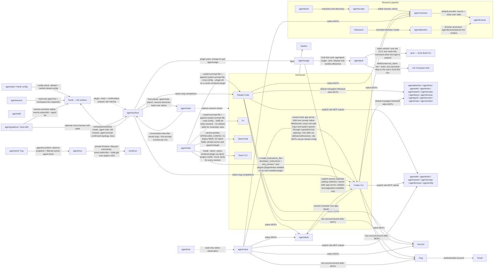
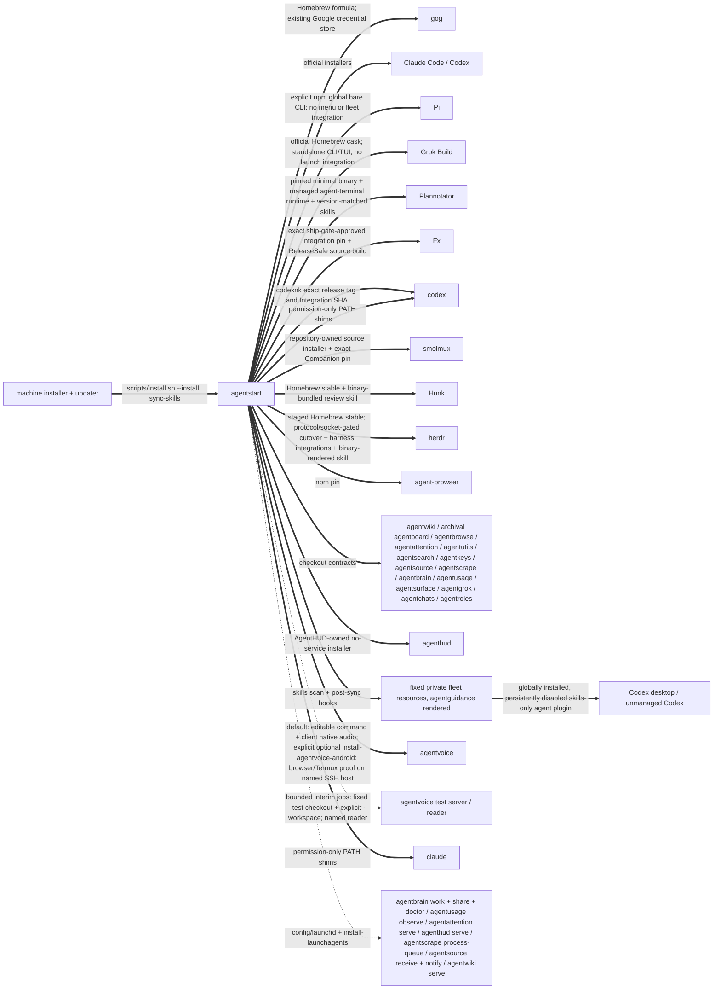
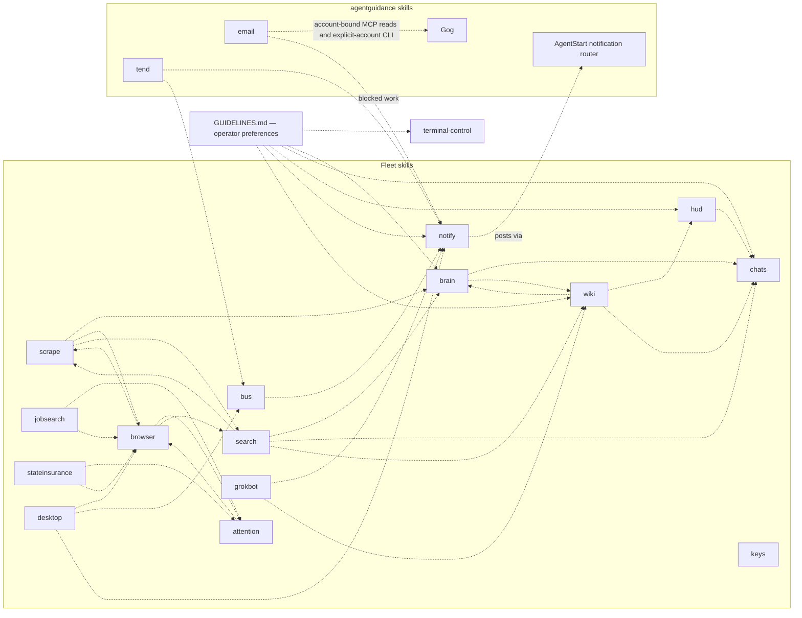

# The fleet map

Every known dependency between the agent apps in `~/code`, with evidence.
Four kinds of edge:

- **calls** (solid): a runtime request or subprocess invocation of another
  tool. Breaking the callee's request, flags, or output breaks the caller.
- **routes** (dashed): a skill deliberately handing work to another skill.
  Breaking the target skill strands the routing.
- **serves** (dotted): a launchd service running fleet code, a tool reading
  another's data on disk, or a tool loading another fleet project's supported
  library surface. AgentStart owns fleet service convergence except the
  declared owner contracts: AgentBrowse installs and recovers Hypeman, and
  AgentVoice owns its default-server LaunchAgent. AgentStart delegates to
  those installers and never renders a competing service; the separate HUD
  web view remains an AgentStart-owned fleet job. Machine services remain
  outside the fleet.
- **pins**: a binary installed at an exact version because a consumer locks
  or resolves it by contract.

## Runtime call graph

## Install and service layer

## Skill routing

An edge `X -.-> Y` means X's runbook names the `Y` skill and routes work to
it. Extracted from the SKILL.md files themselves.

Skill names and descriptions are the capability discovery surface. There is
no prompt-level tool catalog. `agentguidance/scripts/render` splices SYSTEM.md
and GUIDELINES.md into the linked implementation or maintenance references of
collab, build, and maintain; GUIDELINES preserves the
operator's research reuse, work tracking, notification, document-placement,
and managed-PTY preferences. The `tool-advertisement-policy` wiki page records
this separation of operating preferences from discovery.

`keys` references no other skill and none reference it. `email` routes to
`notify`, so mail work that stalls still reaches the human. Both are discovered
through their descriptions, like the other resource skills.

A trap this section has already caught twice: a project's *own* `search`
subcommand (agentboard's and agentwiki's) reads exactly like a reference to
the `search` skill in a bare name-grep. Verify a routing edge from the
sentence around the match, never from the name alone.

## Edges with evidence

### calls

| Caller | Callee | What | Evidence |
| --- | --- | --- | --- |
| agentstart | AgentVoice / Tailscale Serve | `agentvoice-network.ts --enable` explicitly provisions a dedicated tailnet-only WSS route; ordinary installation reconverges only already enabled settings through `agentvoice network status`, `network configure` and first-enable `service restart`. Uses Tailscale status/serve JSON, refuses Funnel and foreign handlers, verifies unrelated routes unchanged. Never grants credentials. | `agentstart/scripts/agentvoice-network.ts`; `agentstart/scripts/install.sh`; `agentstart/tests/agentvoice-network.test.ts`; `agentvoice/src/network/command.ts`; `agentvoice/docs/adr/0034-authenticated-client-network.md` |
| agentstart | agentvoice | Default convergence uses `install-agent-clis` to invoke the checkout-owned `scripts/install.sh --install --quit-menu`: prerequisite checks, clean-source/frozen dependency install, staged native audio build, ownership-checked atomic editable command link and deployed-SHA receipt. On macOS an outdated running owned menu app is asked to quit gracefully and is reopened only after a successful atomic update; current and stopped apps keep their presence unchanged, while refusals fail before replacement. A missing checkout skips; a present broken checkout fails. The same installer also owns and starts the `io.arthack.agentvoice.server` user LaunchAgent. A valid marked session restores its Codex child without media; an unmarked workspace waits for a frontend. `AGENTSTART_PRESERVE_AGENTVOICE_SERVICE=1` selects `--command-only` instead, skipping the menu and service for a live-call cutover. AgentStart must not also render/register this job. AgentStart links its tracked `config/agentvoice/server.json` before fleet installation through `scripts/agentvoice-config`; no native Codex configuration or account wrapper is installed. Separately, the operator-only `install-agentvoice-android --install` resolves the same fleet checkout and delegates exactly to its `scripts/install-android --install --host <host>` contract, defaulting to `smolbird`. That phone proof deployment is absent from `install.sh`, `install-agent-clis`, and `sync-skills`. | `agentstart/scripts/install-agent-clis`; `agentstart/docs/adr/0019-use-agentvoice-graceful-menu-convergence.md`; `agentstart/scripts/install-agentvoice-android`; `agentstart/tests/install-agentvoice-android.test.ts`; `agentvoice/scripts/install.sh`; `agentvoice/scripts/install-android`; `agentvoice/scripts/install.ts`; `agentvoice/scripts/build-native.ts`; `agentvoice/src/service.ts`; `agentvoice/docs/adr/0070-installer-owned-menu-presence.md`; `agentstart/scripts/agentvoice-config`; `agentstart/config/agentvoice/server.json`; `agentvoice/docs/adr/0025-launchagent-default-workspaces.md`; `agentvoice/docs/adr/0071-restore-marked-session-on-server-start.md`; both repositories' isolated installer tests |
| agentstart | agentvoice test server / reader | A bounded interim pair executes the fixed `~/worktrees/agentvoice/parallel-test-environment/agentvoice` checkout through Bun. `io.arthack.agentvoice-test.wait` pins `~/.local/state/agentvoice/test-workspace`; `.serve` pins the same workspace plus the `agentvoice-test` Portless name. Prepared dependencies are required, exact-label lifecycle/status/convergence never touches production, the explicit-workspace server does not claim the default Android/network gateway, and the reader does not fall back to the default socket. Both labels and their fixed-checkout wiring are one future deletion unit, not a multi-session abstraction. | `agentstart/config/launchd/io.arthack.agentvoice-test.wait.plist`; `agentstart/config/launchd/io.arthack.agentvoice-test.serve.plist`; `agentstart/scripts/install-launchagents`; `agentstart/docs/adr/0023-supervise-replaceable-agentvoice-test-services.md`; `agentvoice/docs/parallel-test-environment.md` |
| agentvoice | Codex | Owns an unmodified `codex app-server --enable realtime_conversation --listen ws://127.0.0.1:0 --ws-auth capability-token --ws-token-file <private-file>` child for each retained workspace session, using native thread list/read/start/resume and realtime RPCs. It supplies no custom worker tools, report/follow-up turns, tool callbacks or thread archival/deletion; Codex owns native tools/subagents and voice handoffs. Saved retired worker calls receive a failed tool result and a visible retirement notice without rewriting history. Native permissions apply unless optional `--allow-full-access` explicitly overrides them. The host-only gateway issues a short-lived exact-root ticket for the web composer's Send/Steer/Interrupt and the explicit speech helper; it rejects native reads, settings, descendant navigation, prompt answers and arbitrary RPC before dispatch. Native credentials and request selection never reach browser code. Native approvals, tool questions and MCP elicitations stay pending because AgentVoice does not answer them. Explicit `--fast` additionally reads effective config and the paginated model catalog, enables only the thread-local Fast gate, and validates tier responses; `--no-fast` requests standard. Frontend disconnect ends voice media while the retained native work and child remain; runtime replacement or server shutdown closes the child. A `--role` directory adds process-local skill roots through `skills/extraRoots/set` right after `initialize` and its `mcp.json` servers through per-thread `mcp_servers` config; nothing is written under CODEX_HOME. | `agentvoice/src/main.ts`; `agentvoice/src/core/attach.ts` (`appServerArgv`, `AppServerConnection`); `agentvoice/src/core/runtime.ts`; `agentvoice/src/core/role.ts`; `agentvoice/src/core/full-access.ts`; `agentvoice/src/core/service-tier.ts`; `agentvoice/src/attachment/gateway.ts`; `agentvoice/src/attachment/policy.ts`; `agentvoice/web/server/agent-sender.ts`; `agentvoice/docs/adr/0072-retire-terminal-composition-and-attachments.md` |
| agentusage | Codex | Explicit `catalog collect` requires a caller-selected absolute stock executable and expected version, checks `--version`, then owns a short-lived `app-server --listen stdio://` child for initialization and paginated `model/list` with hidden models included. Records request/cursor continuity in an audit-compatible bundle; never submits a turn, attaches to a live runtime, selects an account or answers native requests. Native startup/catalog activity can use native configuration, credentials and network; this is separate from the offline audit. Initial profile targets 0.154.0 and is fake-protocol validated only. | `agentusage/src/catalog/collect.ts`; `agentusage/src/cli.ts`; `agentusage/docs/catalog-collection.md`; `agentusage/docs/adr/0003-collect-versioned-native-catalogs.md` |
| agentstart | agentstack | invokes its checkout-owned setup, which installs the exact required codexnk GitHub release through the workshop's verified installer, builds packages/UI, and links the editable command without starting or restarting servers. AgentStack and AgentStart keep the shared runtime pin aligned | `agentstart/scripts/install-agent-clis`; `agentstack/scripts/install.sh`; `codexnk/scripts/install.sh` |
| agentstack | codexnk | Every `server_start` launches `~/.local/libexec/codexnk/codex` on a private Unix WebSocket; there is no executable request field, PATH lookup, or vendor fallback. The runtime is a required setup dependency; a legacy live ID using a different binary must be explicitly stopped before reuse. AgentStack stores named account credentials in private SQLite, selects one at launch, and supplies process-local `--identity`, `--capabilities`, and `--history-dir` axes. It tracks its child runtime root and reconciles refreshed credentials back to its account store without switching a running Server's identity. | `agentstack/packages/codex/src/store.ts`; `agentstack/packages/codex/src/supervisor.ts`; `agentstack/packages/codex/src/runtime-auth.ts`; `agentstack/docs/adr/0003-required-codexnk-runtime.md`; `agentstack/docs/adr/0004-codex-account-state.md` |
| agentstack | codexnk input middleware | An explicit per-thread AgentStack observer registers on the private Codex app-server WebSocket; it initially passes direct typed text and finalized realtime handoffs unchanged while keeping the latest 200 candidates and committed outcomes in a process-local UI log. The browser receives only topic invalidations; prompt bodies travel through the authenticated AgentStack server action. A clean stop detaches the owner and restores the unregistered Codex path. No command-routing or other effect policy is installed by this observation slice. | `codexnk/MAINTAIN.md`; `agentstack/packages/codex/src/middleware.ts`; `agentstack/packages/codex/src/input-observer.ts`; `agentstack/packages/codex/ui/input-log.tsx` |
| agentroles | Claude Code | delivers a role directory through native Claude arguments and PATH; AgentStart's shim adds only a default permission mode, while the role owns its MCP and skill resources | `agentroles/src/deliver/claude.ts`; `agentroles/src/exec.ts`; `agentstart/scripts/install-harness-shims` |
| agentroles | Codex | delivers one explicit role through native CLI `-c` model-instruction and MCP overrides and an installed role plugin; these overrides select embedded TUI mode rather than a shared daemon. codexnk's invocation axes and input middleware belong to app-server launches, not this CLI role delivery; the bare shim adds only the default permission mode | `agentroles/src/deliver/codex.ts`; `agentroles/src/codex-plugin.ts`; `codexnk/MAINTAIN.md`; `codex-rs/tui/src/daemon_startup.rs` |
| agentroles | Fx | delivers prompt, MCP and skill paths for one invocation through native Fx flags; nonempty roles also suppress ambient skills. fxnk's shape, identity and history axes remain caller controls; no global fleet overlay is applied | `agentroles/src/deliver/fx.ts`; `agentroles/src/main.ts`; `fxnk/MAINTAIN.md` |
| agentroles | OpenCode | Probes the resolved binary's major version. V1 retains its existing `OPENCODE_CONFIG` fields. V2 translates to native config, appends through a per-launch plugin hook, and runs a private `--standalone` server so the role does not reach a shared server or another invocation. Remote-server and utility launches with a nonempty V2 role are refused. No global fleet overlay is applied. | `agentroles/src/deliver/opencode.ts`; `agentroles/src/render.ts`; `agentroles/docs/adr/0007-deliver-roles-to-both-opencode-majors.md` |
| agentroles | Devin CLI | no per-invocation delivery. `agentroles install --devin <role>` renders `~/.cache/agentroles/devin/<role>/` (`.devin-plugin/plugin.json`, `AGENTS.md` from the role prompt, copied `skills/`, `mcp.json` as `.mcp.json`) and runs `devin plugins remove --local` then `devin plugins install --local --yes`. The plugin is sticky for every Devin session on the machine until `devin plugins remove`. Requires `devin auth login`. Not a launch harness | `agentroles/src/devin-plugin.ts`; `agentroles/src/render.ts`; `agentroles/docs/adr/0005-devin-plugins-are-sticky-user-installs.md` |
| agentstart | agentroles | `install-agent-clis` invokes the checkout-owned `scripts/install.sh --install`: frozen dependency install, an ownership-checked `~/.local/bin/agentroles` link and a deployed-SHA receipt. Nothing is installed for any harness; `agentroles install` remains a user action. AgentStart's read-only `sync-skills --check` path invokes `agentroles install --check` for each already-rendered canonical role and propagates stale state without refreshing either plugin | `agentstart/scripts/install-agent-clis`; `agentstart/scripts/sync-skills`; `agentstart/scripts/check-role-plugins`; `agentroles/scripts/install.sh`; `agentroles/src/main.ts` |
| agentstart | Gog | installs Gog through Homebrew and binds the two declared mailboxes in the fixed direct MCP inventory. Google OAuth and credential storage stay in Gog | `agentstart/scripts/install-gog`; `agentstart/config/resources/mcp-servers.json`; `agentstart/tests/gog-install.py` |
| agentstart | Grok Build | installs the standalone official Homebrew CLI/TUI without Herdr integration; AgentUsage owns Grok billing observations | `agentstart/scripts/install.sh`; `agentstart/tests/validate.sh` |
| agentstart | Pi | invokes its dedicated helper to run the explicit npm install/update action currently published by Pi upstream, including scripts-disabled and release-age flags, with upstream's Node.js floor and writable-prefix fallback. It verifies the installed package, executable path, and version without entering the vendor installer's choice/default path. Pi remains a bare CLI with no MCP, skills, guidance, Herdr, or AgentLaunch integration | `agentstart/scripts/install-pi`; `agentstart/scripts/install.sh`; `agentstart/tests/install-pi.test.ts`; `agentstart/docs/adr/0020-install-pi-with-an-explicit-npm-action.md` |
| agentstart | Plannotator | installs the pinned release through Plannotator's official `--minimal` path so vendor hooks and ambient skills stay absent, verifies the resulting binary, invokes that exact binary's `install-runtime agent-terminal` contract for the managed WebTUI/PTY sidecar, and copies the same tag's core skills into fixed resources. Removing or changing the runtime subcommand disables the annotate UI's embedded Agent tab even though the CLI itself still launches | `agentstart/scripts/install.sh`; asserted by `agentstart/tests/validate.sh`; runtime contract in `plannotator/packages/server/agent-terminal-runtime.ts` |
| agentstart | agentusage | installs AgentUsage and its observer service; bare harness shims no longer call `prepare` or renew leases | `agentstart/scripts/install-agent-clis`; `agentstart/scripts/install-launchagents`; `agentstart/scripts/install-harness-shims` |
| agentstart | Claude Code / Codex / Fx | `install-harness-shims` binds Codex and Fx to the absolute executables reported by codexnk/fxnk `--print-bin`; Claude resolves its official executable through PATH. Claude/Codex retain default unattended permissions; utilities and explicit permission overrides pass through. Fx passes all arguments unchanged. No account, role or model selection is added | `agentstart/scripts/install-harness-shims`; `agentstart/tests/validate.sh`; `agentstart/docs/adr/0041-bind-harness-shims-to-owned-forks.md` |
| agentstart | codexnk | invokes the workshop's release installer with an exact stable tag and Integration SHA; codexnk verifies GitHub asset digest, archive, fork flags and ownership receipts, then atomically publishes its private libexec binary. Vendor Codex remains separate, and active processes are not replaced | `agentstart/scripts/install.sh`; `codexnk/scripts/install.sh`; `codexnk/scripts/install.py`; `codexnk/MAINTAIN.md` |
| agentstart | agentsource | `install-agent-clis` invokes the checkout's hardened installer, which runs a frozen Bun install, securely creates or preserves the private webhook secret, atomically links `~/.local/bin/agentsource` to the checkout's TypeScript entrypoint, and records the deployed commit. The explicit `configure-agentsource-webhooks --apply` path discovers this node's Funnel origin and calls `agentsource webhook-configure` to reconcile signed hooks; ordinary install only runs its non-mutating, agent-oriented diagnostic | `agentstart/scripts/install-agent-clis`; `agentstart/scripts/configure-agentsource-webhooks`; `agentsource/scripts/install.sh`; `agentsource/src/cli.ts` |
| agentsource notifier | agentsource receiver, terminal-notifier | the resident `notify-daemon` subscribes to the receiver's `ci:*` Unix-socket channels with reconnect, remembers one PASS/FAIL verdict per project's primary-branch head in an owner-only state file, coalesces flips for ninety seconds, and posts one grouped notification through `terminal-notifier` on PATH naming what flipped plus every project still red. AgentStart's router submits only through AgentNotify and returns 127 without submission when AgentNotify is unavailable. A missing notifier is logged, never fatal | `agentsource/src/ci-notifier.ts`; `agentsource/src/channel-client.ts` (`subscribeChannels`); `agentstart/config/launchd/io.arthack.agentsource.notify.plist` |
| agentsource | herdr | each observation scan invokes `herdr agent list` and `herdr workspace list` exactly once, concurrently. Workspace checkout metadata associates agents first, with the agent cwd as a deterministic fallback; unavailable or malformed Herdr output degrades only agent presence and never makes the Git scan fail | `agentsource/src/herdr.ts` (`readHerdrSnapshot`, `attachAgentPresence`); `agentsource/src/git.ts` (`scanProjects`) |
| agentstart | agentutils | `install-agent-clis` invokes the checkout's hardened installer, which runs a frozen Bun install, atomically links `~/.local/bin/agentutils` to the checkout's TypeScript entrypoint, and records the deployed commit; the Editor utility lives at the required `agentutils editor` subcommand and follows the fleet's editable, rerunnable installation contract | `agentstart/scripts/install-agent-clis`; `agentutils/scripts/install.sh`; asserted by `agentstart/tests/validate.sh` and `agentutils/test/install.test.ts` |
| agentstart | agentbrowse | `install-agent-clis` invokes the checkout's hardened installer, which runs a frozen Bun install, atomically links `~/.local/bin/agentbrowse` to the checkout's TypeScript entrypoint, and records the deployed commit. After the Browser command installs, AgentStart links its tracked version-2 deployment config with Artbird Hypeman first and local Hypeman second, then links the global agent-browser provider config | `agentstart/scripts/install-agent-clis`; `agentbrowse/scripts/install.sh`; `agentstart/scripts/agentbrowse-config`; `agentstart/config/agentbrowse/config.json`; `agentstart/scripts/agent-browser-config`; `agentstart/config/agent-browser/config.json`; asserted by both repositories' installer tests |
| agentstart | agentattention | immediately after Agentbrowse, `install-agent-clis` invokes Agentattention's hardened installer: frozen dependencies, an atomic editable command link and receipt, plus first-run mode-0600 server/local-client bootstrap. The order satisfies Agentattention's linked `agentbrowse/opentui` browser processor dependency before its resident service can be loaded | `agentstart/scripts/install-agent-clis`; `agentattention/scripts/install.sh`; asserted by both repositories' validation suites |
| agent-browser | agentbrowse | the global `browser.provider` plugin named `agentbrowse` starts the AgentStart-managed `~/.local/bin/agentbrowse provider` through `$HOME` as a short-lived process for manifest, launch, and close requests, bypassing any older same-named command earlier on `PATH`. The provider tries Artbird first and falls through on classified availability failures or a pre-mutation disk-capacity refusal for a new profile to an already-enabled local Hypeman runtime; there is no provider server or configured instance URL | `agentstart/config/agent-browser/config.json`; `agentstart/config/agentbrowse/config.json`; `agentbrowse/cli/provider.ts`; `agentbrowse/README.md` |
| agentbrowse (opt-in screencast helper) | agent-browser | `tools/screencast/run.ts` uses the installed driver with a unique disposable namespace/session and a task-only AgentBrowse configuration selecting the existing local Hypeman backend. It records the exact guest virtual display through authenticated exec; no global default or installer change. | `agentbrowse/tools/screencast/run.ts`; `agentbrowse/tools/screencast/README.md` |
| Jobsearch | agentattention | `jobsearch attention create --file` validates one of the three bounded first-party payloads, invokes `agentattention --json create`, verifies the returned contract, title, and payload, then records only the producer-side continuation. The combined skill separately uses Agentattention's read/wait CLI surface to consume authoritative terminal outcomes | `jobsearch/cli/src/verbs/attention.ts` (`defaultAgentattentionRunner`, `commandFor`, `createAttentionRequest`); `jobsearch/.claude/skills/jobsearch/SKILL.md` |
| agentstart | Codex fleet skills | renders fixed private resources and a skills-only plugin, name-disabled by default; explicit roles select their own resources | `agentstart/scripts/render-capabilities`; `agentstart/scripts/sync-codex-skill-policy`; `agentstart/scripts/render-roles` |
| Explicit default role / AgentVoice | individual stdio MCP servers | the rendered `default` role omits AgentAttention, AgentChats, AgentGrok, AgentHUD, AgentKeys, AgentMux, AgentSounds, and AgentSurface and excludes their dedicated skills (`attention`, `bus`, `chats`, `grokbot`, `hud`, `keys`, `sounds`) via `skills-exclude.json`, dropping their prompt workflows entirely; bare Claude/Codex permission shims inject no fleet inventory | `agentstart/config/resources/mcp-servers.json`; `agentstart/roles/default/mcp.json`; `agentstart/roles/default/skills-exclude.json`; `agentstart/scripts/render-roles`; `agentstart/scripts/install-harness-shims`; `agentstart/docs/adr/0040-collapse-explicit-roles-to-default.md`; `agentstart/docs/adr/0042-prune-removed-mcp-skills-from-default-role.md` |
| email skill | Gog | selects the correct account-bound MCP server for Gmail search/read. Sends, drafts, exact MIME/headers and complete pagination use the CLI with the full --account address. Existing send authorization is retained and uncertain sends are reconciled. Google auth repair uses the supported human sign-in flow | agentguidance/skills/email/SKILL.md; agentguidance/skills/email/references/messages-and-mime.md; installed Gog MCP catalog and CLI help |
| Jobsearch | Gog Gmail | the email reader invokes the Gog CLI with the explicit account, readonly and no-input flags, fetches every page and complete matching thread, and validates headers before the pure sync core can store or stamp anything. Auth failures retain exit 4; timeout, malformed data and incomplete reads cannot advance watermarks | jobsearch/cli/src/email/gog.ts; jobsearch/cli/src/email/index.ts; jobsearch/cli/test/gog-email.test.ts |
| Claude Code / Codex / AgentVoice | shadcn | AgentStart starts `npx shadcn@latest mcp` over stdio through `agentstart mcp shadcn`, always from its fixed registry directory. Explicit roles select that definition from the common inventory; bare permission shims inject no MCP inventory. The caller's project files and npm overrides do not define this registry service; project edits still use the shadcn CLI in that project | `agentstart/scripts/agentstart`; `agentstart/config/resources/mcp-servers.json`; `agentstart/config/resources/shadcn/*`; asserted by `agentstart/tests/shadcn-mcp.py` and both repositories' resource tests |
| agentstart | fxnk | invokes `~/code/fxnk/scripts/install.sh --install --sha <pin>` as the required Fx harness installation contract. The tracked Fx Integration consumer pin is an exact commit already approved by fxnk's Local development gate and ship gate; ordinary AgentStart convergence reuses it and never promotes a moving remote tip | `agentstart/scripts/install.sh`, asserted by `agentstart/tests/validate.sh`; `fxnk/scripts/install.sh`; `fxnk/MAINTAIN.md` (Consumer) |
| fxnk | Fx | binds `~/source/vercel-labs--fx` to published `fork/integration`, builds ReleaseSafe, atomically installs `~/.local/bin/fx`, and disables the independent auto-upgrader. Fx's repo-local `/maintain` skill separately reconciles, gates, and publishes Integration against one captured upstream snapshot | `fxnk/scripts/install.sh`; `agentstart/scripts/install.sh`; `fxnk/MAINTAIN.md`; receipt at `~/.local/state/fxnk/fx-built-commit` |
| agentstart | smolmux | delegates the complete source installation to Smolmux's repository-owned `scripts/install.sh`: the editable `smolmux` Bun command, exact source-built `smolmux-zmx` Companion pin, and `smolmux doctor`. Smolmux sessions run arbitrary commands and own no Fx pin or agent-specific MCP command. AgentStart supplies only the shared binary destination, then links the tracked operator config into `~/.config/smolmux/config.toml`; smolmux's key schema stays a strict subset of Herdr's and uses the same `ctrl+space` prefix. Smolmux publishes no binaries; its four-platform hosted CI is post-push observability, while only its current-Mac local gate blocks merging. | `agentstart/scripts/install.sh` (smolmux block); `smolmux/scripts/install.sh`; `smolmux/scripts/local-gate.sh`; `smolmux/scripts/install-companion.sh`; `smolmux/.github/workflows/ci.yml`; `smolmux/docs/adr/0015-a-socket-is-the-whole-control-surface.md`; `smolmux/docs/adr/0016-sessions-are-arbitrary-commands.md`; `agentstart/config/smolmux/config.toml`; `agentstart/scripts/smolmux-config`; asserted by `agentstart/tests/validate.sh` and `agentstart/tests/smolmux-config.sh` |
| smolmux explorer | Ghostty CLI | At startup the optional local explorer reads resolved terminal appearance with `ghostty +show-config --changes-only=false --no-pager`, resolving the executable from PATH or the macOS application bundle. Only allowlisted appearance values reach the browser. Missing, failed or timed-out discovery uses bundled defaults; incompatible output affects font/theme matching. | `smolmux/examples/explorer/ghostty-config.ts`; `smolmux/examples/explorer/appearance.ts`; `smolmux/examples/explorer/serve.ts` |
| Direct MCP hosts | agentattention / agenthud / agentwiki / agentbrain / agentsearch / agentscrape / agentkeys / agentbrowse / agentgrok / agentsounds / agentchats / agentsurface | starts `<cli> mcp` over stdio and receives tools generated from that CLI's own agent contract. Each server dispatches through its command table in process; only `audience: agent` leaves are exposed. Bare Claude and Codex permission shims inject no MCP inventory; explicit roles select their authored entries. The explicit `default` role omits AgentAttention, AgentChats, AgentGrok, AgentHUD, AgentKeys, AgentMux, AgentSounds, and AgentSurface while retaining the other authored role entries, and excludes those owners' dedicated skills from its rendered directory; the tools themselves remain installed and usable through their owning commands and the common skill set. Existing JSON objects and domain-error envelopes are preserved as structured content and standalone JSON text, including structured error content; plain text and Markdown keep their original format. Transport shutdown closes the owned stdio server. AgentBoard is intentionally absent from this active inventory. | `agentstart/config/agent-contract/MCP.md`; `agentstart/config/resources/mcp-servers.json`; `agentstart/roles/default/mcp.json`; `agentstart/docs/adr/0040-collapse-explicit-roles-to-default.md`; each repository's MCP modules and handshake tests (`src/` except AgentBrowse's `cli/`) |
| agenthud | AgentVoice current session state | `snapshot --native`, the HUD API, and the read-only web projection invoke the installed `agentvoice threads --json` export through AgentHUD's bounded consumer-owned adapter to associate durable assignments with exact instance, generation, root, thread, and turn identities. The adapter accepts at most 1 MiB for 20 seconds, accepts contract versions 1–4 without importing AgentVoice internals, validates version 3 canonical collaboration task identity, and reads version 4 optional native `startedAt` / `completedAt` turn timing without inventing observation-time fallbacks. Legacy, missing, malformed, conflicting, stale, invalid, or incomplete observation never changes Work. | `agenthud/src/native-observer.ts`; `agenthud/src/projection.ts`; `agenthud/src/api.ts`; `agenthud/skills/hud/SKILL.md`; `agentvoice/src/threads/command.ts`; `agentvoice/src/threads/export.ts` |
| Direct MCP hosts | agentsurface | serves agents, message, and guide through shared typed bus handlers. Each bus call supplies its actual socket and caller pane; optional expected session guards pane reuse. Fresh Herdr state determines workspace and sender names, so shared server defaults cannot attribute one caller as another. Cancellation stops retries and reaps Herdr children; interrupted prompt delivery must be reconciled before resending | `agentsurface/src/contract.ts`; `agentsurface/src/bus.ts`; `agentsurface/src/herdr.ts`; `agentsurface/src/mcp-tools.ts`; `agentsurface/src/mcp-server.ts`; `agentsurface/test/mcp.test.ts` |
| Direct MCP hosts | agentsounds | serves `notify` and `guide` through the same typed handlers as the CLI. MCP preserves explicit flag presence, requires absolute recipe/export paths, and cancels and reaps active playback on cancellation or transport shutdown. The human audition TUI and operator hooks remain available | `agentsounds/src/commands.ts`; `agentsounds/src/mcp-tools.ts`; `agentsounds/src/mcp-server.ts`; `agentsounds/src/mcp.ts`; `agentsounds/test/mcp.test.ts` |
| agentstart | agentsounds | invokes the checkout-owned installer for frozen dependencies, an editable command and a private deployed-SHA receipt. The installer preserves independent files, recipes, cached WAVs, and existing Bun links | `agentstart/scripts/install-agent-clis`; `agentsounds/scripts/install.sh`; `agentsounds/test/install.test.ts` |
| Direct MCP hosts | agentattention | serves 12 producer tools from the authored contract through shared typed client handlers. Config selection and human claim/resolve/return remain outside the tool surface; cancellation and stdio shutdown abort live HTTP waits and event streams. Domain failures preserve their envelope and partial prune failures retain failed-item details | `agentattention/src/mcp-tools.ts`; `agentattention/src/mcp-server.ts`; `agentattention/src/mcp.ts`; `agentattention/test/mcp.test.ts`; `agentattention/docs/mcp.md` |
| Direct MCP hosts | agent-browser / agentbrowse | the registered `agent_browser` namespace drives page operations through agent-browser's native MCP surface; `agentbrowse` supplies durable session and target lifecycle tools. For a local-file upload, the browser workflow first calls AgentBrowse `session_stage` on the same active session, then passes its verified guest path to agent-browser's file-input action and checks the page-observed byte count. This is required because remote Chrome resolves file paths inside its Browser target. The workflow otherwise discovers the versioned driver guide, supplies the same explicit session on every call, and resolves the exact live target before a human handoff. Driver upgrades must preserve this pairing | `agentstart/config/resources/mcp-servers.json`; `agentstart/config/agent-browser/config.json`; `agentbrowse/skills/browser/SKILL.md`; `agentbrowse/skills/browser/references/lifecycle.md`; `agentbrowse/docs/uploads.md`; `agentbrowse/cli/provider.ts` |
| agentgrok | grok (Grok Build CLI) | reuses the CLI's login at `$GROK_HOME/auth.json` as the hub bearer token, and when it is expired or within 90 s of it runs the refresh command — `grok models` by default, `AGENTGROK_REFRESH_COMMAND` to override — so the CLI renews its own file under its own lock, then reads it again. agentgrok never writes `auth.json`; `AGENTGROK_TOKEN` bypasses the CLI entirely. A change to the CLI's login file layout or to `grok models` needing interaction breaks every agentgrok call once the token expires | `agentgrok/src/auth.ts` (`resolveCredential`, `spawnRefresh`); `agentgrok/docs/adr/0002-token-refresh-shells-out-to-the-grok-cli.md`; pinned by `agentgrok/test/auth.test.ts` |
| agentgrok | xAI Computer Hub (external, `wss://computer-hub.grok.com/v1/tools`) | one WebSocket per command as `?role=bot_client`: hello, then JSON-RPC `bot.roster`, `bot.status`, `bot.vncDescriptor`, `bot.transcript.offbox`, `bot.usage`, `bot.subscribe`/`unsubscribe`, and `bot.command` relaying one of the hub's 43 allowlisted gateway commands to the user's Grok Bot box; `bot.event` notifications carry `hub:turn_finished`. The hub answers 400 without the role parameter, which the protocol crate does not document. Not a fleet edge — recorded because it is the whole product | `agentgrok/src/hub.ts`, `agentgrok/src/relay.ts`; wire shapes from `xai-org/grok-build` `crates/common/xai-tool-protocol/src/bot_relay.rs`; `agentgrok/docs/adr/0001-the-hub-relay-is-the-transport.md` |
| agentusage | agentgrok | the Grok Bot card runs `agentgrok usage --json` (override `AGENTUSAGE_GROK_BOT_BIN`) and stores an allowlisted weekly percent, period, and plan flags. It does not read the grok CLI token, does not enter Grok selection, and drops the hub manage URL. Changing that envelope or retiring `usage` blanks or stales the card | `agentusage/src/grok-bot/observe.ts`; `agentusage/src/daemon.ts`; `agentusage/docs/adr/0019-observe-grok-bot-usage.md`; `agentgrok/src/cli.ts` (`usage`) |
| agentmux | smolmux | An external singleton supervisor starts/stops its private named Runtime; neither controller is a terminal App. Requires smolmux 0.11.0+ typed observable stop with connection-bound bounded preparation. Attach presents a fresh frame after measured terminal size/background, synchronous Layout refit and a tokenized render boundary; stale Restore pixels stay hidden. The daemon seals new work, stops native resources and acknowledges preparation without recursively stopping. Stop joins one operation; failure stays sealed, readable and retryable. The shared lifecycle helper verifies the exact Runtime owner has exited after Apps end, rather than treating socket closure as proof. Runtime crashes recover normal Layout only while running; accepted stop persists intent and recovers for cleanup. | `agentmux/src/supervisor.ts`; `agentmux/src/smolmux.ts` (`MIN_SMOLMUX_VERSION`); `agentmux/src/daemon.ts` (`connectRuntime`, `prepareStop`, `stop`); `smolmux/src/terminal-client.ts` (`client.present`); `smolmux/src/runtime.ts` (`present`, `resize`); `smolmux/lifecycle`; controller-loss/concurrent-stop/residue qualification in `agentmux/test/instance.e2e.test.ts` |
| agentwork Tray | agentmux | imports `agentmux/client` and `agentmux/protocol` from the sibling package, observes the current snapshot and filtered Agent/theme/stop events over the duplex Unix socket, and sends `agent.show` when a row is pressed. Disconnect clears the displayed projection until reconnect; changing the package exports, snapshot, or event contract breaks the Tray | `agentwork/package.json`; `agentwork/src/tui/tray.ts` (`runTray`); `agentmux/src/api-client.ts` (`observe`); `agentmux/events.schema.json` |
| agentmux | agentwork Tray | resolves the Panel command executable and reads its adjacent `tray.agentmux.json` before first Layout. AgentWork declares `agent-list`; AgentMux 0.35.0+ automatically gates that Panel on Agent presence while retaining its API, visibility wish and PTY policy. No personal Config gate or command-name heuristic establishes identity | `agentmux/src/panel-app.ts`; `agentmux/src/daemon.ts` (`wants`); `agentwork/bin/tray.agentmux.json`; `agentmux/test/panel-app.test.ts`; `agentmux/test/instance.e2e.test.ts` (intrinsic agent-list visibility) |
| agentstart | every `agent*` CLI | owns `config/agent-contract/schema.json`, the one machine-readable self-description each CLI publishes as `<cli> guide --json`, and `scripts/validate-agent-contract.ts`, which EXECUTES that schema rather than restating it. `--agent-help`, `--agent-teaser`, and `--help` are renders of the contract, not second authorships beside it; thirteen of sixteen CLIs go further and derive their argument parser from it, so a declared flag and an accepted flag cannot disagree. Each repository owns its own conformance test and resolves the validator through AgentStart's checkout | `agentstart/config/agent-contract/{schema.json,README.md,MCP.md,example.json}`; `agentstart/scripts/validate-agent-contract.ts`; `agentstart/scripts/json-schema-subset.ts`; asserted by `agentstart/tests/agent-contract.test.ts` and each repository's own contract test |
| agentstart | Hunk | installs or upgrades the Homebrew formula, resolves the version-matched `hunk-review` skill through `hunk skill path hunk-review`, and copies that bundled skill into the fixed resources. It deliberately never installs the skill from GitHub head, which could teach a newer session API than the local binary accepts | `agentstart/scripts/install.sh` (`install_hunk_skill`), asserted by `agentstart/tests/validate.sh`; `hunk/src/core/run/paths.ts` (`resolveBundledSkillPath`) |
| agentstart | Terminal Control skill | the existing fixed-resource renderer applies the authored MCP workflow after the version-matched vendor skill arrives. It preserves vendor frontmatter and keeps the exact CLI guide beside its original sibling files; repeated rendering and vendor refresh do not recursively wrap the generated body | `agentstart/scripts/render-capabilities`; `agentstart/scripts/render-terminal-control-skill`; `agentstart/config/terminal-control/skill-body.md`; `agentstart/tests/render-terminal-control-skill.py` |
| agentstart | AgentVoice default role | the fixed-resource renderer publishes the canonical `default` directory from AgentStart-owned prompts, the `skills-exclude.json`-filtered share of the common portable skills, and its complete MCP resource. It retires intact AgentStart-owned `manager` and `worker` outputs without aliases. Its ownership receipt records content-only prompt, rendered-MCP and resolved-skill hashes with AgentVoice's directory-role v1 framing. AgentVoice loads the selected default role through process-local skill roots and per-thread MCP config, captures the generation's resolved content hashes, and compares them with the current directory in status; source edits do not reload a live generation | `agentstart/scripts/render-roles`; `agentstart/scripts/render-capabilities`; `agentstart/config/agentvoice/server.json`; `agentstart/tests/render-roles.py`; `agentstart/docs/adr/0040-collapse-explicit-roles-to-default.md`; `agentvoice/src/core/role-content.ts`; `agentvoice/src/core/role.ts`; `agentvoice/src/core/runtime.ts` |
| agentsurface plugin | agentusage | the shared Herdr plugin's `usage` pane entrypoint runs `escape-to-quit agentusage` in a titled 80% popup. AgentStart's `prefix+u` binding opens the entrypoint instead of duplicating an untitled generic popup | `agentsurface/plugin/herdr-plugin.toml`; `agentstart/config/herdr/config.toml` |
| agentstart config watcher | Funk preferences, funk-notify | resident `agentstart config watch --notify` publishes validated generated snapshots for managed Claude/Codex launches, detects changes to authored fields in native settings, and groups change/drift/recovery notifications through `funk-notify`. Never writes tracked preferences; Codex captures disposable-profile edits for review before cleanup | `agentstart/scripts/harness-config.ts`; `agentstart/scripts/agentstart`; `agentstart/config/launchd/io.arthack.agentstart.watch-config.plist`; `funk/bin/.local/bin/funk-notify` |
| agentstart | Codex / Funk preferences | the optional `codex-invocation` helper applies Funk's profile; the bare shim does not | `agentstart/scripts/codex-invocation`; `agentstart/scripts/install-harness-shims`; `agentstart/config/codex/README.md` |
| agentstart | Claude / Funk preferences | the optional `claude-invocation` helper applies Funk preferences and trust; the bare shim does not | `agentstart/scripts/claude-invocation`; `agentstart/scripts/install-harness-shims`; `agentstart/config/claude/README.md` |
| agentguidance `tend` skill | herdr, agentsurface | its read-only watcher subscribes to pane and workspace lifecycle events over Herdr's Unix-socket NDJSON API, queries `herdr agent list` once per survey, and treats every live agent status as ownership that blocks a proposal. Git independently supplies linked-worktree and local-main ancestry state. Optional cross-harness self-wake travels through `agentsurface message`; the woken agent routes human notification through `notify`. Tend emits only removal, catch-up, or inspection minisketches and contains no integration, rebase, removal, branch deletion, or push helper | `agentguidance/skills/tend/SKILL.md`; `agentguidance/skills/tend/scripts/watch.ts`; behavioral coverage in `agentguidance/tests/tend.test.ts` |
| agentstart | herdr | installs Herdr, its Claude/Codex integrations, AgentSurface plugin, and a temporary Codex session identity fallback active only inside Herdr | `agentstart/scripts/install.sh`; `agentstart/scripts/install-herdr-codex-session-fallback`; `agentstart/config/herdr/codex-session-fallback.sh` |
| agentstart (`herdr-config`) | herdr | validates every rendered candidate through `HERDR_CONFIG_PATH=<temp> herdr config check`, atomically replaces the managed live config, then reloads the default server and every reachable named session; an unavailable server is nonfatal because its next start reads the validated file | `agentstart/scripts/herdr-config` (`render_candidate`, `reload_live_servers`) |
| agentbrain | agentscrape | evidence pipeline in four argv shapes — `fetch-markdown --markdown`, `fetch-markdown --envelope --allow-private-network --max-content-bytes`, `discover-feed`, `fetch-links --preset x-timeline --limit --max-scrolls` — plus a doctor check; a flag change breaks each shape separately | `agentbrain/src/agentscrape.ts:642,1298-1306,2038,2121-2129`, `src/jobs.ts:736` |
| agentscrape | agent-browser → agentbrowse | resolves `~/.local/bin/agent-browser` first, then PATH. Ordinary requests create a unique task session and close it in cleanup; the provider now deletes its disposable profile too. An explicit `--session` or pinned session stays operator-owned and is not automatically closed. For saved sign-ins, the browser workflow first leases `personal` with `agentbrowse session prepare TASK --profile personal`, then supplies that task session to scraping. No Chromium profile merge or shared concurrent driver session is supported | `agentscrape/src/browser.ts` (`freshSession`, `withBrowserSession`, `runAgentBrowser`); `agentbrowse/cli/sessions.ts`; `agentbrowse/skills/browser/SKILL.md`; `agentstart/config/agent-browser/config.json` |
| Legacy AgentBoard CLI | agentwiki | `agentwiki publish <file> --name agentboard --kind render --json` remains implemented for archival use. Managed sessions no longer receive the Board skill or MCP and new work is never redirected here. | `agentboard/src/cli.ts:834-843`; `agentstart/scripts/sync-skills`; `agentstart/config/resources/mcp-servers.json` |
| agentsurface | herdr | hosts directive producers and starts native harness kinds in Herdr; spools intent until startup is confirmed, then delivers through `agent prompt`; retains undelivered intent for recovery | `agentsurface/src/host.ts`; `agentsurface/src/directive.ts`; `agentsurface/src/herdr.ts`; `agentsurface/plugin/herdr-plugin.toml` |

### serves / data

| From | To | What | Evidence |
| --- | --- | --- | --- |
| agentvoice serve | portless | Locked 0.15.6 foreground route `https://agentvoice.localhost`; bare direct use remains editable Vite development while AgentStart's resident reader runs the installer-prepared production build with `agentvoice serve --production --tailscale`. Tailscale mode adds the exact Portless-injected tailnet-only origin while retaining localhost and refusing Funnel/ngrok. Requires the existing shared loopback HTTPS proxy; no sudo or call startup. AgentStart keeps it resident as `io.arthack.agentvoice.serve`; full convergence prepares AgentVoice before launch-agent convergence, and exact-label convergence can replace or diagnose the reader without operating AgentVoice's separately owned waiting server, menu app, clients, calls, test services or future Native SDK shell. | `agentvoice/src/web-serve.ts`; `agentvoice/src/web-target.ts`; `agentvoice/web/server/{dev,preview,local-origin}.ts`; `agentvoice/web/README.md`; `agentvoice/scripts/install.ts`; `agentstart/config/launchd/io.arthack.agentvoice.serve.plist`; `agentstart/scripts/{install-agent-clis,install-launchagents}`; `agentstart/docs/adr/0022-supervise-agentvoice-transcript-reader.md` |
| agentvoice test serve | portless | Bounded interim route `https://agentvoice-test.localhost`, plus its explicit Portless tailnet-only origin, executed from the fixed parallel-test checkout and pinned to `~/.local/state/agentvoice/test-workspace`. AgentStart keeps the named reader resident as `io.arthack.agentvoice-test.serve` beside the independently supervised `io.arthack.agentvoice-test.wait`. The reader stays offline when that exact workspace socket is absent; it never falls back to the default reader/server. | `agentvoice/docs/parallel-test-environment.md`; `agentvoice/src/web-serve.ts`; `agentvoice/web/server/live-reader.ts`; `agentstart/config/launchd/io.arthack.agentvoice-test.wait.plist`; `agentstart/config/launchd/io.arthack.agentvoice-test.serve.plist`; `agentstart/scripts/install-launchagents`; `agentstart/docs/adr/0023-supervise-replaceable-agentvoice-test-services.md` |
| agenthud serve | portless | Fixed `https://agenthud.localhost` route, plus an explicit Portless tailnet-only origin, editable Vite/HMR by default with an explicit production mode. Exact-origin checks cover both routes; Funnel/ngrok remain disabled. AgentStart keeps it resident as `io.arthack.agenthud.serve`; an exact-label convergence can install or diagnose HUD without touching AgentVoice, the retired AgentChats plist, the shared proxy, or another fleet job. AgentHUD's own installer prepares the command, dependencies, and web assets without a service action. | `agenthud/src/{launcher,web-origin,api}.ts`; `agenthud/web/server/{dev,dev-server}.ts`; `agenthud/scripts/install.sh`; `agentstart/config/launchd/io.arthack.agenthud.serve.plist`; `agentstart/scripts/install-launchagents`; `agentstart/docs/adr/0011-keep-agenthud-resident.md` |
| agentstart | agentattention, agentbrain, agentchats, agenthud, agentvoice, agentscrape, agentsource, agentusage, agentwiki | installs their commands too. AgentChats installation retains its CLI, index, OpenTUI picker, skill, and stdio MCP without a web build or service action. AgentHUD is an ordinary independent participant whose installer prepares its editable command and web assets without a service action. AgentStart owns these active fleet launch agents outright: `io.arthack.agentattention.serve`, `io.arthack.agentbrain.work`, `.share`, and `.doctor`, `io.arthack.agenthud.serve`, `io.arthack.agentvoice.serve`, `io.arthack.agentusage.observe`, `io.arthack.agentscrape.process-queue`, `io.arthack.agentsource.receive` and `.notify`, and `io.arthack.agentwiki.serve`. The Brain worker may retain an operator-selected `AGENTSCRAPE_BROWSER_SESSION` across installer runs, but it also sets `AGENTSCRAPE_OWN_PINNED_SESSION=1`: the serialized worker retains that Agentbrowse profile and authentication while Agentscrape closes each browser target after the operation, so an empty queue retains no browser VM. Exact-label targeting can converge or diagnose one job without operating on its neighbors; a healthy identical loaded job is not restarted. AgentVoice remains sole owner of `io.arthack.agentvoice.server`. Bounded retirement selectors remove only exact-marker-owned plists and jobs for the retired AgentChats web reader and three AgentLab services. Labels use the account-wide `io.arthack.<project>.<verb>` grammar while the manifest separately records resident, periodic, or queue-triggered lifecycle. Ordinary plists enter through the tool's one public binary; the next row records the bounded test-checkout exception. The receiver plist names only the private secret's path, never its value. Templates, manifest, rendering, ownership refusal, status, and load live here so a service never has two owners racing to render it. | `agentstart/config/launchd/*.plist`; `agentstart/scripts/install-agent-clis`; `agentstart/scripts/install-launchagents`; `agenthud/scripts/install.sh`; `agentvoice/scripts/install.sh`; asserted by `agentstart/tests/{install-agent-clis.test.ts,install-launchagents.sh,validate.sh}` |
| agentstart | agentvoice test service lifecycle | AgentStart additionally owns the two interim `io.arthack.agentvoice-test.*` labels. They are the sole source-checkout exception to the public-command service rule, use distinct logs, share only the explicit test workspace, and remain separate from AgentVoice's default-server owner and the production transcript reader. | `agentstart/docs/adr/0023-supervise-replaceable-agentvoice-test-services.md`; `agentstart/config/launchd/io.arthack.agentvoice-test.wait.plist`; `agentstart/config/launchd/io.arthack.agentvoice-test.serve.plist`; `agentstart/tests/install-launchagents.sh` |
| agentattention | agentbrowse | the first-party browser-interaction processor loads Agentbrowse's supported `agentbrowse/opentui` package surface, discovers the attention item's exact Browser target name, embeds `LiveViewRenderable`, and requests/releases control around the human interaction. It never modifies or imports the pinned external agent-browser project | `agentattention/package.json`; `agentattention/src/tui/processors/browser.ts`; `agentbrowse/package.json` (`./opentui` export); `agentbrowse/src/opentui/core.ts` |
| machine installer + updater | agentstart | the only inbound edges from outside the fleet: the installer calls `scripts/install.sh --install` and nothing else about the fleet, because agentstart installs every fleet command and every fleet service and discovers the tailnet bind address itself; the machine's scheduled updater calls only `scripts/sync-skills` by path — unattended convergence refreshes fixed resources but deliberately does not upgrade Herdr while a resident server may still run older protocol bytes | `agentstart/scripts/install.sh` (the documented external interface), `agentstart/scripts/install-agent-clis`, `agentstart/scripts/install-launchagents`, `funk/libexec/funk-update` |
| Legacy AgentBoard data | agentwiki | preserved Board items can hold wiki slugs through `link` / `unlink`, so changing wiki's slug scheme breaks historical links even though active guidance sends durable work to HUD | `agentboard/skills/board/references/board-model.md`; `agentwiki/skills/wiki/SKILL.md`; `agentwiki/src/slug.ts` |
| agentchats | Claude Code, Codex | owns its session index end to end, with no third-party indexer left in the fleet: readers for the two local transcript stores (`~/.claude/projects/<slug>/<uuid>.jsonl`, `~/.codex/sessions/.../rollout-<stamp>-<uuid>.jsonl`), an incremental ingest, and one SQLite + FTS5 database at `~/.local/state/agentchats/index.db`. The index is derived state — a pruned transcript leaves search, and the whole database rebuilds from the stores with `agentchats index`. Its stdio MCP tools share typed CLI handlers, preserve exact JSON/error/Markdown results, and stop incomplete indexing on cancellation; agents search through the direct MCP, while the human picker remains available. Nothing downstream may treat the derived index as authoritative | `agentchats/src/parse/claude.ts:3`; `agentchats/src/parse/codex.ts:2`; `agentchats/src/store/ingest.ts`; `agentchats/src/store/schema.ts:63`; `agentchats/src/store/paths.ts:50`; `agentchats/src/cli/commands.ts`; `agentchats/scripts/install.sh` |
| agentsurface | agentchats | the plugin's `chats` pane runs `agentsurface host -- agentchats search`: the resume picker renders on stderr in the popup, live-queries the local index, and writes one resume session directive to stdout per pick, per the `surface-handoff-protocol` contract. The directive carries `session_id`, the executor's dedupe key: a session already live on the surface is focused (workspace + tab), never resumed a second time. A pick that cannot resume faithfully exits nonzero with the reason, which the host holds on screen | `agentsurface/plugin/herdr-plugin.toml:33-38`; `agentchats/src/tui/app.ts:84` (`runSearch`); `agentchats/src/tui/directive.ts:35-49` (`buildResumeDirective`); `agentsurface/src/directive.ts:65-78` (`startSession`, the `session_id` branch) |
| agentchats | agentsurface | the picker enriches its rows through `agentsurface conversation describe` — the read-only naming surface: JSON lines of {harness, path} in, {path, slug, excerpt} lines out, one subprocess per listing refresh. Slugs come from agentsurface's slug store (written whenever `conversation slug` pays for inference — the tab namer's path); excerpts are first-prompt extraction from the transcript head. A machine without agentsurface, or a failing call, enriches nothing and the rows keep their indexed titles | `agentchats/src/tui/describe.ts:4-11`; `agentsurface/src/conversation/describe.ts:52-87`; `agentsurface/src/conversation/store.ts` |
| agentchats | agentsurface | resume directives carry native `claude --resume ID` or `codex resume ID` argv; AgentSurface realizes them through Herdr | `agentchats/src/tui/directive.ts`; `agentsurface/src/directive.ts` |
| desktop skill / MCP hosts | Agentdesk / Codex Computer Use | native harness Computer Use remains available; otherwise agentdesk mcp wraps one owned supported Codex app-server and dynamically preserves its CUA schemas, images and consent flow. Guide and initialize do not start Codex; dynamic discovery or use does. Each stdio connection owns and reaps its child, with no model turn for tool discovery. Browser pages still use the browser workflow | agentdesk/skills/desktop/SKILL.md; agentdesk/src/mcp.ts; agentdesk/scripts/install.sh; agentstart/config/resources/mcp-servers.json |
| agentkeys | stowed machine configs | audits the interception chain across Karabiner/skhd/Ghostty/tmux/Neovim — files the machine layer stows | `agentkeys` skill description; the machine's stow packages |
| legacy agentboard, agentchats | each other's CLIs | the shared "agent* state dump" bearings convention remains readable for recovery: one cross-tool contract for workspace-scoped bearings, with a common ~4-chars-per-token `--budget` and silence as the all-clear | `agentchats/src/cli/state.ts`, `agentboard/src/brief.ts:140,151-158`, `agentboard/src/contract.ts:576-581` |
| agentstart statusline | agentusage | displays `AGENTUSAGE_ACCOUNT` when an explicit prepared launch supplies it; bare shims do not prepare accounts | `agentstart/config/statusline/claude-statusline.sh`; `agentusage/src/service/prepare.ts` |
| agentstart | herdr, agentsurface, agentusage | renders Herdr config for the chats picker, usage popup, and close confirmations; the retired launch popup and `prefix+l` binding are absent | `agentstart/config/herdr/config.toml`; `agentstart/scripts/herdr-config`; `agentsurface/plugin/herdr-plugin.toml` |
| herdr | agentsurface, agentusage | links the AgentSurface plugin for chats, usage, close confirmations, and tab naming; no AgentLaunch popup remains | `agentsurface/plugin/herdr-plugin.toml`; `agentstart/config/herdr/config.toml` |

### pins

| Binary | Version | Why | Evidence |
| --- | --- | --- | --- |
| Grok Build | official stable Homebrew cask | installs only the standalone native CLI/TUI; no Herdr integration | `agentstart/scripts/install.sh`; `agentstart/tests/validate.sh` |
| Plannotator | 0.27.9 | the CLI, its `install-runtime agent-terminal` contract, and its core skills move as one pinned release. AgentStart deliberately uses the minimal vendor install to avoid ambient harness integrations, then restores the separately managed runtime through the verified binary | `agentstart/scripts/install.sh` (`plannotator_version` and runtime invocation); `agentstart/tests/validate.sh` |
| agent-browser | 0.33.2 | one pin, two contracts: Agentbrowse implements its provider protocol and its `browser` skill defers command syntax to this build's version-matched guide; Agentscrape resolves the `~/.local/bin/agent-browser` link before PATH and passes stable session names through that provider. An upgrade verifies both consumers | `agentstart/scripts/install.sh` (`agent_browser_version`); `agentbrowse/cli/provider.ts`; `agentbrowse/skills/browser/SKILL.md`; `agentscrape/src/browser.ts` (`resolveBrowser`, `runAgentBrowser`) |
| @native-sdk/cli | current npm release | AgentStart installs npm's unqualified package so the CLI follows the current published release; the Native SDK discovery skill is installed separately from its upstream repository and the installer verifies `native skills list` plus `native skills get core` | `agentstart/scripts/install.sh`; `agentstart/tests/validate.sh`; `https://github.com/vercel-labs/native` |
| zig | Brewfile-tracked, duplicated in the installer | Native SDK packaging builds against it | `agentstart/scripts/install.sh` |
| zig@0.15 | 0.15 line, keg-only | Terminal Control's libghostty-vt source build requires the older line beside current Zig | `agentstart/scripts/install.sh` |
| Fx | `e639de6aded41ae168a8888b920ff71db41877d0` on published `fork/integration` | AgentStart tracks the exact Fx Integration consumer pin approved by fxnk's Local development gate and ship gate; fxnk builds only that SHA, binds the checkout, and disables the binary's independent auto-updater | `agentstart/scripts/install.sh` (`fx_integration_sha`); `fxnk/MAINTAIN.md` (Gate and Consumer); `fxnk/scripts/install.sh`; receipt at `~/.local/state/fxnk/fx-built-commit` |
| herdr | official stable Homebrew formula, fleet protocol 20 minimum | AgentStart installs the formula when absent and every default/named server socket is proved inactive. An installed formula upgrades only with `AGENTSTART_HERDR_ALLOW_UPGRADE=1` under the same inactive socket gate; present or uncertain socket state preserves the installed bytes | `agentstart/scripts/install.sh`; `agentstart/scripts/herdr-socket-state`; behavioral coverage in `agentstart/tests/herdr-socket-state.sh` |

General Claude/Codex account management belongs to AgentUsage; AgentStack
separately owns the credentials for Codex Servers created through its package
UI and does not select or modify AgentUsage's accounts. The fleet does not
install or launch through claude-swap, codex-swap or codex-multi-auth. Existing
standalone checkouts, credential stores and backups are left intact. Explicit
`agentusage accounts import --file` and native `accounts login` enroll accounts
into the owned pool; there is no runtime store discovery or reverse write.

The Fx and zmx forks are owned by workshop repositories (`fxnk`, `zmax`):
each workshop's `MAINTAIN.md` is that fork's contract, the shared `maintain`
skill (agentguidance) is the cycle, and the workshop's consumer step binds the
result — fxnk's installer and zmax's move of smolmux's Companion pin. The
`fork-rebase-policy` wiki page is the overview of the arrangement. The former
`cswax` workshop is archived and has no fleet consumer.

| Fork | Integration branch | Owner | Gate |
| --- | --- | --- | --- |
| `~/source/vercel-labs--fx` | `integration` | `fxnk` via `/maintain` and `scripts/install.sh --install --sha` | fxnk's exact-SHA Local development gate and ship gate |
| `~/source/neurosnap--zmx` | `integration` | `zmax` via `/maintain` and `scripts/pin-companion.sh` (→ `smolmux/companion.json`) | `zig fmt --check`, `zig build test`, bats, a `-Dcompanion` ReleaseFast build, smolmux's suite against it |

Codex-swap and codex-multi-auth are no longer fleet dependencies. The shared
AgentUsage daemon has one authenticated loopback listener for all managed native
sessions; every resume prepares anew. AgentVoice’s stock app-server bypass
remains intact, with no Responses provider injection into its Realtime path.

### routes (skill → skill)

| From | Routes to | Notable natures |
| --- | --- | --- |
| hud | chats | for a Codex collaboration worker absent from AgentVoice observation, the manager uses AgentChats `routing` to obtain exact attempt, parent/child turn, model and effort citations for a transcript binding. AgentHUD never scans transcripts or treats the receipt as live activity. Resource permission and physical-state coordination use their direct human and notification owners rather than an AgentHUD record (`agenthud/skills/hud/SKILL.md`; `agenthud/docs/adr/0009-bind-codex-collaboration-transcripts.md`; `agentchats/skills/chats/SKILL.md`; `agentstart/docs/adr/0029-retire-agenthud-resource-lease-recording.md`) |
| brain | wiki | authored documents route to wiki. Saved research is useful context; a local miss is not a prerequisite for current web research. The worker's Agentscrape extraction is a runtime dependency, not a skill-routing edge (`agentbrain/skills/brain/SKILL.md`; `agentbrain/skills/brain/references/ingestion.md`) |
| scrape | brain, browser, search | URL discovery routes to search, page interaction and sign-in to browser, and worthwhile source ingestion to brain. Immediate extraction does not require ingestion first (`agentscrape/skills/scrape/SKILL.md`) |
| search | brain, scrape, wiki | saved reading supplies context; known-source reading routes to scrape, saved sources to brain, and a requested durable synthesis to wiki. An explicit current-research request does not depend on empty local results (`agentsearch/skills/search/SKILL.md`) |
| browser | scrape, search | human-only interaction with the resolved exact live target uses AgentBrowse's `view` and an explicit human outcome through conversation or AgentNotify; automation pauses during human control. Fetching public content uses scrape and finding pages uses search (`agentbrowse/skills/browser/SKILL.md`; `agentbrowse/skills/browser/references/lifecycle.md`) |
| attention | browser | prepared browser handoffs load browser for the stable session, resolve its exact live target through AgentBrowse MCP, then create and await a durable item through Attention MCP. Native harness questions remain appropriate for in-session clarification (`agentattention/skills/attention/SKILL.md`; `agentattention/skills/attention/references/runtime.md`) |
| jobsearch | attention, browser | the combined work-round skill loads attention for every human handoff and browser before interactive pages; its producer workflow hands only exact live Browser targets to Agentattention (`jobsearch/.claude/skills/jobsearch/SKILL.md`; `jobsearch/.claude/skills/references/attention-workflow.md`) |
| stateinsurance | attention, browser | the project work-round skill routes bounded questions, document approvals, and exact-target MyMaineConnection interaction to attention while browser owns the stable `mainecare` session, persistent profile, and live-target handoff (`stateinsurance/.claude/skills/stateinsurance/SKILL.md`; `stateinsurance/AGENTS.md`) |
| desktop | browser, notify | page interaction uses browser; peer panes are not controlled with GUI input; a brief input takeover is announced in the current conversation or through notify when the human is away (`agentdesk/skills/desktop/SKILL.md`) |
| wiki | brain | collected source material routes to brain; Wiki's `search` is its own subcommand, not the search skill (`agentwiki/skills/wiki/SKILL.md`) |
| GUIDELINES.md (this repo) | brain, notify, wiki, terminal-control | spliced into linked collab/build/maintain references; applies research reuse and human-controlled resource authority, preserves notifications and managed PTY work, and routes durable wiki knowledge while honoring requested artifact formats and destinations. Capability discovery uses skill descriptions |
| tend | notify | ownership uncertainty goes to an authorized native peer channel or the human, not an absent role skill; the shipped survey helper retains its native Git/Herdr subprocess contract. Notifications follow the existing proposal and failed-ownership triggers (`agentguidance/skills/tend/SKILL.md`; `agentguidance/skills/tend/references/survey-and-lifecycle.md`) |
| bus | notify | reaches the operator when an authorized task needs a human to unblock a recipient (`agentsurface/skills/bus/references/delivery-and-recovery.md`) |
| grokbot | notify, wiki | a bot waiting on a human decision or sign-in is announced through notify; a result worth preserving uses wiki. An unfinished or timed-out turn is reconciled before another prompt is sent (`agentgrok/skills/grokbot/SKILL.md`; `agentgrok/skills/grokbot/references/operations-and-recovery.md`) |
| email (agentguidance) | notify | a lapsed credential or consent screen needs the human, who is not reading the transcript — the stall is announced, not waited in (`agentguidance/skills/email/SKILL.md`) |

## Checked and absent

AgentVoice frontend API v2 moves native audio/WebRTC into `agentvoice client`;
the browser uses the same server signaling contract. `--device` and
`--output-device` belong to the explicit client, not the server. AgentRoles'
server launch flags and the AgentStart installer contract are unchanged.
Evidence: `agentvoice/src/frontend/protocol.ts`, `frontend/native-media.ts`,
`frontend/client-runtime.ts`, `docs/client-api.md`, ADR 0033. The signed runtime
is reused by the native client for macOS microphone permission identity;
the server never loads the audio library.

Edges that were looked for and do not exist — recorded so the next audit
does not re-suspect them:

- agentbrain → agentsearch: no reference anywhere in `agentbrain/src`;
  ingestion is purely scrape-fed (checked 2026-08-09).
- active fleet → Agentweb: no runtime, service, checkout-install, skill-routing,
  or pinned-binary edge remains after the Agentscrape migration. Only dated historical update notes remain (checked again 2026-09-08).
- AgentVoice → Herdr: no runtime, config, installation, service, or skill-routing
  edge remains. AgentVoice uses an owned stock Codex child over private native WebSocket
  and a host-only gateway for web input and explicit speech. Herdr is independently used
  elsewhere in the fleet (retired 2026-09-04; rechecked 2026-09-15).
- AgentVoice → smolmux / codex-viewer / SSH backend: no runtime or install edge
  remains. Bare `agentvoice` shows help; terminal composition, `attach agent`,
  `attach voice`, desktop `--attach`, the SSH bridge and viewer launcher were
  removed. `agentvoice client` remains explicit. Smolmux remains independently
  installed for agentmux and other users (retired and checked 2026-09-15;
  `agentvoice/docs/adr/0072-retire-terminal-composition-and-attachments.md`).
- AgentVoice → AgentStart managed resource inventory: no runtime read of
  `managed-skills.txt` or `AGENTSTART_RESOURCES_ROOT`, and no automatic
  `skills.config` enablement remains. Codex owns skill discovery and policy;
  explicit operator config still passes through. Role skills (`--role`) use
  process-local extra roots on the owned child, not `skills.config` or plugin
  changes. Developer fleet conventions
  remain unchanged (`agentvoice/src/core/params.ts`, `agentvoice/src/core/runtime.ts`,
  `agentvoice/docs/adr/0007-defer-skill-policy-to-codex.md`; retired and checked
  2026-09-04; roles added 2026-09-05, `agentvoice/docs/adr/0014-roles.md`).
- AgentVoice → agentusage / codex-swap: account selection, pool inventory,
  profile onboarding/reconciliation and quota-triggered child replacement are
  removed. The stock Codex child inherits CODEX_HOME unchanged; native Codex
  owns authentication/config/history. Retired accounts commands/config fail
  clearly; existing credentials, profiles and shared-state links remain on disk
  (`agentvoice/src/main.ts`, `agentvoice/src/core/config.ts`,
  `agentvoice/src/core/runtime.ts`, `agentvoice/tests/account-retirement.test.ts`;
  retired and checked 2026-09-04).
- AgentStart roles / AgentVoice / AgentHUD → AgentFX: the active execution
  controller, routing-context, exact-snapshot observation and rendered worker-roster
  consumer edges are retired. AgentStart no longer installs or exposes AgentFX;
  the coordinated AgentVoice and AgentHUD retirements preserve historical
  transcripts, bindings and Results without creating new live executions
  (`agentstart/docs/adr/0036-retire-agentfx-role-and-installer-integration.md`;
  retired 2026-09-19).
- AgentVoice → phone/services: phone discovery/pairing, Tailscale/dns-sd lookup, Android packaging
  and the legacy resident/remote launchd jobs are retired from active AgentVoice source;
  previously installed services and private state are not removed by that cut.
  The new waiting default server is separately managed by AgentVoice's own
  `io.arthack.agentvoice.server` LaunchAgent installer (ADR 0025); it does not adopt
  those legacy jobs.

AgentStart → AgentVoice installer wiring landed in source on 2026-09-04;
verification used disposable checkouts/destinations. No live installation was run.

Last verified: 2026-08-09, twice — an initial first-hand sweep, then an
independent second sweep that removed two false routing edges (own-`search`
subcommands), added the conduit and TOOLS.md edges, and re-confirmed both
absences above. Updated 2026-08-12 for the de-Orca topology: AgentLaunch owns
bare harness launch balancing, AgentStart retires AgentBus launch agents and
adapters, and TOOLS.md no longer advertises the retired bus skill. Updated
again 2026-08-12 for the orchestrator doctrine unification: the new
agentguidance orchestrate skill wields collab and build through shared
fragments. Updated again 2026-08-12 for the fleet service
taxonomy: noun-role labels, explicit lifecycle metadata, and one public binary
per tool replace daemon/command-shaped labels and separate `*d` executables.
Updated 2026-08-15 for the surface abstraction: herdr (external,
homebrew-core) becomes the orchestrator doctrine's reference launch surface —
AgentStart renders its shipped skill from the binary, and the orchestrate
doctrine binds it by name. The `land-vs-place` and new launch-surface wiki
pages carry the ruling. Updated 2026-08-16 for the first AgentSurface
integration: `agentsurface launch` composes herdr (workspace/worktree
create, agent start) with agentlaunch's new read-only `x-catalog`, and the
managed herdr config gains the `prefix+l` popup binding. Updated again
2026-08-16 for the second integration: `agentsurface conversation slug`
runs metadata completions through `agentlaunch --x-level <metadata_level>`
(the catalog's new per-harness cheap pair), the agentsurface herdr plugin
names tabs from `pane.agent_detected` hooks, agentstart links that plugin
and adopts the agentsurface checkout contract, and the retired-integration
cleanup stops treating the reborn `agentsurface` command link as retired.
Updated again 2026-08-16 for AgentStart's Herdr config ownership: AgentStart
replaces Funk as the live Herdr config owner, and its helper validates and
live-reloads the generated config. Updated again 2026-08-16 to make the
existing AgentSurface plugin own the launcher's title and popup geometry, with
the managed keybinding opening that pane entrypoint from the active pane's cwd.
Updated 2026-08-19: the theme manager is gone. Tinty, its Herdr templates, its
Homebrew tap and formula, and the generated Ghostty theme were all removed, and
`herdr-tinty` became `herdr-config` — a plain render of the tracked behavior
config. Ghostty runs its built-in default colors, Herdr's `terminal` theme
follows the terminal, and no layer names a color of its own.
Updated 2026-08-17 for the third AgentSurface integration, the message bus:
`agentsurface agents`/`message` speak herdr's `agent list`, `tab list`,
`pane get`, and `agent prompt`, so agents on the surface message each other
by tab-label names or session ids with herdr as the delivery path. The bus
gained its skill the same day: `bus` joins TOOLS.md's advertisements and
routes to `notify` for blocked-target escalation; `message --wait-unblocked`
retries a blocked delivery until its deadline.
Updated 2026-08-17 to make the AgentSurface plugin the shared home for fleet
TUIs bound to popups: its new `usage` pane runs `agentusage` through the
escape-to-close wrapper under the title `Agent Usage`, while
AgentStart's `prefix+u` binding opens that pane entrypoint.
Updated 2026-08-18 for the inverted launch integration: the one-screen
launch form moves into agentlaunch as `--x-surface`, taking the roots and
priming config, the drafts, and project-frequency ordering with it, and
agentsurface becomes the generic surface host — `agentsurface host --
<tool>` names a per-run sink in `AGENTSURFACE_DIRECTIVES`, tails it, and
realizes each session directive as a detached `execute-directive`. The
protocol (strict schema, hard version gate, `directive.schema.json`) is
owned by agentsurface and ruled by the new `surface-handoff-protocol` wiki
page; the plugin's `launch` pane now runs the host over agentlaunch's form,
and a future resume app plugs in the same way. Revised the same day: the
directive channel moved from a host-named sink file to the tool's own
stdout — the form renders on stderr, the host pipes and reads stdout, the
`AGENTSURFACE_DIRECTIVES` env var is gone — and the activator, after a
brief life as an `x-surface` subcommand, settled back to the `--x-surface`
flag: surface emission is a modality of agentlaunch's one job, not a
second command.
Updated 2026-08-21 for Hunk: AgentStart installs the Homebrew-stable review TUI
and copies its bundled `hunk-review` skill into the then-current common capability pack from
`hunk skill path`, keeping the agent session commands matched to the installed
binary instead of independently tracking GitHub head.
Updated again 2026-08-21 for the managed Fx fork: PRs #242, #244, and #245
coexist on published `integration`; AgentStart rebases and gates that one ref,
builds the system binary from it, and disables Fx's separate dev-channel
auto-updater so the binding remains authoritative.
Updated 2026-08-22 for guarded Herdr topology closes: AgentSurface adds a
generic fail-closed terminal confirmation that executes exact argv only after
an explicit decision, and AgentStart replaces Herdr's immediate pane, tab, and
workspace close bindings with session-modal confirmations on the same keys.
Updated 2026-08-24 for capability-pack composition: AgentStart collects the
default `common` pack, AgentLaunch projects it and optional session packs into
managed harnesses without moving native histories, and Codex standalone App
Servers register extra roots while suppressing the desktop compatibility
aliases by name. Codex keeps the `-c` flags before a subcommand and the
ones after it in separate sets and a subcommand carrying its own discards the
global ones, so a caller that appends flags — codex-swap does — silently drops
a policy placed in front of the subcommand.
Updated 2026-08-25 for fxnk's exact-SHA installer contract: AgentStart now
tracks the ship-gate-approved Fx Integration consumer pin, passes it on every
convergence, and never mistakes the current remote tip for an approval. Also
2026-08-25: claude-swap's fork moved to the `cswax` workshop, so agentusage
consumes it and no unattended converge can rewrite or publish a fork.
Updated 2026-08-26 for agentsource: the read-only Git attention TUI joins the
editable fleet CLI installation through its checkout-owned installer.
Updated again 2026-08-26 for AgentUtils Editor: the chromeless human-and-agent
text editor joins the same editable fleet CLI installation through its
checkout-owned installer. Updated 2026-08-29 for the AgentUtils clean-break
rename: AgentStart installs the `agentutils` checkout and command, while the
existing Surface is the required `editor` subcommand.
Updated 2026-08-27 for agentbrowse: agent-browser now starts its short-lived
Artbird provider over standard I/O by default, while AgentStart installs the
editable provider command and owns the linked global provider configuration.
The provider returns the Browser target's CDP URL dynamically; no service or
static provider-instance URL is part of this edge.
Updated again 2026-08-27 after a stale Bun-global `agentbrowse` shadowed the
managed link: the provider command now resolves `~/.local/bin/agentbrowse`
through `$HOME` rather than relying on `PATH` order.
Updated 2026-08-28 for the local Smolmux release path: AgentStart installs one
serialized Mac builder that reuses Smolmux's repository-owned gates for native
arm64 and Rosetta x86_64, combines only completed hosted Linux artifacts, and
keeps hosted-run cancellation, public Blob verification, latest-only pruning,
and exact tagging behind the explicit publication command.
Updated again 2026-08-28 for Herdr config convergence: activating a validated
render reloads the default server and every reachable named session, keeping
all live Herdr processes on the same tracked policy.
Updated again 2026-08-27 for Agentsource webhook ingress: AgentStart owns the
resident receiver service and the explicit Funnel/GitHub convergence path,
while ordinary installation performs only a silent-on-health diagnostic that
hands incomplete authorization back to an agent with human-only steps clearly
separated. Agentsource owns stable-secret creation, HMAC verification, and the
installed repository-hook reconciliation subcommand.
Updated 2026-08-28 for Agentsource agent presence: each observation takes one
read-only agent and workspace snapshot from Herdr, then associates agents with
known primary checkouts and linked worktrees without guessing provenance.
Updated 2026-08-28 for the Agentattention foundation: AgentStart installs it
immediately after Agentbrowse and exclusively owns its resident server; the
browser processor consumes Agentbrowse's supported OpenTUI library surface
without changing the pinned external agent-browser dependency. Its tool-owned
`attention` skill also joins the common TOOLS.md advertisements.
Updated again 2026-08-28 for browser skill ownership: Agentbrowse now owns the
fleet's `browser` runbook, resolves each stable agent-browser session to its
current exact Browser target for Agentattention handoff, and defers changing
agent-browser command syntax to the binary's version-matched core guide.
At that checkpoint Agentweb still kept its legacy runtime for unmigrated callers
but exported no skill.
Updated again 2026-08-28 for the local Browser fallback: AgentStart installs
agentbrowse-infra before Agentbrowse, owns the locked Artbird-first and
already-enabled-Apple-second deployment config, and names the short-lived
agent-browser provider `agentbrowse`. Installation never enables Apple or
acquires its image.
Updated again 2026-08-28 for the first downstream migration: Jobsearch now
creates only bounded Agentattention items, retains only producer-side domain
continuations, and routes its one cross-harness work-round skill through the
fleet-owned `attention` and `browser` capabilities.
Updated again 2026-08-28 for Stateinsurance: its cross-harness project skill
keeps benefits-case facts in the repository, gives all human-item lifecycle to
Agentattention, and uses Agentbrowse's durable `mainecare` Browser profile plus
exact live-target handoff instead of a separate headed-browser path.
Updated 2026-08-28 to replace the 2026-08-24 capability-pack design with one
fixed private resource set. AgentLaunch no longer owns a Codex App Server,
socket, remote TUI, or fake provider: native `codex-swap run` and `resume`
restore Codex's own linked-worktree trust behavior. The globally installed
skills-only `agent` plugin stays inert by persistent qualified-name disables,
and managed AgentLaunch sessions enable those names in their later session
layer.
Updated 2026-08-29 to retire Agentweb after its last caller migrated. AgentStart
no longer installs its checkout, broker service, command wrappers, or
Agentscrape conduit environment; a marker-guarded one-time convergence removes
only the owned broker plist, wrappers, and receipt while retaining private
state and foreign occupants. Agentscrape now reuses an explicitly named stable
agent-browser session, which the configured Agentbrowse provider maps to a
durable Browser profile. Agentbrowse and Agentattention own browser automation,
authentication persistence, and human handoff; the external agent-browser pin
remains unchanged and immutable to this phase.
Updated again 2026-08-29 for smolmux's MCP-only automation surface: MCP hosts start
the eleven-tool stdio server, smolmux forwards semantic Work operations through
Fx's authenticated per-Agent socket, and the former CLI control, duplex Bus,
prompt-paste, wait, and event-stream paths have no runtime edge left in the
fleet.
Updated 2026-08-30 for Plannotator: AgentStart keeps vendor installation
minimal so fixed resources remain authoritative, then invokes the pinned
binary's managed agent-terminal runtime installer and carries the same tag's
core skills. The complete install and pin edges are now recorded here.
Updated 2026-08-31 for codex-swap PR #3: the downstream consumer now pins the
official codex-multi-auth 2.10.0 release, which contains upstream #682/#683's
pinned retry safeguards and pin-specific pool-token bypass; the temporary fork
remains dormant behind `NDY_FORK_ACTIVE=0`.
Updated 2026-08-31 to retire the former third harness: its launcher, account
provider, session index, statusline, fixed-resource projection, Herdr
integration, and pinned utility no longer have active fleet edges. AgentStart's
full convergence retains only a one-time exact-target cleanup path for the
previously managed installation and state roots.
Updated 2026-09-01 to rebuild session search inside the fleet: the
third-party indexer is gone, and agentchats now owns the whole path — its own
transcript readers, incremental ingest, and SQLite + FTS5 index under
`~/.local/state/agentchats`, installed by its checkout contract from
AgentStart's installer. The surface edges are unchanged in shape: AgentSurface
still hosts the picker on `prefix+h` and realizes its resume directives,
the picker still enriches rows through `agentsurface conversation describe`,
and `--x-resume` still carries the session to agentlaunch. TOOLS.md
re-advertises `chats`, and agentguidance's watch-requests now names
`agentchats resume <source_path> --shell`.
Updated 2026-09-01 for the agentguidance skill retirement: orchestrate,
prompt, resource-create, resource-update, story, and watch-requests are
deleted at their source, and with them every edge they carried — the
resource skills' agentbrain dependency, story's agentwiki publication,
watch-requests' chats and notify routes, and orchestrate's collab, build,
and herdr wielding. TOOLS.md now splices into collab and build only.
AgentStart filters all six from the additive sync and removes their
fixed-resource residue on a full install; the orchestrator dispatch
vocabulary retired with them, leaving Surface defined only by what tend
observes.
Updated 2026-09-02 to move shadcn from ambient harness configuration into the
fixed fleet resources: Claude receives it from the session-only plugin and
Codex from AgentLaunch's session overrides. Full convergence removes the
ambient shadcn entries and removes, rather than carries forward, the retired
LiveKit MCP and skill; unrelated ambient MCPs remain native harness state.
Updated 2026-09-08 to give shadcn a fleet-owned registry directory. Managed
local sessions share one project-independent service definition.
Updated 2026-09-03 for agentcollab's explicit agentmux dependency: the Sheet's
direct-call example follows `agent_launch_claude`, and attached Sheet Events
invoke unified `agent_message` with a one-recipient `names` list through the
Hub. Delivery requires `results[0].ok`; an unavailable or unsuccessful Message
tool leaves the Event pending and does not affect MCP Event notifications.
Updated 2026-09-04 for the source Clone convention: external repositories now
live at `~/source/<upstream-owner>--<repo>`, the original remote is `upstream`,
and an optional operator fork is `fork`; fork consumers and their evidence
paths moved without changing ownership or gates.
Updated 2026-09-04 for grok-swap: AgentStart installs its checkout contract
immediately before AgentUsage, which observes Grok billing and delegates
multi-account selection and short-lived reservations to the provider. There is
deliberately no AgentLaunch or fleet-service edge yet.
Updated again 2026-09-04 for Grok Build: AgentStart installs the official
stable Homebrew cask so the native `grok` CLI/TUI is available for direct
experimentation and account-specific model discovery. It does not connect the
harness to grok-swap, AgentLaunch, or Herdr.
Updated again 2026-09-04 for Smolmux's arbitrary-command contract: the retired
agent MCP, Fx pin, private Fx binary, and Work-control edge left the active
graph. AgentStart now delegates only the editable `smolmux` command, its exact
Companion pin, and doctor verification to Smolmux's source installer.
Updated 2026-09-05 for the Agentsource CI notifier: AgentStart owns a second
resident Agentsource service, now `io.arthack.agentsource.notify`, which subscribes to the
receiver's `ci:*` channels and posts one grouped terminal-notifier banner per
green/red flip of any registered project's primary branch. It is the fleet's
one CI notification regime. The redundant fxnk-specific Full CI polling job,
verdict ledger, and heartbeat were retired on 2026-09-06; maintenance now
inspects hosted runs directly when a result needs diagnosis.

Updated 2026-09-06 for account-wide launch service names: every active fleet
LaunchAgent moved to `io.arthack.<project>.<verb>`, with marker-guarded
replacement of the prior noun-role label and an owner-provided status view.

Updated 2026-09-05 for the shared fleet event API: verified the existing
Agentmux-to-Smolmux Runtime dependency and Agentwork Tray-to-Agentmux consumer.
Both use singular `event.subscribe` plus `state.get`, typed event envelopes,
and repo-local `events.schema.json` catalogs; AgentVoice and Agentsource share
that wire convention without introducing a runtime catalog service.

### Hypeman browser runtime

| Caller | Dependency | Contract | Evidence |
|---|---|---|---|
| agentbrowse | Hypeman API | Authenticated instance/image/volume lifecycle; explicit configured backend URL and token file. Launch never starts the host service or prepares an image. | `agentbrowse/cli/hypeman-backend.ts`; `agentbrowse/config/deployment.ts` |
| agentbrowse | Kernel image API / CDP | Native profile lifecycle uses CDP `Browser.close`, supervisor state and filesystem `sync` through `/process/exec`, `GET /fs/download_dir_zstd` export, and `POST /configure` with `profile_archive` import. Session upload staging streams bytes through `PUT /fs/write_file`, checks `GET /fs/file_info`, and uses bounded `/process/exec` calls for private ownership, SHA-256 verification, and exact temporary-directory cleanup. macOS reaches guest API port 10001 through a private loopback relay; Linux uses a managed SSH tunnel. Changes to these APIs or the shutdown contract break safe profile close/export/import or remote file staging; incoming fleet-app contracts remain unchanged. | `agentbrowse/cli/kernel.ts`; `agentbrowse/cli/hypeman-backend.ts`; `agentbrowse/host/profile-layout.py`; `agentbrowse/host/hypeman-relay.py`; `agentbrowse/docs/profiles.md`; `agentbrowse/docs/uploads.md`; `agentbrowse/docs/adr/0016-stage-uploads-inside-the-browser-target.md` |
| agentbrowse | AgentBrowse host helper on Artbird | SSH invokes the installed `agentbrowse-hypeman network-sync` command after instance creation/start/deletion to reconcile private CDP and WebRTC forwarding. | `agentbrowse/cli/hypeman-backend.ts`; `agentbrowse/host/agentbrowse-hypeman` |
| agentbrowse | Hypeman 0.3.0 | Explicit setup verifies platform archive digests; installer-owned service recovery preserves profile volumes. macOS uses system Python for a loopback TCP/UDP relay; Linux uses an owned nftables table. | `agentbrowse/host/agentbrowse-hypeman`; `agentbrowse/host/hypeman-relay.py` |
| Funk Artbird browser watchdog | AgentBrowse CLI + Artbird SSH | The five-minute read-only machine watchdog samples AgentBrowse target/session inventory and fixed remote temperature/process evidence. Sustained heat, browser-VM CPU, unhealthy targets, untracked VMs, or observation failure creates a throttled evidence handoff; it never releases sessions, destroys targets, kills processes, or starts inference. | `funk/libexec/artbird-browser-watchdog.py`; `funk/libexec/install-artbird-browser-watchdog-agent.py`; `funk/tests/artbird-browser-watchdog.py` |

Updated 2026-09-07: AgentBrowse owns Mac/Linux Hypeman installation, the pinned
prebuilt builder image, launchd/systemd service recovery and private relays.
AgentStart no longer installs agentbrowse-infra. Artbird owns generic host setup;
its old runtime roles are removed. Funk does not install Docker CLI/Buildx or
Apple container. Source browser profiles remain ordinary user data.

**2026-09-07 — skill discovery.** Retired the TOOLS.md catalog and its render
points from collab, build, and maintain. The installer removes only its owned
legacy link. Resource skill descriptions now carry discovery; GUIDELINES keeps
operating preferences. Updated the active routing diagram and table above.

Updated 2026-09-07 for AgentUsage account ownership: removed the AgentLaunch →
Claude/Codex swap, AgentUsage → swap/cswax and AgentStart → codex-swap installer
edges. Added prepare/lease transport in AgentLaunch’s existing parent; the
existing observer service runs the shared proxy. Native homes/history remain
unchanged. Stock Codex 0.153.4 acceptance proved provider, profile, resource and
user config on exec, nested exec resume and interactive resume. Transport config
belongs after native/resource options and before literal `--` because local
`-c` options replace global overrides. This supersedes the older placement and
swap transport notes above. The fixtures prove retired harness cleanup without a codex-swap
checkout/command and rendered observer plists without old environment pins.

Updated 2026-09-08 for the operational MCP workflows: board, groom, keys,
browser, and grokbot teach direct MCP discovery and structured calls, with
domain details in linked references. The browser workflow distinguishes page
operations from durable target lifecycle and preserves the existing Attention
handoff transport. AgentBrowse now exits cleanly on stdin EOF, including before
initialization. Refreshed evidence for stored wiki links and browser extraction.

Updated 2026-09-13 to retire AgentStart's HTTP MCP projection. One shared direct
inventory continues to feed managed Claude, Codex and AgentVoice sessions,
including Agentdesk, both browser servers, termctrl and two Gog mailboxes.
AgentStart no longer owns a FastMCP service, private HTTP toolsets, or a Funnel
handler. Workflow skills and Jobsearch continue to use their native MCP/CLI
surfaces.

Updated 2026-09-13 for the active Work cutover. Managed MCP inventories and
manager/worker roles replace AgentBoard with `agenthud mcp`; the fixed-resource
sync excludes and prunes Board/Groom skills and ships AgentVoice's HUD skill.
AgentStart delegates AgentHUD command installation to AgentVoice's separate
no-service installer. AgentBoard's checkout, CLI, stdio MCP implementation,
database, event history, and outgoing Wiki references remain preserved for
archival queries, but no active skill routes new work there and no redirect or
dual write exists. AgentBoard exposes no socket service endpoint in its current
source; its MCP transport is stdio.

Updated 2026-09-14 to keep the HUD continuously available after extracting it
to the independent AgentHUD checkout. AgentStart owns the resident
`io.arthack.agenthud.serve` job while AgentHUD retains the editable command,
web dependencies, optional production build, and fixed
`agenthud.localhost` Portless route. Exact-label launch-agent install, plan, and
status operations isolate HUD from every other service, and repeated
convergence leaves an identical healthy job running. AgentHUD's own installer
remains service-free; Board preservation remains unchanged.

Historical update from 2026-09-14, superseded below: managers reconcile
actual holders, exact scope/team coverage, sharing/capacity rules, grant and
physical-state evidence, recheck and expiry at start/resume and lease changes.
HUD records coordinate evidence but never grant permission or turn missing,
expired or revoked state into proof of physical release. Workers report facts
and limitations to their parent without HUD writes.

Superseded 2026-09-17 by the retirement of AgentHUD Resource and Lease recording.
Direct human permission, Attention/AgentNotify grant evidence and physical-state
coordination remain authoritative; AgentHUD now retains only Work, Assignment and
Result evidence. The HUD fleet route keeps only the AgentChats transcript-binding
dependency.

Historical update from 2026-09-14, superseded below: both explicit roles started
the fixed `agentmux mcp --instance default` stdio bridge, whose stable
`discover` and `call` tools connect to the live Instance socket separately for
each invocation. An absent or restarted Instance does not prevent MCP startup,
and the bridge never launches AgentMux. The common inventory and worker HUD
exclusion remain unchanged.

Updated 2026-09-15 to retire AgentChats' web transcript reader while preserving
its terminal and agent contracts. AgentStart no longer renders or supervises
`io.arthack.agentchats.serve`; a bounded exact-marker cleanup remains available
for the previously installed job. Funk no longer builds or installs the
AgentChats Transcripts kiosk, and AgentVoice no longer consumes an AgentChats UI
runtime package. Previously installed app bytes await explicit cleanup;
transcript and index data remain untouched. The AgentSurface-hosted OpenTUI picker on `prefix+h`,
its resume directives and row enrichment, and AgentChats CLI/index/stdio MCP
remain current.

Updated 2026-09-20 for backup/index containment. Funk's transcript vault no
longer invokes AgentChats: it performs only additive transcript preservation
and reports that legacy indexing is deferred pending a bounded runner. The
former Funk transcript-vault → AgentChats runtime edge is retired; no freshness
schedule replaces it in this stage. Evidence: `funk/bin/.local/bin/transcript-vault`,
`funk/tests/funk-backup.sh`, and
`funk/docs/adr/0009-preserve-transcripts-independently-of-search-freshness.md`.

**2026-09-08 — current-state cleanup.** Removed completed compatibility and
retirement paths from AgentStart and Funk after their targets were confirmed
absent. Fleet services now converge only current labels with exact ownership
markers. Homebrew Herdr keeps its socket gate, using explicit
`AGENTSTART_HERDR_ALLOW_UPGRADE=1` for upgrades. `docs/agent-interfaces.md`
records which workflows use MCP, native harness mechanisms, or owning CLIs/TUIs.

Updated 2026-09-22: AgentUsage's Grok Bot card calls `agentgrok usage --json`.
That is display-only and separate from the owned Grok billing inventory.

Updated 2026-09-08 for Grok account ownership and repository retirement:
AgentUsage now owns xAI device OAuth, refresh, private account storage, billing,
selection, and short reservations directly (`agentusage/src/grok/`,
`src/balance/grok.ts`, and ADR 0001). AgentStart no longer installs grok-swap;
AgentUsage no longer invokes it. Native Grok Build login remains separate.

The operator retired these checkouts to `~/archive`: `agentweb`, `droidedtui`,
`fxm-start`, `multipass`, `cswax`, `grok-swap`, `clispeak`, `agentcollab`,
`agentworkplace`, and `agentworkplace-site`. The current graph omits the former
agentcollab → agentmux and cswax → claude-swap edges. Their earlier entries in
this chronology describe historical behavior. Incoming references in `~/code`
were checked before retirement; Grok's live AgentStart and AgentUsage edges
were migrated first. Stored credentials and application data are preserved.

Updated 2026-09-23: AgentLaunch moved to `~/archive/agentlaunch`. AgentStart's
bare Claude/Codex shims now inject only default unattended permissions; they
do not balance accounts, select models, apply invocation profiles, or load the
fixed resource set. AgentSurface's launch form and Herdr `prefix+l` binding
were retired, and AgentChats resumes with native arguments. Earlier
AgentLaunch references in this chronology describe historical edges only.

## AgentNotify notification inbox

| Caller | Callee | Kind | Evidence and consequence |
|---|---|---|---|
| AgentStart installer | AgentNotify | calls | `scripts/install-agent-clis` invokes `agentnotify/scripts/install.sh --install`; the owner builds the native app and CLI, refuses foreign destinations and replacement of a running app, and never restarts it. An identical signed release is left running unchanged. |
| AgentNotify setup / Preferences / CLI / MCP | AgentStart notification shim installer | calls | `NotifyCore/NotificationShim.swift` invokes `~/code/agentstart/scripts/install-notification-shim` only for explicit installation, installing the same router into `~/.local/bin` and passing the Homebrew prefix set used by status. The app remembers its one-time offer independently of task state; disposable services use an isolated destination and prefix. Missing AgentStart is reported without writing another implementation. |
| AgentStart notification router | AgentNotify | calls | `config/notifications/terminal-notifier` delegates to AgentNotify after a bounded diagnosis; `scripts/install-harness-shims` also converges the ownership-checked router. No Homebrew binary is overwritten. |
| Funk notification helpers | AgentStart notification router | calls | `funk/bin/.local/bin/funk-notify`, `funk/libexec/funk-update`, and `funk/libexec/verify-notifications` prefer `~/.local/bin/terminal-notifier`. Diagnosis verifies AgentNotify's required own-arrivals-only policy without creating a durable probe task. The retired bulk-dismiss helper and its `ctrl+cmd+escape` skhd binding no longer consume AgentNotify's Complete All chord. |
| Funk process-headroom warning | AgentNotify Unix socket | calls | `funk/libexec/process-headroom.py` sends throttled headroom warnings through the documented `send` JSON-line socket API, without spawning a CLI or launching the app. `funk/libexec/install-process-headroom-agent.py` installs the five-minute machine LaunchAgent; notification body opens a local investigation handoff. A missing app leaves a pending request for the next scheduled check. |
| Funk Artbird browser watchdog | AgentNotify Unix socket | calls | `funk/libexec/artbird-browser-watchdog.py` sends grouped, idempotent warning and recovery notices through the documented `send` JSON-line socket API. The exact pending request survives delivery failure; the five-minute LaunchAgent remains read-only and opens only its local evidence handoff. |
| Explicit roles / AgentVoice resources | AgentNotify MCP | serves | `config/resources/mcp-servers.json` exposes `~/.local/bin/agentnotify mcp`; bare shims do not inject it |
| Fleet building/delivery guidance | notifications skill | routes | `prompts/agentguidance/GUIDELINES.md` prefers AgentNotify’s `skills/notifications/SKILL.md` for durable completion and attention notices. The older `notify` entrypoint routes to that skill and explains the AgentStart router's AgentNotify-only failure boundary. |

AgentNotify’s app owns its private account-local Unix socket. No AgentStart LaunchAgent is installed for it; CLI/MCP launches the app on demand. The managed `~/.local/bin/terminal-notifier` router redirects PATH callers through AgentNotify. Funk explicitly prefers that path even when its caller has Homebrew first. Homebrew terminal-notifier must be unlinked before the router is installed so standard-prefix callers cannot bypass it. If AgentNotify or its read-only readiness check is unavailable, the router returns 127 and submits nothing. Once a request is dispatched, the router preserves its output/status and never retries it. Vendored binaries outside the standard prefixes bypass PATH routing and this compatibility contract. AgentNotify accepts into its durable store and presents only through its own inbox and sticky arrival preview; it never requests system-notification authorization or posts macOS banners, sounds, categories, or Notification Center entries.

Updated 2026-09-12 for the AgentNotify-only terminal-notifier contract: the
shared installer now refuses a linked Homebrew notifier at its configured
standard prefixes, and the router no longer searches for or executes an
original-notifier fallback. Unavailable AgentNotify fails before submission
with status 127; managed aliases remain safe and permitted.

**2026-09-12 — role ownership.** AgentStart owns `roles/manager` (formerly
AgentVoice's default) and `roles/worker`, with prompt Markdown and separate
`mcp.json` templates. `scripts/render-roles`, called by `render-capabilities`,
assembles `resources/roles/{manager,worker}` with each role's MCP definitions
and shared skills. It no longer reads AgentVoice prompt sources. AgentVoice's
tracked server configuration selects manager; its generic role loader and
controller MCP remain unchanged. Evidence: `roles/README.md`,
`scripts/render-roles`, `config/agentvoice/server.json`, `tests/render-roles.py`.

Updated 2026-09-21 for AgentRoles Fx delivery: `agentroles <role> -- fx` maps the
role directory onto Fx's native prompt, MCP, and skill-root flags. No AgentLaunch
marker; no Codex-style install. Use the rendered role; source `mcp.json` commands
are templates. Evidence: `agentroles/src/deliver/fx.ts`, `roles/README.md`.

Updated 2026-09-23 for AgentRoles OpenCode delivery: `agentroles <role> -- opencode`
sets `OPENCODE_CONFIG` to a cache-rendered `opencode.json`. No AgentLaunch marker;
no install. Skills stay in the role directory. Evidence:
`agentroles/src/deliver/opencode.ts`, `agentroles/docs/adr/0004-opencode-is-delivered-through-opencode-config.md`.

Updated 2026-09-24 for dual-major OpenCode delivery: AgentRoles probes the
resolved binary. V1 keeps its existing mapping; V2 receives native fields and
a per-launch append plugin under a private `--standalone` server. Empirical
isolated-home runs on 1.18.32 and 2.0.16 verified prompt, skill and MCP
delivery. Evidence: `agentroles/docs/adr/0007-deliver-roles-to-both-opencode-majors.md`.

Updated 2026-09-23 for AgentRoles Devin plugins: `agentroles install --devin <role>`
renders a Devin plugin and installs it with `devin plugins install --local`. Sticky
for every session; no `agentroles <role> -- devin`. Evidence:
`agentroles/src/devin-plugin.ts`, `agentroles/docs/adr/0005-devin-plugins-are-sticky-user-installs.md`.

Updated 2026-09-23 for the single default-role cutover. AgentStart now renders
only `roles/default`, safely removes intact owned `manager` and `worker` outputs,
and selects default for AgentVoice. The role omits AgentAttention, AgentChats,
AgentGrok, AgentHUD, AgentKeys, AgentMux, AgentSounds, and AgentSurface MCPs while
the common managed inventory, tool installation, services, and skills remain
unchanged. Evidence: `agentstart/roles/default/mcp.json` and
`agentstart/docs/adr/0040-collapse-explicit-roles-to-default.md`.

Updated 2026-09-23 for the default-role skill prune. The rendered `default`
role additionally excludes the omitted MCP owners' dedicated skills
(`attention`, `bus`, `chats`, `grokbot`, `hud`, `keys`, `sounds`) through
`roles/default/skills-exclude.json`, and its prompt drops the AgentHUD
tracking lifecycle and AgentChats routing-receipt requirement with no
replacement mechanism; generic native worker report-and-review
accountability remains. The default-role -> agentchats `routing-receipt` edge is
removed; the common skill set, managed inventory, and those tools' other
consumers are unchanged. Evidence: `agentstart/roles/default/skills-exclude.json`
and `agentstart/docs/adr/0042-prune-removed-mcp-skills-from-default-role.md`.

## Retired managed execution integration (2026-09-19)

The former AgentFX/AgentUsage execution controller, AgentStart manager MCP and
worker-roster export, AgentVoice routing-context producer, AgentHUD live
AgentFX observer, and automatic comparison profile are no longer active fleet
edges. Their accepted ADRs remain as history, and durable execution, routing,
binding, transcript and Result records remain readable by their owning projects.

AgentGrok and GrokBot remain active through the runtime, MCP, install and skill
edges documented above. AgentStart also retains Grok Build and the exact
fxnk-owned Fx Integration installation.

## Retired AgentLab runtime integration (2026-09-20)

AgentLab (Greybird) is preserved as archived reference source and has no active
fleet edge. AgentStart no longer installs its command, builds its assets,
publishes `agentlab.localhost`, or supervises its console, Codex app-server, or
Fx broker. The three former exact labels remain temporarily selectable only for
bounded exact-marker cleanup. Git history, reusable source and documentation,
durable HUD history, feedback SQLite data, and private state remain preserved.
Stock Codex, AgentUsage, the fxnk-owned Fx Integration install, and unrelated
fleet jobs are unchanged. Evidence: `agentstart/docs/adr/0039-retire-agentlab-runtime-integration.md`.
