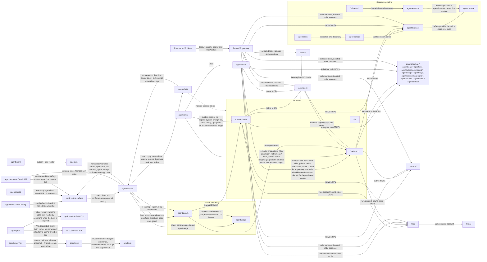
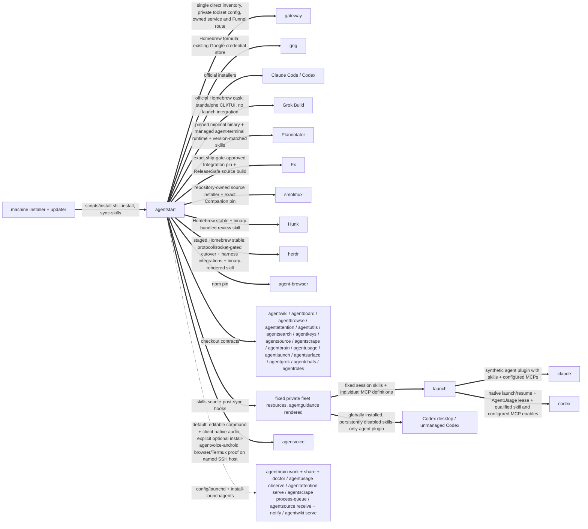
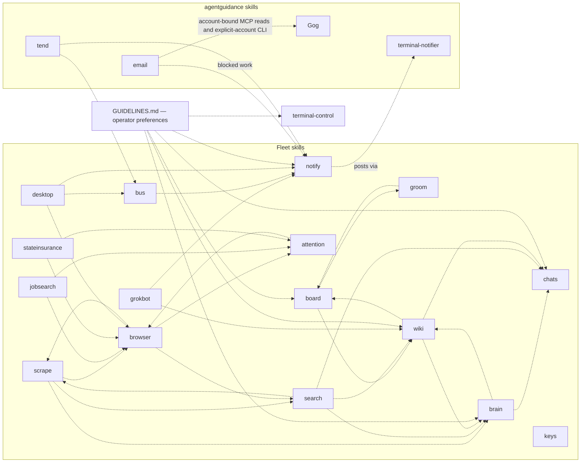

# The fleet map

Every known dependency between the agent apps in `~/code`, with evidence.
Four kinds of edge:

- **calls** (solid): a runtime request or subprocess invocation of another
  tool. Breaking the callee's request, flags, or output breaks the caller.
- **routes** (dashed): a skill deliberately handing work to another skill.
  Breaking the target skill strands the routing.
- **serves** (dotted): a launchd service running fleet code, a tool reading
  another's data on disk, or a tool loading another fleet project's supported
  library surface. AgentStart owns fleet service convergence except the
  declared owner contracts: AgentBrowse installs and recovers Hypeman, and
  AgentVoice owns its default-server LaunchAgent. AgentStart delegates to
  those installers and never renders a competing service. Machine services
  remain outside the fleet.
- **pins**: a binary installed at an exact version because a consumer locks
  or resolves it by contract.

## Runtime call graph

## Install and service layer

## Skill routing

An edge `X -.-> Y` means X's runbook names the `Y` skill and routes work to
it. Extracted from the SKILL.md files themselves.

Skill names and descriptions are the capability discovery surface. There is
no prompt-level tool catalog. `agentguidance/scripts/render` splices SYSTEM.md
and GUIDELINES.md into the linked implementation or maintenance references of
collab, build, and maintain; GUIDELINES preserves the
operator's research reuse, work tracking, notification, document-placement,
and managed-PTY preferences. The `tool-advertisement-policy` wiki page records
this separation of operating preferences from discovery.

`keys` references no other skill and none reference it. `email` routes to
`notify`, so mail work that stalls still reaches the human. Both are discovered
through their descriptions, like the other resource skills.

A trap this section has already caught twice: a project's *own* `search`
subcommand (agentboard's and agentwiki's) reads exactly like a reference to
the `search` skill in a bare name-grep. Verify a routing edge from the
sentence around the match, never from the name alone.

## Edges with evidence

### calls

| Caller | Callee | What | Evidence |
| --- | --- | --- | --- |
| agentstart | AgentVoice / Tailscale Serve | `agentvoice-network.ts --enable` explicitly provisions a dedicated tailnet-only WSS route; ordinary installation reconverges only already enabled settings through `agentvoice network status`, `network configure` and first-enable `service restart`. Uses Tailscale status/serve JSON, refuses Funnel and foreign handlers, verifies unrelated routes unchanged. Never grants credentials. | `agentstart/scripts/agentvoice-network.ts`; `agentstart/scripts/install.sh`; `agentstart/tests/agentvoice-network.test.ts`; `agentvoice/src/network/command.ts`; `agentvoice/docs/adr/0034-authenticated-client-network.md` |
| agentstart | agentvoice | Default convergence uses `install-agent-clis` to invoke the checkout-owned `scripts/install.sh --install`: prerequisite checks, clean-source/frozen dependency install, staged native audio build, ownership-checked atomic editable command link and deployed-SHA receipt. A missing checkout skips; a present broken checkout fails. On macOS the same installer also owns and starts the `io.arthack.agentvoice.server` user LaunchAgent, which waits without audio or a Codex child until the pointer frontend calls; `--command-only` skips service management. AgentStart must not also render/register this job. AgentStart links its tracked `config/agentvoice/server.json` before fleet installation through `scripts/agentvoice-config`; no native Codex configuration or account wrapper is installed. Separately, the operator-only `install-agentvoice-android --install` resolves the same fleet checkout and delegates exactly to its `scripts/install-android --install --host <host>` contract, defaulting to `smolbird`. That phone proof deployment is absent from `install.sh`, `install-agent-clis`, and `sync-skills`. | `agentstart/scripts/install-agent-clis`; `agentstart/scripts/install-agentvoice-android`; `agentstart/tests/install-agentvoice-android.test.ts`; `agentvoice/scripts/install.sh`; `agentvoice/scripts/install-android`; `agentvoice/scripts/install.ts`; `agentvoice/scripts/build-native.ts`; `agentvoice/src/service.ts`; `agentstart/scripts/agentvoice-config`; `agentstart/config/agentvoice/server.json`; `agentvoice/docs/adr/0025-launchagent-default-workspaces.md`; both repositories' isolated installer tests |
| agentvoice | smolmux | Bare `agentvoice` starts a unique `smolmux start --foreground --name` process, verifies its PID/name/host over the private protocol-2 socket, and composes `agentvoice client`, `attach voice`, and `attach agent` with local PTYs only. Read-only frontend observation gates the attachments on the spawned client’s live call and exact workspace/thread. Closing the foreground process ends all panes; no Companion persistence or automatic attachment replay. Requires installed smolmux 0.9.2+ and its local PTY helper. | `agentvoice/src/composition/launch.ts`; `agentvoice/src/composition/controller.ts`; `agentvoice/src/composition/layout.ts`; `agentvoice/src/frontend/observer.ts`; `agentvoice/docs/composition.md` |
| agentvoice | codex-viewer | `agentvoice attach voice` resolves the active/default workspace and active or saved conversation, then launches `codex-viewer --voice-jsonl <file> --follow`. Closing the viewer does not stop recording or voice. | `agentvoice/src/attachment/command.ts`; `agentvoice/src/attachment/voice-launcher.ts`; `agentvoice/src/recording/store.ts` |
| agentvoice | Codex | owns an unmodified `codex app-server --enable realtime_conversation --listen ws://127.0.0.1:0 --ws-auth capability-token --ws-token-file <private-file>` child for each frontend-owned call through the waiting local server, using native thread list/read/start/resume and realtime RPCs. It supplies no custom worker tools, report/follow-up turns, tool callbacks or thread archival/deletion; Codex owns native tools/subagents and voice handoffs. Saved retired worker calls receive a failed tool result and a visible retirement notice without rewriting history. Native permissions apply unless optional --allow-full-access explicitly overrides them. Always-available `agentvoice attach agent` launches the same stock Codex TUI through an authenticated exact-thread gateway; no attachment flags or full-access gate. Both owner and TUI use native WebSocket RPC. Native approvals, tool questions and MCP elicitations stay pending for TUI answers; Codex owns pending-request replay. Unsupported client requests still receive a visible refusal or RPC error. Explicit --fast additionally reads effective config and the paginated model catalog, enables only the thread-local Fast gate, and validates tier responses; --no-fast requests standard. Frontend disconnect ends owned work and closes the child; the waiting server remains, normally under its owned default LaunchAgent. A `--role` directory adds process-local skill roots through `skills/extraRoots/set` right after `initialize` and its `mcp.json` servers through per-thread `mcp_servers` config; nothing is written under CODEX_HOME | `agentvoice/src/main.ts`; `agentvoice/src/core/attach.ts` (`appServerArgv`, `AppServerConnection`); `agentvoice/src/core/runtime.ts`; `agentvoice/src/core/role.ts`; `agentvoice/src/core/full-access.ts`; `agentvoice/src/core/service-tier.ts`; `agentvoice/docs/adr/0009-one-foreground-workspace.md`; `agentvoice/docs/adr/0014-roles.md`; `agentvoice/src/attachment/launcher.ts`; `agentvoice/src/attachment/gateway.ts`; `agentvoice/docs/adr/0022-websocket-native-tui.md` |
| agentroles | Claude Code | delivers a role directory to one `claude` invocation through PATH (so the AgentLaunch shim still applies): `--system-prompt-file` or `--append-system-prompt-file`, `--mcp-config <role>/mcp.json`, and `--plugin-dir` on a skills-only plugin rendered fresh under `~/.cache/agentroles/claude/<role>/`. The child also receives `AGENTROLES_ROLE`/`AGENTROLES_NAME`; the harness exit code is returned unchanged | `agentroles/src/main.ts` (`deliver`); `agentroles/src/deliver/claude.ts`; `agentroles/src/render.ts`; `agentroles/src/exec.ts`; `agentroles/README.md` |
| agentroles | Codex | delivers a role to one `codex` invocation as `-c` overrides with TOML values: `model_instructions_file` or `developer_instructions`, one `mcp_servers.<name>` per translated `mcp.json` server, and `plugins.<role>@agentroles.enabled=true`. Overrides follow `exec`/`review` or `resume <id>`, mirroring AgentLaunch, and never touch `skills.config`, which the shim owns. `agentroles install <role>` is the one Codex-state write: it renders the role as a skills-only plugin in the local `agentroles` marketplace, runs `codex plugin marketplace add` once and `codex plugin remove`/`add`, then persists the plugin disabled through `config/value/write` on a `codex app-server` child | `agentroles/src/deliver/codex.ts`; `agentroles/src/codex-plugin.ts`; `agentroles/src/app-server.ts`; `agentroles/src/render.ts`; `agentroles/docs/adr/0001-roles-are-directories-delivered-by-argv.md` |
| agentroles | agentvoice | passes `--role <dir>` and nothing else; AgentVoice reads the directory itself because only its process can register skill roots on the child it owns | `agentroles/src/deliver/agentvoice.ts`; `agentvoice/src/core/role.ts` |
| agentstart | agentroles | `install-agent-clis` invokes the checkout-owned `scripts/install.sh --install`: frozen dependency install, an ownership-checked `~/.local/bin/agentroles` link and a deployed-SHA receipt. Nothing is installed for any harness; `agentroles install` remains a user action | `agentstart/scripts/install-agent-clis`; `agentroles/scripts/install.sh` |
| agentstart | FastMCP / Tailscale / Gog | installs pinned FastMCP through uv and Gog through Homebrew; owns the io.arthack.agentstart.serve-mcp service and exact /mcp Funnel handler. A private configuration selects tools at /mcp/TOOLSET with distinct bearer credentials. The gateway reuses one direct inventory and preserves stdio state per frontend session. Google OAuth stays in Gog | AgentStart scripts/install-mcp-gateway, scripts/install-gog, gateway/gateway.py, gateway/uv.lock, config/mcp-gateway.json, config/launchd/io.arthack.agentstart.serve-mcp.plist; gateway/test_gateway.py; tests/mcp-install.py |
| agentstart | Grok Build | installs or upgrades the official stable Homebrew cask, exposing the vendor's `grok` command and `agent` alias. This installs only the native CLI/TUI: AgentStart does not add Grok to AgentLaunch or Herdr, and AgentUsage owns Grok billing and account selection without activating harness credentials | `agentstart/scripts/install.sh`; asserted by `agentstart/tests/validate.sh`; Homebrew cask `grok-build` |
| agentstart | Plannotator | installs the pinned release through Plannotator's official `--minimal` path so vendor hooks and ambient skills stay absent, verifies the resulting binary, invokes that exact binary's `install-runtime agent-terminal` contract for the managed WebTUI/PTY sidecar, and copies the same tag's core skills into fixed resources. Removing or changing the runtime subcommand disables the annotate UI's embedded Agent tab even though the CLI itself still launches | `agentstart/scripts/install.sh`; asserted by `agentstart/tests/validate.sh`; runtime contract in `plannotator/packages/server/agent-terminal-runtime.ts` |
| agentstart | agentusage | installs AgentUsage before AgentLaunch. AgentUsage owns Claude/Codex/Grok accounts, direct observations and the Claude/Codex proxy in its existing `daemon run`; AgentStart owns the observer LaunchAgent and converges it last. No Claude/Codex swap installer is invoked | `agentstart/scripts/install-agent-clis`; `agentstart/scripts/install-launchagents`; `agentusage/scripts/install.sh`; `agentusage/src/daemon.ts` |
| agentstart | agentlaunch | `install-agent-clis` invokes `scripts/install.sh --install` after `agentusage`; `scripts/install-agentlaunch-shims` is the external shim contract for bare `claude`/`codex` | `agentstart/scripts/install-agent-clis`; `agentstart/scripts/install-agentlaunch-shims` |
| agentstart | agentsource | `install-agent-clis` invokes the checkout's hardened installer, which runs a frozen Bun install, securely creates or preserves the private webhook secret, atomically links `~/.local/bin/agentsource` to the checkout's TypeScript entrypoint, and records the deployed commit. The explicit `configure-agentsource-webhooks --apply` path discovers this node's Funnel origin and calls `agentsource webhook-configure` to reconcile signed hooks; ordinary install only runs its non-mutating, agent-oriented diagnostic | `agentstart/scripts/install-agent-clis`; `agentstart/scripts/configure-agentsource-webhooks`; `agentsource/scripts/install.sh`; `agentsource/src/cli.ts` |
| agentsource notifier | agentsource receiver, terminal-notifier | the resident `notify-daemon` subscribes to the receiver's `ci:*` Unix-socket channels with reconnect, remembers one PASS/FAIL verdict per project's primary-branch head in an owner-only state file, coalesces flips for ninety seconds, and posts one grouped banner through `terminal-notifier` on PATH naming what flipped plus every project still red. A missing notifier is logged, never fatal | `agentsource/src/ci-notifier.ts`; `agentsource/src/channel-client.ts` (`subscribeChannels`); `agentstart/config/launchd/io.arthack.agentsource.notify.plist` |
| agentsource | herdr | each observation scan invokes `herdr agent list` and `herdr workspace list` exactly once, concurrently. Workspace checkout metadata associates agents first, with the agent cwd as a deterministic fallback; unavailable or malformed Herdr output degrades only agent presence and never makes the Git scan fail | `agentsource/src/herdr.ts` (`readHerdrSnapshot`, `attachAgentPresence`); `agentsource/src/git.ts` (`scanProjects`) |
| agentstart | agentutils | `install-agent-clis` invokes the checkout's hardened installer, which runs a frozen Bun install, atomically links `~/.local/bin/agentutils` to the checkout's TypeScript entrypoint, and records the deployed commit; the Editor utility lives at the required `agentutils editor` subcommand and follows the fleet's editable, rerunnable installation contract | `agentstart/scripts/install-agent-clis`; `agentutils/scripts/install.sh`; asserted by `agentstart/tests/validate.sh` and `agentutils/test/install.test.ts` |
| agentstart | agentbrowse | `install-agent-clis` invokes the checkout's hardened installer, which runs a frozen Bun install, atomically links `~/.local/bin/agentbrowse` to the checkout's TypeScript entrypoint, and records the deployed commit. After the Browser command installs, AgentStart links its tracked version-2 deployment config with Artbird Hypeman first and local Hypeman second, then links the global agent-browser provider config | `agentstart/scripts/install-agent-clis`; `agentbrowse/scripts/install.sh`; `agentstart/scripts/agentbrowse-config`; `agentstart/config/agentbrowse/config.json`; `agentstart/scripts/agent-browser-config`; `agentstart/config/agent-browser/config.json`; asserted by both repositories' installer tests |
| agentstart | agentattention | immediately after Agentbrowse, `install-agent-clis` invokes Agentattention's hardened installer: frozen dependencies, an atomic editable command link and receipt, plus first-run mode-0600 server/local-client bootstrap. The order satisfies Agentattention's linked `agentbrowse/opentui` browser processor dependency before its resident service can be loaded | `agentstart/scripts/install-agent-clis`; `agentattention/scripts/install.sh`; asserted by both repositories' validation suites |
| agent-browser | agentbrowse | the global `browser.provider` plugin named `agentbrowse` starts the AgentStart-managed `~/.local/bin/agentbrowse provider` through `$HOME` as a short-lived process for manifest, launch, and close requests, bypassing any older same-named command earlier on `PATH`. The provider tries Artbird first and only falls through on classified availability failures to an already-enabled local Hypeman runtime; there is no provider server or configured instance URL | `agentstart/config/agent-browser/config.json`; `agentstart/config/agentbrowse/config.json`; `agentbrowse/cli/provider.ts`; `agentbrowse/README.md` |
| Jobsearch | agentattention | `jobsearch attention create --file` validates one of the three bounded first-party payloads, invokes `agentattention --json create`, verifies the returned contract, title, and payload, then records only the producer-side continuation. The combined skill separately uses Agentattention's read/wait CLI surface to consume authoritative terminal outcomes | `jobsearch/cli/src/verbs/attention.ts` (`defaultAgentattentionRunner`, `commandFor`, `createAttentionRequest`); `jobsearch/.claude/skills/jobsearch/SKILL.md` |
| agentstart | agentlaunch / Codex | builds one fixed private resource tree, renders Claude's session-only `agent` plugin with the fleet MCP inventory and Codex's globally installed strictly skills-only `agent` plugin, and persistently name-disables every qualified Codex skill. The same MCP definitions are also rendered for AgentLaunch's Codex session config. Portable skill manifests stay bare; only the disposable Codex copy qualifies default prompts. The six-hour sync refreshes the current inventory without binary upgrades or service restarts | `agentstart/scripts/sync-skills`; `agentstart/scripts/render-capabilities`; `agentstart/scripts/install.sh`; `agentstart/scripts/sync-codex-skill-policy`; `agentstart/config/resources/*`; `agentstart/docs/adr/0002-render-one-private-resource-set.md` |
| agentlaunch | Claude Code / Codex | loads the one fixed resource set. Claude receives the synthetic `agent` plugin with skills and fleet MCPs; native Codex `run`, `resume`, `exec`, and `review` name-enable every qualified `$agent:<skill>` and inject the same MCP definitions through session config, using the selected AgentUsage lease and unchanged native homes. Utility and unmanaged harness invocations receive neither resource. AgentLaunch owns no App Server, Unix socket, remote TUI, projection, or receipt; native Codex therefore owns linked-worktree trust and the complete session lifecycle | `agentlaunch/src/resources.ts`; `agentlaunch/src/launch.ts`; `agentlaunch/docs/adr/0032-agentusage-owns-account-preparation.md` |
| Claude Code / Codex / AgentVoice | individual stdio MCP servers | each managed model session receives direct fleet tools, Agentdesk, agent-browser, termctrl, two account-bound Gog servers, and fleet shadcn from the same rendered inventory. Native tool discovery retains each server schema and structured result. Utility invocations do not receive fleet resources | agentstart/config/resources/mcp-servers.json; agentstart/scripts/render-mcp-resources; agentstart/scripts/render-capabilities; agentlaunch/src/resources.ts; agentlaunch/test/resources.test.ts; agentstart/scripts/render-agentvoice-role |
| email skill | Gog | selects the correct account-bound MCP server for Gmail search/read. Sends, drafts, exact MIME/headers and complete pagination use the CLI with the full --account address. Existing send authorization is retained and uncertain sends are reconciled. Google auth repair uses the supported human sign-in flow | agentguidance/skills/email/SKILL.md; agentguidance/skills/email/references/messages-and-mime.md; installed Gog MCP catalog and CLI help |
| Jobsearch | Gog Gmail | the email reader invokes the Gog CLI with the explicit account, readonly and no-input flags, fetches every page and complete matching thread, and validates headers before the pure sync core can store or stamp anything. Auth failures retain exit 4; timeout, malformed data and incomplete reads cannot advance watermarks | jobsearch/cli/src/email/gog.ts; jobsearch/cli/src/email/index.ts; jobsearch/cli/test/gog-email.test.ts |
| Claude Code / Codex / AgentVoice / HTTP toolsets | shadcn | AgentStart starts `npx shadcn@latest mcp` over stdio through `agentstart mcp shadcn`, always from its fixed registry directory. Managed model sessions receive that definition through the common inventory, and selected authenticated HTTP toolsets proxy the same service. The caller's project files and npm overrides do not define this registry service; project edits still use the shadcn CLI in that project | `agentstart/scripts/agentstart`; `agentstart/config/resources/mcp-servers.json`; `agentstart/config/resources/shadcn/*`; `agentstart/config/mcp-gateway.json`; asserted by `agentstart/tests/shadcn-mcp.py` and both repositories' resource tests |
| agentstart | fxnk | invokes `~/code/fxnk/scripts/install.sh --install --sha <pin>` as the required Fx harness installation contract. The tracked Fx Integration consumer pin is an exact commit already approved by fxnk's Local development gate and ship gate; ordinary AgentStart convergence reuses it and never promotes a moving remote tip | `agentstart/scripts/install.sh`, asserted by `agentstart/tests/validate.sh`; `fxnk/scripts/install.sh`; `fxnk/MAINTAIN.md` (Consumer) |
| fxnk | Fx | binds `~/source/vercel-labs--fx` to published `fork/integration`, builds ReleaseSafe, atomically installs `~/.local/bin/fx`, and disables the independent auto-upgrader. Fx's repo-local `/maintain` skill separately reconciles, gates, and publishes Integration against one captured upstream snapshot | `fxnk/scripts/install.sh`; `agentstart/scripts/install.sh`; `fxnk/MAINTAIN.md`; receipt at `~/.local/state/fxnk/fx-built-commit` |
| agentstart | smolmux | delegates the complete source installation to Smolmux's repository-owned `scripts/install.sh`: the editable `smolmux` Bun command, exact source-built `smolmux-zmx` Companion pin, and `smolmux doctor`. Smolmux sessions run arbitrary commands and own no Fx pin or agent-specific MCP command. AgentStart supplies only the shared binary destination, then links the tracked operator config into `~/.config/smolmux/config.toml`; smolmux's key schema stays a strict subset of Herdr's and uses the same `ctrl+space` prefix. Smolmux publishes no binaries; its four-platform hosted CI is post-push observability, while only its current-Mac local gate blocks merging. | `agentstart/scripts/install.sh` (smolmux block); `smolmux/scripts/install.sh`; `smolmux/scripts/local-gate.sh`; `smolmux/scripts/install-companion.sh`; `smolmux/.github/workflows/ci.yml`; `smolmux/docs/adr/0015-a-socket-is-the-whole-control-surface.md`; `smolmux/docs/adr/0016-sessions-are-arbitrary-commands.md`; `agentstart/config/smolmux/config.toml`; `agentstart/scripts/smolmux-config`; asserted by `agentstart/tests/validate.sh` and `agentstart/tests/smolmux-config.sh` |
| smolmux explorer | Ghostty CLI | At startup the optional local explorer reads resolved terminal appearance with `ghostty +show-config --changes-only=false --no-pager`, resolving the executable from PATH or the macOS application bundle. Only allowlisted appearance values reach the browser. Missing, failed or timed-out discovery uses bundled defaults; incompatible output affects font/theme matching. | `smolmux/examples/explorer/ghostty-config.ts`; `smolmux/examples/explorer/appearance.ts`; `smolmux/examples/explorer/serve.ts` |
| Direct MCP hosts / HTTP gateway | agentattention / agentboard / agentwiki / agentbrain / agentsearch / agentscrape / agentkeys / agentbrowse / agentgrok / agentsounds / agentchats / agentsurface | starts `<cli> mcp` over stdio and receives tools generated from that CLI's own agent contract. Each server dispatches through its command table in process; only `audience: agent` leaves are exposed. Managed Claude/Codex workflows discover and call these tools directly. Existing JSON objects and domain-error envelopes are preserved as structured content and standalone JSON text, including structured error content; plain text and Markdown keep their original format. Transport shutdown closes the owned stdio server | `agentstart/config/agent-contract/MCP.md`; `agentstart/config/resources/mcp-servers.json`; each repository's MCP modules and handshake tests (`src/` except AgentBrowse's `cli/`) |
| Direct MCP hosts / HTTP gateway | agentsurface | serves agents, message, and guide through shared typed bus handlers. Each bus call supplies its actual socket and caller pane; optional expected session guards pane reuse. Fresh Herdr state determines workspace and sender names, so shared server defaults cannot attribute one caller as another. Cancellation stops retries and reaps Herdr children; interrupted prompt delivery must be reconciled before resending | `agentsurface/src/contract.ts`; `agentsurface/src/bus.ts`; `agentsurface/src/herdr.ts`; `agentsurface/src/mcp-tools.ts`; `agentsurface/src/mcp-server.ts`; `agentsurface/test/mcp.test.ts` |
| Direct MCP hosts / HTTP gateway | agentsounds | serves `notify` and `guide` through the same typed handlers as the CLI. MCP preserves explicit flag presence, requires absolute recipe/export paths, and cancels and reaps active playback on cancellation or transport shutdown. The human audition TUI and operator hooks remain available | `agentsounds/src/commands.ts`; `agentsounds/src/mcp-tools.ts`; `agentsounds/src/mcp-server.ts`; `agentsounds/src/mcp.ts`; `agentsounds/test/mcp.test.ts` |
| agentstart | agentsounds | invokes the checkout-owned installer for frozen dependencies, an editable command and a private deployed-SHA receipt. The installer preserves independent files, recipes, cached WAVs, and existing Bun links | `agentstart/scripts/install-agent-clis`; `agentsounds/scripts/install.sh`; `agentsounds/test/install.test.ts` |
| Direct MCP hosts / HTTP gateway | agentattention | serves 12 producer tools from the authored contract through shared typed client handlers. Config selection and human claim/resolve/return remain outside the tool surface; cancellation and stdio shutdown abort live HTTP waits and event streams. Domain failures preserve their envelope and partial prune failures retain failed-item details | `agentattention/src/mcp-tools.ts`; `agentattention/src/mcp-server.ts`; `agentattention/src/mcp.ts`; `agentattention/test/mcp.test.ts`; `agentattention/docs/mcp.md` |
| Direct MCP hosts / HTTP gateway | agent-browser / agentbrowse | the registered `agent_browser` namespace drives page operations through agent-browser's native MCP surface; `agentbrowse` supplies durable session and target lifecycle tools. The browser workflow discovers the versioned driver guide, supplies the same explicit session on every call, and resolves the exact live target before a human handoff. Driver upgrades must preserve this pairing | `agentstart/config/resources/mcp-servers.json`; `agentstart/config/agent-browser/config.json`; `agentbrowse/skills/browser/SKILL.md`; `agentbrowse/skills/browser/references/lifecycle.md`; `agentbrowse/cli/provider.ts` |
| agentgrok | grok (Grok Build CLI) | reuses the CLI's login at `$GROK_HOME/auth.json` as the hub bearer token, and when it is expired or within 90 s of it runs the refresh command — `grok models` by default, `AGENTGROK_REFRESH_COMMAND` to override — so the CLI renews its own file under its own lock, then reads it again. agentgrok never writes `auth.json`; `AGENTGROK_TOKEN` bypasses the CLI entirely. A change to the CLI's login file layout or to `grok models` needing interaction breaks every agentgrok call once the token expires | `agentgrok/src/auth.ts` (`resolveCredential`, `spawnRefresh`); `agentgrok/docs/adr/0002-token-refresh-shells-out-to-the-grok-cli.md`; pinned by `agentgrok/test/auth.test.ts` |
| agentgrok | xAI Computer Hub (external, `wss://computer-hub.grok.com/v1/tools`) | one WebSocket per command as `?role=bot_client`: hello, then JSON-RPC `bot.roster`, `bot.status`, `bot.vncDescriptor`, `bot.transcript.offbox`, `bot.usage`, `bot.subscribe`/`unsubscribe`, and `bot.command` relaying one of the hub's 43 allowlisted gateway commands to the user's Grok Bot box; `bot.event` notifications carry `hub:turn_finished`. The hub answers 400 without the role parameter, which the protocol crate does not document. Not a fleet edge — recorded because it is the whole product | `agentgrok/src/hub.ts`, `agentgrok/src/relay.ts`; wire shapes from `xai-org/grok-build` `crates/common/xai-tool-protocol/src/bot_relay.rs`; `agentgrok/docs/adr/0001-the-hub-relay-is-the-transport.md` |
| agentmux | smolmux | starts and stops its private named Runtime through the CLI, then uses the duplex Unix API for terminal control and `event.subscribe` plus `state.get` observation. Smolmux 0.8.0 or newer supplies the lifetime/generation/sequence envelope; reconnect replaces the cached projection while transient notices remain independent of snapshot watermarks. Changing the CLI, socket protocol, or native session identity breaks terminal control and Runtime recovery | `agentmux/src/smolmux.ts` (`smolmuxArgv`, `startSmolmux`, `MIN_SMOLMUX_VERSION`); `agentmux/src/daemon.ts` (`connectRuntime`, `recoverRuntime`); `smolmux/events.schema.json`; real recovery coverage in `agentmux/test/instance.e2e.test.ts` |
| agentwork Tray | agentmux | imports `agentmux/client` and `agentmux/protocol` from the sibling package, observes the current snapshot and filtered Agent/theme/stop events over the duplex Unix socket, and sends `agent.show` when a row is pressed. Disconnect clears the displayed projection until reconnect; changing the package exports, snapshot, or event contract breaks the Tray | `agentwork/package.json`; `agentwork/src/tui/tray.ts` (`runTray`); `agentmux/src/api-client.ts` (`observe`); `agentmux/events.schema.json` |
| agentstart | every `agent*` CLI | owns `config/agent-contract/schema.json`, the one machine-readable self-description each CLI publishes as `<cli> guide --json`, and `scripts/validate-agent-contract.ts`, which EXECUTES that schema rather than restating it. `--agent-help`, `--agent-teaser`, and `--help` are renders of the contract, not second authorships beside it; thirteen of sixteen CLIs go further and derive their argument parser from it, so a declared flag and an accepted flag cannot disagree. Each repository owns its own conformance test and resolves the validator through AgentStart's checkout | `agentstart/config/agent-contract/{schema.json,README.md,MCP.md,example.json}`; `agentstart/scripts/validate-agent-contract.ts`; `agentstart/scripts/json-schema-subset.ts`; asserted by `agentstart/tests/agent-contract.test.ts` and each repository's own contract test |
| agentstart | Hunk | installs or upgrades the Homebrew formula, resolves the version-matched `hunk-review` skill through `hunk skill path hunk-review`, and copies that bundled skill into the fixed resources. It deliberately never installs the skill from GitHub head, which could teach a newer session API than the local binary accepts | `agentstart/scripts/install.sh` (`install_hunk_skill`), asserted by `agentstart/tests/validate.sh`; `hunk/src/core/run/paths.ts` (`resolveBundledSkillPath`) |
| agentstart | Terminal Control skill | the existing fixed-resource renderer applies the authored MCP workflow after the version-matched vendor skill arrives. It preserves vendor frontmatter and keeps the exact CLI guide beside its original sibling files; repeated rendering and vendor refresh do not recursively wrap the generated body | `agentstart/scripts/render-capabilities`; `agentstart/scripts/render-terminal-control-skill`; `agentstart/config/terminal-control/skill-body.md`; `agentstart/tests/render-terminal-control-skill.py` |
| agentstart | AgentVoice default role | the existing fixed-resource renderer publishes a standard role linking the app-owned default prompt files, common portable skills, and existing MCP resources. AgentVoice loads that role through process-local skill roots and per-thread MCP config; source prompt bytes, native delegation, independent roles, and active calls remain under their existing owners | `agentstart/scripts/render-agentvoice-role`; `agentstart/scripts/render-capabilities`; `agentstart/config/agentvoice/server.json`; `agentstart/tests/render-agentvoice-role.py`; `agentvoice/src/core/role.ts`; `agentvoice/src/core/runtime.ts`; `agentvoice/src/core/params.ts` |
| agentsurface plugin | agentusage | the shared Herdr plugin's `usage` pane entrypoint runs `escape-to-quit agentusage` in a titled 80% popup. AgentStart's `prefix+u` binding opens the entrypoint instead of duplicating an untitled generic popup | `agentsurface/plugin/herdr-plugin.toml`; `agentstart/config/herdr/config.toml` |
| agentlaunch | agentusage | bounded `prepare claude\|codex --json [--account selector] [--model model] [--dry-run]` supplies validated native args, private env and an opaque lease. The existing parent renews over loopback HTTP and releases on all exit/failure paths. Dry runs reserve nothing and print a credential-free re-prepare invocation. Changing the v1 envelope or lease protocol requires both repositories to land together | `agentlaunch/src/balance.ts`; `agentlaunch/src/account-session.ts`; `agentlaunch/src/launch.ts`; `agentusage/src/service/prepare.ts`; `agentusage/src/service/leases.ts`; `agentusage/docs/ACCOUNT-OWNERSHIP.md` |
| agentlaunch | claude / codex | launches the resolved native harness and sets `AGENTLAUNCH_LAUNCH=1`; AgentStart's bare-command shims route to `agentlaunch --x-harness <harness>` and use that sentinel to reach the native binary without rebalancing. Codex runtime descendants pass through AgentStart's invocation-profile helper | `agentlaunch/src/launch.ts`; `agentstart/scripts/install-agentlaunch-shims`; `agentlaunch/docs/adr/0004-shims-route-bare-calls-the-sentinel-breaks-recursion.md` |
| agentstart config watcher | Funk preferences, funk-notify | resident `agentstart config watch --notify` publishes validated generated snapshots for managed Claude/Codex launches, detects changes to authored fields in native settings, and groups change/drift/recovery notifications through `funk-notify`. Never writes tracked preferences; Codex captures disposable-profile edits for review before cleanup | `agentstart/scripts/harness-config.ts`; `agentstart/scripts/agentstart`; `agentstart/config/launchd/io.arthack.agentstart.watch-config.plist`; `funk/bin/.local/bin/funk-notify` |
| agentstart | Codex / Funk preferences | the managed Codex shim invokes `scripts/codex-invocation <native-codex> ...`, copying `~/code/funk/config/harnesses/codex.toml` into a unique native profile with effective cwd/project-root trust. Keeps the selected account and Codex home; removes only its own profile at child exit. Runtime commands receive profiles; utility/remote calls and the explicit shim bypass remain native. The full installer converges the shims | `agentstart/scripts/codex-invocation`; `agentstart/scripts/install-agentlaunch-shims`; `agentstart/config/codex/README.md`; `funk/config/harnesses/codex.toml`; `agentstart/tests/codex-invocation.test.ts` |
| agentstart | Claude / Funk preferences | the managed Claude shim invokes `scripts/claude-invocation <native-claude> ...`, loading Funk's Stowed `~/.claude/preferences.json` with native `--settings` and recording cwd/Git/worktree trust under Claude's local config lock. Writable settings, accounts, and trust history stay local; explicit settings replace the overlay and utility/isolated/remote calls pass through | `agentstart/scripts/claude-invocation`; `agentstart/scripts/install-agentlaunch-shims`; `agentstart/config/claude/README.md`; `funk/claude/.claude/preferences.json`; `agentstart/tests/claude-invocation.py` |
| agentguidance `tend` skill | herdr, agentsurface | its read-only watcher subscribes to pane and workspace lifecycle events over Herdr's Unix-socket NDJSON API, queries `herdr agent list` once per survey, and treats every live agent status as ownership that blocks a proposal. Git independently supplies linked-worktree and local-main ancestry state. Optional cross-harness self-wake travels through `agentsurface message`; the woken agent routes human notification through `notify`. Tend emits only removal, catch-up, or inspection minisketches and contains no integration, rebase, removal, branch deletion, or push helper | `agentguidance/skills/tend/SKILL.md`; `agentguidance/skills/tend/scripts/watch.ts`; behavioral coverage in `agentguidance/tests/tend.test.ts` |
| agentstart | herdr | installs the official stable Homebrew formula when absent and upgrades it only during an explicitly authorized socket-free maintenance run, then runs `herdr integration install claude\|codex`, links agentsurface's launcher-pane and tab-naming plugin directory with `herdr plugin link`, and renders the version-matched surface skill from `herdr --skill` into the fixed resources | `agentstart/scripts/install.sh` (`install_or_upgrade_formula herdr`, `install_herdr_integrations`, `install_herdr_skill`); `agentstart/scripts/herdr-socket-state`; asserted by `agentstart/tests/validate.sh` |
| agentstart (`herdr-config`) | herdr | validates every rendered candidate through `HERDR_CONFIG_PATH=<temp> herdr config check`, atomically replaces the managed live config, then reloads the default server and every reachable named session; an unavailable server is nonfatal because its next start reads the validated file | `agentstart/scripts/herdr-config` (`render_candidate`, `reload_live_servers`) |
| agentbrain | agentscrape | evidence pipeline in four argv shapes — `fetch-markdown --markdown`, `fetch-markdown --envelope --allow-private-network --max-content-bytes`, `discover-feed`, `fetch-links --preset x-timeline --limit --max-scrolls` — plus a doctor check; a flag change breaks each shape separately | `agentbrain/src/agentscrape.ts:642,1298-1306,2038,2121-2129`, `src/jobs.ts:736` |
| agentscrape | agent-browser → agentbrowse | resolves `~/.local/bin/agent-browser` first, then PATH, and passes an explicit stable `--session` name without creating, authenticating, or closing it. With the configured Agentbrowse provider that name maps to a durable Browser profile: cookies and storage survive target replacement, so authentication established through the fleet `browser` + `attention` workflow is available to the deliberate Agentscrape call without an origin registry or conduit | `agentscrape/src/browser.ts` (`resolveBrowser`, `runAgentBrowser`); `agentscrape/skills/scrape/SKILL.md`; `agentscrape/skills/scrape/references/extraction.md`; `agentstart/config/agent-browser/config.json`; `agentbrowse/cli/provider.ts` |
| agentboard | agentwiki | `agentwiki publish <file> --name agentboard --kind render --json` | `agentboard/src/cli.ts:834-843` |
| agentsurface | agentlaunch | the plugin's `launch` pane runs `agentsurface host -- agentlaunch --x-surface`: the host spawns agentlaunch's interactive form on the popup terminal in the focused pane's cwd with stdout piped — the form renders on stderr and writes session directives to stdout, the whole interface, per the `surface-handoff-protocol` wiki contract and `agentsurface/directive.schema.json`. Realizing a directive rides agentlaunch again through the shim herdr types: the directive's `--x-level` args pass through untouched, and the executor appends `--x-prompt-file <spool path>` for the intent (agentlaunch ADR 0029), because herdr refuses control characters in a shell-typed argument. Separately, `agentlaunch x-catalog --x-json` before slug inference reads each harness's `metadata_level`, and `conversation slug` runs `agentlaunch --x-harness <h> --x-level <metadata_level>` with native non-interactive tokens in the fixed `/tmp/agentsurface/inference` cwd — agentlaunch by name, not the bare shim, because a session's `AGENTLAUNCH_LAUNCH` sentinel would exec the native binary and drop the level | `agentsurface/plugin/herdr-plugin.toml`; `agentsurface/src/host.ts` (`runHost`); `agentsurface/src/directive.ts` (`executeDirective`, `writeIntentFile`); `agentlaunch/src/surface/directive.ts`; `agentsurface/src/catalog.ts` (`loadLaunchCatalog`); `agentsurface/src/conversation/infer.ts` (`composeInference`) |
| agentsurface | herdr | drives the socket API through the CLI (`HERDR_BIN_PATH`, then PATH), split across the host (`workspace list` probe, `pane get` for the opened-over cwd) and the detached `execute-directive` executor it spawns per stdout directive line so the popup closes with the hosted tool: `pane list`/`workspace list` to find a workspace already hosting the project, then `tab create` into it or `workspace create`/`worktree create` (each `--focus`/`--no-focus` by the directive, plus `workspace focus` for a cross-workspace jump), `agent list`, `agent start <opaque-a-token> --kind <harness> --pane <root-pane> -- --x-level <model>:<effort> [--x-prompt-file <state intents/ spool file>]` with the pane-busy ready retry and an `agent_name_taken` re-derive, and `notification show` for failures with no terminal. The intent travels as a spool-file reference, never literal text — herdr types the command into the pane's shell and rejects control characters (`invalid_agent_argument`), so a multi-line intent can only cross as a path; the executor prunes the spool by age. The bare harness command herdr runs is agentstart's shim, so the shim → agentlaunch edge carries balancing, yolo, and the prompt-file expansion; `agent_not_ready` (blocked on a startup dialog) is a soft outcome because the expanded intent rides the native argv and the harness submits it once the dialog clears. The plugin hook uses `pane get` + `workspace get`, plus `worktree list` for the checkout's branch, then `pane report-metadata` to publish the Agent sidebar's contiguous `$project` label on every detection; afterward it polls `pane get` for `agent_session`/`tab_id` and runs `tab rename <tab_id> <slug>`. The message bus (`agentsurface agents` / `message`) adds `agent list` + `tab list` (agents named by their tabs' labels), `pane get` for the sender's own identity from terminal `HERDR_PANE_ID` or explicit MCP caller context, and `agent prompt <pane> <prefixed text>` — herdr delivering an agent-to-agent message as typed input (paste + Enter), so a working target's harness queues it and a blocked target rejects it. The generic `agentsurface confirm` boundary adds only exact argv execution after an explicit terminal decision; its three plugin pane entrypoints capture Herdr context, and the internal `close-active` bridge maps only `pane`, `tab`, or `workspace` to the context's id before calling the corresponding public `close` command, leaving every topology rule in Herdr | `agentsurface/src/herdr.ts`, `agentsurface/src/host.ts`, `agentsurface/src/directive.ts`, `agentsurface/src/tab-namer.ts`, `agentsurface/src/bus.ts`, `agentsurface/src/confirm.ts`, `agentsurface/src/close.ts`, `agentsurface/plugin/herdr-plugin.toml`; `agentstart/config/herdr/config.toml` |

### serves / data

| From | To | What | Evidence |
| --- | --- | --- | --- |
| codex-viewer | agentvoice | reads explicit per-conversation voice JSONL recordings through `--voice-jsonl <file> [--follow]`; AgentVoice automatically records call voice events, and the explicit `voice:record` observer can export them, without a new transport, native history modification, or model-context injection | `agentvoice/scripts/voice-record.ts`; `agentvoice/src/recording/writer.ts`; `agentvoice/docs/events.md`; `codex-viewer/codex/codex-rs/tui/src/session_viewer/voice_transcript.rs`; `codex-viewer/codex/codex-rs/tui/src/bin/session-viewer.rs` |
| agentstart | agentattention, agentbrain, agentscrape, agentsource, agentusage, agentwiki | installs their commands too, and owns these fleet launch agents outright: `io.arthack.agentattention.serve`, `io.arthack.agentbrain.work`, `.share`, and `.doctor`, `io.arthack.agentusage.observe`, `io.arthack.agentscrape.process-queue`, `io.arthack.agentsource.receive` and `.notify`, and `io.arthack.agentwiki.serve`. Labels use the account-wide `io.arthack.<project>.<verb>` grammar while the manifest separately records resident, periodic, or queue-triggered lifecycle; every plist enters through the tool's one public binary. The receiver plist names only the private secret's path, never its value. Templates, manifest, rendering, label replacement, status, and load live here so a service never has two owners racing to render it | `agentstart/config/launchd/*.plist`, `agentstart/scripts/install-launchagents`, asserted by `agentstart/tests/validate.sh` |
| agentattention | agentbrowse | the first-party browser-interaction processor loads Agentbrowse's supported `agentbrowse/opentui` package surface, discovers the attention item's exact Browser target name, embeds `LiveViewRenderable`, and requests/releases control around the human interaction. It never modifies or imports the pinned external agent-browser project | `agentattention/package.json`; `agentattention/src/tui/processors/browser.ts`; `agentbrowse/package.json` (`./opentui` export); `agentbrowse/src/opentui/core.ts` |
| machine installer + updater | agentstart | the only inbound edges from outside the fleet: the installer calls `scripts/install.sh --install` and nothing else about the fleet, because agentstart installs every fleet command and every fleet service and discovers the tailnet bind address itself; the machine's scheduled updater calls only `scripts/sync-skills` by path — unattended convergence refreshes fixed resources but deliberately does not upgrade Herdr while a resident server may still run older protocol bytes | `agentstart/scripts/install.sh` (the documented external interface), `agentstart/scripts/install-agent-clis`, `agentstart/scripts/install-launchagents`, `funk/libexec/funk-update` |
| agentboard | agentwiki | board items hold wiki slugs through `link` / `unlink`, so changing wiki's slug scheme breaks stored links even where publishing never runs | `agentboard/skills/board/SKILL.md`; `agentboard/skills/board/references/board-model.md`; `agentwiki/skills/wiki/SKILL.md`; `agentwiki/src/slug.ts` |
| agentchats | Claude Code, Codex | owns its session index end to end, with no third-party indexer left in the fleet: readers for the two local transcript stores (`~/.claude/projects/<slug>/<uuid>.jsonl`, `~/.codex/sessions/.../rollout-<stamp>-<uuid>.jsonl`), an incremental ingest, and one SQLite + FTS5 database at `~/.local/state/agentchats/index.db`. The index is derived state — a pruned transcript leaves search, and the whole database rebuilds from the stores with `agentchats index`. Its stdio MCP tools share typed CLI handlers, preserve exact JSON/error/Markdown results, and stop incomplete indexing on cancellation; agents search through the direct MCP, while the human picker remains available. Nothing downstream may treat the derived index as authoritative | `agentchats/src/parse/claude.ts:3`; `agentchats/src/parse/codex.ts:2`; `agentchats/src/store/ingest.ts`; `agentchats/src/store/schema.ts:63`; `agentchats/src/store/paths.ts:50`; `agentchats/src/cli/commands.ts`; `agentchats/scripts/install.sh` |
| agentsurface | agentchats | the plugin's `chats` pane runs `agentsurface host -- agentchats search`: the resume picker renders on stderr in the popup, live-queries the local index, and writes one resume session directive to stdout per pick, per the `surface-handoff-protocol` contract. The directive carries `session_id`, the executor's dedupe key: a session already live on the surface is focused (workspace + tab), never resumed a second time. A pick that cannot resume faithfully exits nonzero with the reason, which the host holds on screen | `agentsurface/plugin/herdr-plugin.toml:33-38`; `agentchats/src/tui/app.ts:84` (`runSearch`); `agentchats/src/tui/directive.ts:35-49` (`buildResumeDirective`); `agentsurface/src/directive.ts:65-78` (`startSession`, the `session_id` branch) |
| agentchats | agentsurface | the picker enriches its rows through `agentsurface conversation describe` — the read-only naming surface: JSON lines of {harness, path} in, {path, slug, excerpt} lines out, one subprocess per listing refresh. Slugs come from agentsurface's slug store (written whenever `conversation slug` pays for inference — the tab namer's path); excerpts are first-prompt extraction from the transcript head. A machine without agentsurface, or a failing call, enriches nothing and the rows keep their indexed titles | `agentchats/src/tui/describe.ts:4-11`; `agentsurface/src/conversation/describe.ts:52-87`; `agentsurface/src/conversation/store.ts` |
| agentchats | agentlaunch | a resume directive's `agent.args` are `["--x-resume", <native-session-id>]` — agentlaunch's flag spelling of `x-resume`, added for exactly this path because herdr types only the bare kind command (the shim) plus arguments. The session-id derivation in the picker mirrors agentlaunch's store layouts | `agentchats/src/tui/directive.ts:44` (`buildResumeDirective`); `agentchats/src/tui/resume.ts:37-42` (`deriveSessionId`); `agentlaunch/src/main.ts:202-206` (the `--x-resume` reroute) |
| desktop skill / MCP hosts | Agentdesk / Codex Computer Use | native harness Computer Use remains available; otherwise agentdesk mcp wraps one owned supported Codex app-server and dynamically preserves its CUA schemas, images and consent flow. Guide and initialize do not start Codex; dynamic discovery or use does. Each stdio connection owns and reaps its child, with no model turn for tool discovery. Browser pages still use the browser workflow | agentdesk/skills/desktop/SKILL.md; agentdesk/src/mcp.ts; agentdesk/scripts/install.sh; agentstart/config/resources/mcp-servers.json |
| agentkeys | stowed machine configs | audits the interception chain across Karabiner/skhd/Ghostty/tmux/Neovim — files the machine layer stows | `agentkeys` skill description; the machine's stow packages |
| agentboard, agentchats | each other's CLIs | the shared "agent* state dump" bearings convention: one cross-tool contract for workspace-scoped bearings, with a common ~4-chars-per-token `--budget` and silence as the all-clear | `agentchats/src/cli/state.ts`, `agentboard/src/brief.ts:140,151-158`, `agentboard/src/contract.ts:576-581` |
| agentstart statusline | agentusage | Claude displays the validated `AGENTUSAGE_ACCOUNT` identity exported by preparation, independent of native home layout. Codex lacks a configurable environment-backed account item. An automatic Codex account switch is reported by the launcher at the next lease renewal | `agentstart/config/statusline/claude-statusline.sh`; `agentusage/src/service/prepare.ts`; `agentlaunch/src/account-session.ts` |
| agentstart | herdr, agentsurface, agentusage | owns Herdr's live `config.toml` as a render of its tracked behavior config, which carries no palette: Herdr's `terminal` theme follows the terminal. The behavior opens AgentSurface's titled `launch` plugin pane on `prefix+l` from the active pane's cwd and the plugin's titled `usage` pane on `prefix+u`; Funk retains only the machine-owned `agent-mem.sh` referenced by the config. It also replaces Herdr's immediate `prefix+x`, `prefix+shift+x`, and `prefix+shift+d` close actions with the AgentSurface plugin's named confirmation panes; Herdr captures the active topology ids in popup context when each entrypoint opens | `agentstart/config/herdr/config.toml`; `agentstart/scripts/herdr-config`; `agentsurface/plugin/herdr-plugin.toml`; `funk/herdr/.config/herdr/agent-mem.sh` |
| herdr | agentsurface, agentusage | the linked `agentsurface` plugin (registered by agentstart's installer via `herdr plugin link`, manifest in `agentsurface/plugin/`) exposes `agentsurface host -- agentlaunch --x-surface` as the titled 80% session-modal `launch` popup, `agentsurface host -- agentchats search` as the titled 80% `chats` resume-picker popup, `escape-to-quit agentusage` as the titled 80% `usage` popup, and three compact `agentsurface confirm` panes for pane/tab/workspace closure. It runs `agentsurface name-tab` on every `pane.agent_detected` and `pane.agent_status_changed`. The launch (`prefix+l`) and chats (`prefix+h`) bindings pass the active pane's cwd to their popups; opening each close popup captures the active pane, tab, and workspace in `HERDR_PLUGIN_CONTEXT_JSON`, and session-modal input keeps the target stable while the dialog is open. The hook receives the event as `HERDR_PLUGIN_EVENT_JSON`, publishes the `$project` sidebar token on detection (root repository, branch badge, and checked-out branch, for a linked worktree and the repository's own checkout alike), keeps its state under `HERDR_PLUGIN_STATE_DIR`, and names the pane's tab after its conversation once per tab — each hook run one bounded attempt, re-armed by the next status transition when a stalled start (a trust dialog) outlives it | `agentsurface/plugin/herdr-plugin.toml`; `agentstart/config/herdr/config.toml`; `agentstart/scripts/install.sh` (`install_herdr_plugins`) |

### pins

| Binary | Version | Why | Evidence |
| --- | --- | --- | --- |
| Grok Build | official stable Homebrew cask | Homebrew verifies the signed release artifact and gives the native CLI/TUI one managed update path. The installation deliberately stops before AgentLaunch, Herdr, or AgentUsage credential activation | `agentstart/scripts/install.sh`; Homebrew cask `grok-build`; asserted by `agentstart/tests/validate.sh` |
| Plannotator | 0.27.9 | the CLI, its `install-runtime agent-terminal` contract, and its core skills move as one pinned release. AgentStart deliberately uses the minimal vendor install to avoid ambient harness integrations, then restores the separately managed runtime through the verified binary | `agentstart/scripts/install.sh` (`plannotator_version` and runtime invocation); `agentstart/tests/validate.sh` |
| agent-browser | 0.33.2 | one pin, two contracts: Agentbrowse implements its provider protocol and its `browser` skill defers command syntax to this build's version-matched guide; Agentscrape resolves the `~/.local/bin/agent-browser` link before PATH and passes stable session names through that provider. An upgrade verifies both consumers | `agentstart/scripts/install.sh` (`agent_browser_version`); `agentbrowse/cli/provider.ts`; `agentbrowse/skills/browser/SKILL.md`; `agentscrape/src/browser.ts` (`resolveBrowser`, `runAgentBrowser`) |
| @native-sdk/cli | 0.7 line | the native-sdk skill documents 0.7 and its agent helpers are version-matched | `agentstart/scripts/install.sh` (`native_sdk_version`) |
| zig | Brewfile-tracked, duplicated in the installer | Native SDK packaging builds against it | `agentstart/scripts/install.sh` |
| zig@0.15 | 0.15 line, keg-only | Terminal Control's libghostty-vt source build requires the older line beside current Zig | `agentstart/scripts/install.sh` |
| Fx | `e6ef2148c63f304883de21768bcfcdbf97c4d833` on published `fork/integration` | AgentStart tracks the exact Fx Integration consumer pin approved by fxnk's Local development gate and ship gate; fxnk builds only that SHA, binds the checkout, and disables the binary's independent auto-updater | `agentstart/scripts/install.sh` (`fx_integration_sha`); `fxnk/MAINTAIN.md` (Gate and Consumer); `fxnk/scripts/install.sh`; receipt at `~/.local/state/fxnk/fx-built-commit` |
| herdr | official stable Homebrew formula, fleet protocol 20 minimum | AgentStart installs the formula when absent and every default/named server socket is proved inactive. An installed formula upgrades only with `AGENTSTART_HERDR_ALLOW_UPGRADE=1` under the same inactive socket gate; present or uncertain socket state preserves the installed bytes | `agentstart/scripts/install.sh`; `agentstart/scripts/herdr-socket-state`; behavioral coverage in `agentstart/tests/herdr-socket-state.sh` |

Claude/Codex account management now belongs to AgentUsage; the fleet does not
install or launch through claude-swap, codex-swap or codex-multi-auth. Existing
standalone checkouts, credential stores and backups are left intact. Explicit
`agentusage accounts import --file` and native `accounts login` enroll accounts
into the owned pool; there is no runtime store discovery or reverse write.

The Fx and zmx forks are owned by workshop repositories (`fxnk`, `zmax`):
each workshop's `MAINTAIN.md` is that fork's contract, the shared `maintain`
skill (agentguidance) is the cycle, and the workshop's consumer step binds the
result — fxnk's installer and zmax's move of smolmux's Companion pin. The
`fork-rebase-policy` wiki page is the overview of the arrangement. The former
`cswax` workshop is archived and has no fleet consumer.

| Fork | Integration branch | Owner | Gate |
| --- | --- | --- | --- |
| `~/source/vercel-labs--fx` | `integration` | `fxnk` via `/maintain` and `scripts/install.sh --install --sha` | fxnk's exact-SHA Local development gate and ship gate |
| `~/source/neurosnap--zmx` | `integration` | `zmax` via `/maintain` and `scripts/pin-companion.sh` (→ `smolmux/companion.json`) | `zig fmt --check`, `zig build test`, bats, a `-Dcompanion` ReleaseFast build, smolmux's suite against it |

Codex-swap and codex-multi-auth are no longer fleet dependencies. The shared
AgentUsage daemon has one authenticated loopback listener for all managed native
sessions; every resume prepares anew. AgentVoice’s stock app-server bypass
remains intact, with no Responses provider injection into its Realtime path.

### routes (skill → skill)

| From | Routes to | Notable natures |
| --- | --- | --- |
| board | groom, wiki | restructuring several items uses an atomic grooming draft; linked documents use wiki and board renders publish through it (see the calls edge). Board's `search` is its own subcommand (`agentboard/skills/board/SKILL.md`; `agentboard/skills/board/references/board-model.md`) |
| groom | board | individual items, claims, routine state changes, and ordering use board; coherent backlog restructuring uses grooming (`agentboard/skills/groom/SKILL.md`; `agentboard/skills/groom/references/drafts.md`) |
| brain | chats, wiki | prior conversations route to chats and authored documents to wiki. Saved research is useful context; a local miss is not a prerequisite for current web research. The worker's Agentscrape extraction is a runtime dependency, not a skill-routing edge (`agentbrain/skills/brain/SKILL.md`; `agentbrain/skills/brain/references/ingestion.md`) |
| scrape | brain, browser, search | URL discovery routes to search, page interaction and sign-in to browser, and worthwhile source ingestion to brain. Immediate extraction does not require ingestion first (`agentscrape/skills/scrape/SKILL.md`) |
| search | brain, chats, scrape, wiki | saved reading and prior conversations supply context; known-source reading routes to scrape, saved sources to brain, and a requested durable synthesis to wiki. An explicit current-research request does not depend on empty local results (`agentsearch/skills/search/SKILL.md`) |
| browser | attention, scrape, search | human-only interaction with the resolved exact live target uses attention's current transport; automation pauses during human control and closes only after terminal handoff status. Fetching public content uses scrape and finding pages uses search (`agentbrowse/skills/browser/SKILL.md`; `agentbrowse/skills/browser/references/lifecycle.md`) |
| attention | browser | prepared browser handoffs load browser for the stable session, resolve its exact live target through AgentBrowse MCP, then create and await a durable item through Attention MCP. Native harness questions remain appropriate for in-session clarification (`agentattention/skills/attention/SKILL.md`; `agentattention/skills/attention/references/runtime.md`) |
| jobsearch | attention, browser | the combined work-round skill loads attention for every human handoff and browser before interactive pages; its producer workflow hands only exact live Browser targets to Agentattention (`jobsearch/.claude/skills/jobsearch/SKILL.md`; `jobsearch/.claude/skills/references/attention-workflow.md`) |
| stateinsurance | attention, browser | the project work-round skill routes bounded questions, document approvals, and exact-target MyMaineConnection interaction to attention while browser owns the stable `mainecare` session, persistent profile, and live-target handoff (`stateinsurance/.claude/skills/stateinsurance/SKILL.md`; `stateinsurance/AGENTS.md`) |
| desktop | browser, bus, notify | page interaction uses browser; authorized peer messages use bus instead of GUI input; a brief input takeover is announced in the current conversation or through notify when the human is away (`agentdesk/skills/desktop/SKILL.md`) |
| wiki | board, brain, chats | the durable home the others cite into. Wiki's `search` is its own subcommand, not the search skill |
| GUIDELINES.md (this repo) | brain, chats, board, notify, wiki, terminal-control | spliced into linked collab/build/maintain references; applies research reuse and tracking when relevant, preserves notifications and managed PTY work, and routes durable wiki knowledge while honoring requested artifact formats and destinations. Capability discovery uses skill descriptions |
| tend | bus, notify | a fresh ownership question uses the bus MCP workflow with verified caller and recipient identity within communication authority. The shipped survey helper retains its native Git/Herdr subprocess contract; notifications follow the existing proposal and failed-ownership triggers (`agentguidance/skills/tend/SKILL.md`; `agentguidance/skills/tend/references/survey-and-lifecycle.md`) |
| bus | notify | reaches the operator when an authorized task needs a human to unblock a recipient (`agentsurface/skills/bus/references/delivery-and-recovery.md`) |
| grokbot | notify, wiki | a bot waiting on a human decision or sign-in is announced through notify; a result worth preserving uses wiki. An unfinished or timed-out turn is reconciled before another prompt is sent (`agentgrok/skills/grokbot/SKILL.md`; `agentgrok/skills/grokbot/references/operations-and-recovery.md`) |
| email (agentguidance) | notify | a lapsed credential or consent screen needs the human, who is not reading the transcript — the stall is announced, not waited in (`agentguidance/skills/email/SKILL.md`) |

## Checked and absent

AgentVoice frontend API v2 moves native audio/WebRTC into `agentvoice client`;
the browser uses the same server signaling contract. `--device` and
`--output-device` belong to the client/composition, not the server. AgentRoles'
server launch flags and the AgentStart installer contract are unchanged.
Evidence: `agentvoice/src/frontend/protocol.ts`, `frontend/native-media.ts`,
`frontend/client-runtime.ts`, `docs/client-api.md`, ADR 0033. The signed runtime
is reused by the native client for macOS microphone permission identity;
the server never loads the audio library.

Edges that were looked for and do not exist — recorded so the next audit
does not re-suspect them:

- agentbrain → agentsearch: no reference anywhere in `agentbrain/src`;
  ingestion is purely scrape-fed (checked 2026-08-09).
- active fleet → Agentweb: no runtime, service, checkout-install, skill-routing,
  or pinned-binary edge remains after the Agentscrape migration. Only dated historical update notes remain (checked again 2026-09-08).
- AgentVoice → Herdr: no runtime, config, installation, service, or skill-routing
  edge remains. AgentVoice uses an owned stock Codex child over private native WebSocket;
  its local stock TUI attachment uses its own gateway, with no Herdr dependency.
  Herdr is independently used elsewhere in the fleet (retired 2026-09-04;
  transport and local TUI attachment updated 2026-09-06).
- AgentVoice → AgentStart managed resource inventory: no runtime read of
  `managed-skills.txt` or `AGENTSTART_RESOURCES_ROOT`, and no automatic
  `skills.config` enablement remains. Codex owns skill discovery and policy;
  explicit operator config still passes through. Role skills (`--role`) use
  process-local extra roots on the owned child, not `skills.config` or plugin
  changes. Developer fleet conventions
  remain unchanged (`agentvoice/src/core/params.ts`, `agentvoice/src/core/runtime.ts`,
  `agentvoice/docs/adr/0007-defer-skill-policy-to-codex.md`; retired and checked
  2026-09-04; roles added 2026-09-05, `agentvoice/docs/adr/0014-roles.md`).
- AgentVoice → agentusage / codex-swap: account selection, pool inventory,
  profile onboarding/reconciliation and quota-triggered child replacement are
  removed. The stock Codex child inherits CODEX_HOME unchanged; native Codex
  owns authentication/config/history. Retired accounts commands/config fail
  clearly; existing credentials, profiles and shared-state links remain on disk
  (`agentvoice/src/main.ts`, `agentvoice/src/core/config.ts`,
  `agentvoice/src/core/runtime.ts`, `agentvoice/tests/account-retirement.test.ts`;
  retired and checked 2026-09-04).
- AgentVoice → phone/services: phone discovery/pairing, Tailscale/dns-sd lookup, Android packaging
  and the legacy resident/remote launchd jobs are retired from active AgentVoice source;
  previously installed services and private state are not removed by that cut.
  The new waiting default server is separately managed by AgentVoice's own
  `io.arthack.agentvoice.server` LaunchAgent installer (ADR 0025); it does not adopt
  those legacy jobs.

AgentStart → AgentVoice installer wiring landed in source on 2026-09-04;
verification used disposable checkouts/destinations. No live installation was run.

Last verified: 2026-08-09, twice — an initial first-hand sweep, then an
independent second sweep that removed two false routing edges (own-`search`
subcommands), added the conduit and TOOLS.md edges, and re-confirmed both
absences above. Updated 2026-08-12 for the de-Orca topology: AgentLaunch owns
bare harness launch balancing, AgentStart retires AgentBus launch agents and
adapters, and TOOLS.md no longer advertises the retired bus skill. Updated
again 2026-08-12 for the orchestrator doctrine unification: the new
agentguidance orchestrate skill wields collab and build through shared
fragments. Updated again 2026-08-12 for the fleet service
taxonomy: noun-role labels, explicit lifecycle metadata, and one public binary
per tool replace daemon/command-shaped labels and separate `*d` executables.
Updated 2026-08-15 for the surface abstraction: herdr (external,
homebrew-core) becomes the orchestrator doctrine's reference launch surface —
AgentStart renders its shipped skill from the binary, and the orchestrate
doctrine binds it by name. The `land-vs-place` and new launch-surface wiki
pages carry the ruling. Updated 2026-08-16 for the first AgentSurface
integration: `agentsurface launch` composes herdr (workspace/worktree
create, agent start) with agentlaunch's new read-only `x-catalog`, and the
managed herdr config gains the `prefix+l` popup binding. Updated again
2026-08-16 for the second integration: `agentsurface conversation slug`
runs metadata completions through `agentlaunch --x-level <metadata_level>`
(the catalog's new per-harness cheap pair), the agentsurface herdr plugin
names tabs from `pane.agent_detected` hooks, agentstart links that plugin
and adopts the agentsurface checkout contract, and the retired-integration
cleanup stops treating the reborn `agentsurface` command link as retired.
Updated again 2026-08-16 for AgentStart's Herdr config ownership: AgentStart
replaces Funk as the live Herdr config owner, and its helper validates and
live-reloads the generated config. Updated again 2026-08-16 to make the
existing AgentSurface plugin own the launcher's title and popup geometry, with
the managed keybinding opening that pane entrypoint from the active pane's cwd.
Updated 2026-08-19: the theme manager is gone. Tinty, its Herdr templates, its
Homebrew tap and formula, and the generated Ghostty theme were all removed, and
`herdr-tinty` became `herdr-config` — a plain render of the tracked behavior
config. Ghostty runs its built-in default colors, Herdr's `terminal` theme
follows the terminal, and no layer names a color of its own.
Updated 2026-08-17 for the third AgentSurface integration, the message bus:
`agentsurface agents`/`message` speak herdr's `agent list`, `tab list`,
`pane get`, and `agent prompt`, so agents on the surface message each other
by tab-label names or session ids with herdr as the delivery path. The bus
gained its skill the same day: `bus` joins TOOLS.md's advertisements and
routes to `notify` for blocked-target escalation; `message --wait-unblocked`
retries a blocked delivery until its deadline.
Updated 2026-08-17 to make the AgentSurface plugin the shared home for fleet
TUIs bound to popups: its new `usage` pane runs `agentusage` through the
escape-to-close wrapper under the title `Agent Usage`, while
AgentStart's `prefix+u` binding opens that pane entrypoint.
Updated 2026-08-18 for the inverted launch integration: the one-screen
launch form moves into agentlaunch as `--x-surface`, taking the roots and
priming config, the drafts, and project-frequency ordering with it, and
agentsurface becomes the generic surface host — `agentsurface host --
<tool>` names a per-run sink in `AGENTSURFACE_DIRECTIVES`, tails it, and
realizes each session directive as a detached `execute-directive`. The
protocol (strict schema, hard version gate, `directive.schema.json`) is
owned by agentsurface and ruled by the new `surface-handoff-protocol` wiki
page; the plugin's `launch` pane now runs the host over agentlaunch's form,
and a future resume app plugs in the same way. Revised the same day: the
directive channel moved from a host-named sink file to the tool's own
stdout — the form renders on stderr, the host pipes and reads stdout, the
`AGENTSURFACE_DIRECTIVES` env var is gone — and the activator, after a
brief life as an `x-surface` subcommand, settled back to the `--x-surface`
flag: surface emission is a modality of agentlaunch's one job, not a
second command.
Updated 2026-08-21 for Hunk: AgentStart installs the Homebrew-stable review TUI
and copies its bundled `hunk-review` skill into the then-current common capability pack from
`hunk skill path`, keeping the agent session commands matched to the installed
binary instead of independently tracking GitHub head.
Updated again 2026-08-21 for the managed Fx fork: PRs #242, #244, and #245
coexist on published `integration`; AgentStart rebases and gates that one ref,
builds the system binary from it, and disables Fx's separate dev-channel
auto-updater so the binding remains authoritative.
Updated 2026-08-22 for guarded Herdr topology closes: AgentSurface adds a
generic fail-closed terminal confirmation that executes exact argv only after
an explicit decision, and AgentStart replaces Herdr's immediate pane, tab, and
workspace close bindings with session-modal confirmations on the same keys.
Updated 2026-08-24 for capability-pack composition: AgentStart collects the
default `common` pack, AgentLaunch projects it and optional session packs into
managed harnesses without moving native histories, and Codex standalone App
Servers register extra roots while suppressing the desktop compatibility
aliases by name. Codex keeps the `-c` flags before a subcommand and the
ones after it in separate sets and a subcommand carrying its own discards the
global ones, so a caller that appends flags — codex-swap does — silently drops
a policy placed in front of the subcommand.
Updated 2026-08-25 for fxnk's exact-SHA installer contract: AgentStart now
tracks the ship-gate-approved Fx Integration consumer pin, passes it on every
convergence, and never mistakes the current remote tip for an approval. Also
2026-08-25: claude-swap's fork moved to the `cswax` workshop, so agentusage
consumes it and no unattended converge can rewrite or publish a fork.
Updated 2026-08-26 for agentsource: the read-only Git attention TUI joins the
editable fleet CLI installation through its checkout-owned installer.
Updated again 2026-08-26 for AgentUtils Editor: the chromeless human-and-agent
text editor joins the same editable fleet CLI installation through its
checkout-owned installer. Updated 2026-08-29 for the AgentUtils clean-break
rename: AgentStart installs the `agentutils` checkout and command, while the
existing Surface is the required `editor` subcommand.
Updated 2026-08-27 for agentbrowse: agent-browser now starts its short-lived
Artbird provider over standard I/O by default, while AgentStart installs the
editable provider command and owns the linked global provider configuration.
The provider returns the Browser target's CDP URL dynamically; no service or
static provider-instance URL is part of this edge.
Updated again 2026-08-27 after a stale Bun-global `agentbrowse` shadowed the
managed link: the provider command now resolves `~/.local/bin/agentbrowse`
through `$HOME` rather than relying on `PATH` order.
Updated 2026-08-28 for the local Smolmux release path: AgentStart installs one
serialized Mac builder that reuses Smolmux's repository-owned gates for native
arm64 and Rosetta x86_64, combines only completed hosted Linux artifacts, and
keeps hosted-run cancellation, public Blob verification, latest-only pruning,
and exact tagging behind the explicit publication command.
Updated again 2026-08-28 for Herdr config convergence: activating a validated
render reloads the default server and every reachable named session, keeping
all live Herdr processes on the same tracked policy.
Updated again 2026-08-27 for Agentsource webhook ingress: AgentStart owns the
resident receiver service and the explicit Funnel/GitHub convergence path,
while ordinary installation performs only a silent-on-health diagnostic that
hands incomplete authorization back to an agent with human-only steps clearly
separated. Agentsource owns stable-secret creation, HMAC verification, and the
installed repository-hook reconciliation subcommand.
Updated 2026-08-28 for Agentsource agent presence: each observation takes one
read-only agent and workspace snapshot from Herdr, then associates agents with
known primary checkouts and linked worktrees without guessing provenance.
Updated 2026-08-28 for the Agentattention foundation: AgentStart installs it
immediately after Agentbrowse and exclusively owns its resident server; the
browser processor consumes Agentbrowse's supported OpenTUI library surface
without changing the pinned external agent-browser dependency. Its tool-owned
`attention` skill also joins the common TOOLS.md advertisements.
Updated again 2026-08-28 for browser skill ownership: Agentbrowse now owns the
fleet's `browser` runbook, resolves each stable agent-browser session to its
current exact Browser target for Agentattention handoff, and defers changing
agent-browser command syntax to the binary's version-matched core guide.
At that checkpoint Agentweb still kept its legacy runtime for unmigrated callers
but exported no skill.
Updated again 2026-08-28 for the local Browser fallback: AgentStart installs
agentbrowse-infra before Agentbrowse, owns the locked Artbird-first and
already-enabled-Apple-second deployment config, and names the short-lived
agent-browser provider `agentbrowse`. Installation never enables Apple or
acquires its image.
Updated again 2026-08-28 for the first downstream migration: Jobsearch now
creates only bounded Agentattention items, retains only producer-side domain
continuations, and routes its one cross-harness work-round skill through the
fleet-owned `attention` and `browser` capabilities.
Updated again 2026-08-28 for Stateinsurance: its cross-harness project skill
keeps benefits-case facts in the repository, gives all human-item lifecycle to
Agentattention, and uses Agentbrowse's durable `mainecare` Browser profile plus
exact live-target handoff instead of a separate headed-browser path.
Updated 2026-08-28 to replace the 2026-08-24 capability-pack design with one
fixed private resource set. AgentLaunch no longer owns a Codex App Server,
socket, remote TUI, or fake provider: native `codex-swap run` and `resume`
restore Codex's own linked-worktree trust behavior. The globally installed
skills-only `agent` plugin stays inert by persistent qualified-name disables,
and managed AgentLaunch sessions enable those names in their later session
layer.
Updated 2026-08-29 to retire Agentweb after its last caller migrated. AgentStart
no longer installs its checkout, broker service, command wrappers, or
Agentscrape conduit environment; a marker-guarded one-time convergence removes
only the owned broker plist, wrappers, and receipt while retaining private
state and foreign occupants. Agentscrape now reuses an explicitly named stable
agent-browser session, which the configured Agentbrowse provider maps to a
durable Browser profile. Agentbrowse and Agentattention own browser automation,
authentication persistence, and human handoff; the external agent-browser pin
remains unchanged and immutable to this phase.
Updated again 2026-08-29 for smolmux's MCP-only automation surface: MCP hosts start
the eleven-tool stdio server, smolmux forwards semantic Work operations through
Fx's authenticated per-Agent socket, and the former CLI control, duplex Bus,
prompt-paste, wait, and event-stream paths have no runtime edge left in the
fleet.
Updated 2026-08-30 for Plannotator: AgentStart keeps vendor installation
minimal so fixed resources remain authoritative, then invokes the pinned
binary's managed agent-terminal runtime installer and carries the same tag's
core skills. The complete install and pin edges are now recorded here.
Updated 2026-08-31 for codex-swap PR #3: the downstream consumer now pins the
official codex-multi-auth 2.10.0 release, which contains upstream #682/#683's
pinned retry safeguards and pin-specific pool-token bypass; the temporary fork
remains dormant behind `NDY_FORK_ACTIVE=0`.
Updated 2026-08-31 to retire the former third harness: its launcher, account
provider, session index, statusline, fixed-resource projection, Herdr
integration, and pinned utility no longer have active fleet edges. AgentStart's
full convergence retains only a one-time exact-target cleanup path for the
previously managed installation and state roots.
Updated 2026-09-01 to rebuild session search inside the fleet: the
third-party indexer is gone, and agentchats now owns the whole path — its own
transcript readers, incremental ingest, and SQLite + FTS5 index under
`~/.local/state/agentchats`, installed by its checkout contract from
AgentStart's installer. The surface edges are unchanged in shape: AgentSurface
still hosts the picker on `prefix+h` and realizes its resume directives,
the picker still enriches rows through `agentsurface conversation describe`,
and `--x-resume` still carries the session to agentlaunch. TOOLS.md
re-advertises `chats`, and agentguidance's watch-requests now names
`agentchats resume <source_path> --shell`.
Updated 2026-09-01 for the agentguidance skill retirement: orchestrate,
prompt, resource-create, resource-update, story, and watch-requests are
deleted at their source, and with them every edge they carried — the
resource skills' agentbrain dependency, story's agentwiki publication,
watch-requests' chats and notify routes, and orchestrate's collab, build,
and herdr wielding. TOOLS.md now splices into collab and build only.
AgentStart filters all six from the additive sync and removes their
fixed-resource residue on a full install; the orchestrator dispatch
vocabulary retired with them, leaving Surface defined only by what tend
observes.
Updated 2026-09-02 to move shadcn from ambient harness configuration into the
fixed fleet resources: Claude receives it from the session-only plugin and
Codex from AgentLaunch's session overrides. Full convergence removes the
ambient shadcn entries and removes, rather than carries forward, the retired
LiveKit MCP and skill; unrelated ambient MCPs remain native harness state.
Updated 2026-09-08 to give shadcn a fleet-owned registry directory and make it
available through both authenticated HTTP toolsets. Managed local sessions and
remote toolsets now share one project-independent service definition.
Updated 2026-09-03 for agentcollab's explicit agentmux dependency: the Sheet's
direct-call example follows `agent_launch_claude`, and attached Sheet Events
invoke unified `agent_message` with a one-recipient `names` list through the
Hub. Delivery requires `results[0].ok`; an unavailable or unsuccessful Message
tool leaves the Event pending and does not affect MCP Event notifications.
Updated 2026-09-04 for the source Clone convention: external repositories now
live at `~/source/<upstream-owner>--<repo>`, the original remote is `upstream`,
and an optional operator fork is `fork`; fork consumers and their evidence
paths moved without changing ownership or gates.
Updated 2026-09-04 for grok-swap: AgentStart installs its checkout contract
immediately before AgentUsage, which observes Grok billing and delegates
multi-account selection and short-lived reservations to the provider. There is
deliberately no AgentLaunch or fleet-service edge yet.
Updated again 2026-09-04 for Grok Build: AgentStart installs the official
stable Homebrew cask so the native `grok` CLI/TUI is available for direct
experimentation and account-specific model discovery. It does not connect the
harness to grok-swap, AgentLaunch, or Herdr.
Updated again 2026-09-04 for Smolmux's arbitrary-command contract: the retired
agent MCP, Fx pin, private Fx binary, and Work-control edge left the active
graph. AgentStart now delegates only the editable `smolmux` command, its exact
Companion pin, and doctor verification to Smolmux's source installer.
Updated 2026-09-05 for the Agentsource CI notifier: AgentStart owns a second
resident Agentsource service, now `io.arthack.agentsource.notify`, which subscribes to the
receiver's `ci:*` channels and posts one grouped terminal-notifier banner per
green/red flip of any registered project's primary branch. It is the fleet's
one CI notification regime. The redundant fxnk-specific Full CI polling job,
verdict ledger, and heartbeat were retired on 2026-09-06; maintenance now
inspects hosted runs directly when a result needs diagnosis.

Updated 2026-09-06 for account-wide launch service names: every active fleet
LaunchAgent moved to `io.arthack.<project>.<verb>`, with marker-guarded
replacement of the prior noun-role label and an owner-provided status view.

Updated 2026-09-05 for the shared fleet event API: verified the existing
Agentmux-to-Smolmux Runtime dependency and Agentwork Tray-to-Agentmux consumer.
Both use singular `event.subscribe` plus `state.get`, typed event envelopes,
and repo-local `events.schema.json` catalogs; AgentVoice and Agentsource share
that wire convention without introducing a runtime catalog service.

### Hypeman browser runtime

| Caller | Dependency | Contract | Evidence |
|---|---|---|---|
| agentbrowse | Hypeman API | Authenticated instance/image/volume lifecycle; explicit configured backend URL and token file. Launch never starts the host service or prepares an image. | `agentbrowse/cli/hypeman-backend.ts`; `agentbrowse/config/deployment.ts` |
| agentbrowse | Kernel image API / CDP | Native profile lifecycle uses CDP `Browser.close`, supervisor state and filesystem `sync` through `/process/exec`, `GET /fs/download_dir_zstd` export, and `POST /configure` with `profile_archive` import. macOS reaches guest API port 10001 through a private loopback relay; Linux uses a managed SSH tunnel. Changes to these APIs or the shutdown contract break safe profile close/export/import; incoming fleet-app contracts remain unchanged. | `agentbrowse/cli/kernel.ts`; `agentbrowse/cli/hypeman-backend.ts`; `agentbrowse/host/profile-layout.py`; `agentbrowse/host/hypeman-relay.py`; `agentbrowse/docs/profiles.md` |
| agentbrowse | AgentBrowse host helper on Artbird | SSH invokes the installed `agentbrowse-hypeman network-sync` command after instance creation/start/deletion to reconcile private CDP and WebRTC forwarding. | `agentbrowse/cli/hypeman-backend.ts`; `agentbrowse/host/agentbrowse-hypeman` |
| agentbrowse | Hypeman 0.3.0 | Explicit setup verifies platform archive digests; installer-owned service recovery preserves profile volumes. macOS uses system Python for a loopback TCP/UDP relay; Linux uses an owned nftables table. | `agentbrowse/host/agentbrowse-hypeman`; `agentbrowse/host/hypeman-relay.py` |

Updated 2026-09-07: AgentBrowse owns Mac/Linux Hypeman installation, the pinned
prebuilt builder image, launchd/systemd service recovery and private relays.
AgentStart no longer installs agentbrowse-infra. Artbird owns generic host setup;
its old runtime roles are removed. Funk does not install Docker CLI/Buildx or
Apple container. Source browser profiles remain ordinary user data.

**2026-09-07 — skill discovery.** Retired the TOOLS.md catalog and its render
points from collab, build, and maintain. The installer removes only its owned
legacy link. Resource skill descriptions now carry discovery; GUIDELINES keeps
operating preferences. Updated the active routing diagram and table above.

Updated 2026-09-07 for AgentUsage account ownership: removed the AgentLaunch →
Claude/Codex swap, AgentUsage → swap/cswax and AgentStart → codex-swap installer
edges. Added prepare/lease transport in AgentLaunch’s existing parent; the
existing observer service runs the shared proxy. Native homes/history remain
unchanged. Stock Codex 0.153.4 acceptance proved provider, profile, resource and
user config on exec, nested exec resume and interactive resume. Transport config
belongs after native/resource options and before literal `--` because local
`-c` options replace global overrides. This supersedes the older placement and
swap transport notes above. The fixtures prove retired harness cleanup without a codex-swap
checkout/command and rendered observer plists without old environment pins.

Updated 2026-09-08 for the operational MCP workflows: board, groom, keys,
browser, and grokbot teach direct MCP discovery and structured calls, with
domain details in linked references. The browser workflow distinguishes page
operations from durable target lifecycle and preserves the existing Attention
handoff transport. AgentBrowse now exits cleanly on stdin EOF, including before
initialization. Refreshed evidence for stored wiki links and browser extraction.

Updated 2026-09-08 for direct delivery: one shared inventory now feeds managed
Claude, Codex and AgentVoice sessions, including Agentdesk, both browser
servers, termctrl and two Gog mailboxes. The FastMCP gateway exposes configured
toolsets with independent auth and isolated session state. AgentStart owns its
service and exact Funnel handler; Funk no longer recreates the retired route
or removes Gog. Workflow skills and Jobsearch use their native MCP/CLI surfaces.

**2026-09-08 — current-state cleanup.** Removed completed compatibility and
retirement paths from AgentStart and Funk after their targets were confirmed
absent. Fleet services now converge only current labels with exact ownership
markers. Homebrew Herdr keeps its socket gate, using explicit
`AGENTSTART_HERDR_ALLOW_UPGRADE=1` for upgrades. `docs/agent-interfaces.md`
records which workflows use MCP, native harness mechanisms, or owning CLIs/TUIs.

Updated 2026-09-08 for Grok account ownership and repository retirement:
AgentUsage now owns xAI device OAuth, refresh, private account storage, billing,
selection, and short reservations directly (`agentusage/src/grok/`,
`src/balance/grok.ts`, and ADR 0001). AgentStart no longer installs grok-swap;
AgentUsage no longer invokes it. Native Grok Build login remains separate.

The operator retired these checkouts to `~/archive`: `agentweb`, `droidedtui`,
`fxm-start`, `multipass`, `cswax`, `grok-swap`, `clispeak`, `agentcollab`,
`agentworkplace`, and `agentworkplace-site`. The current graph omits the former
agentcollab → agentmux and cswax → claude-swap edges. Their earlier entries in
this chronology describe historical behavior. Incoming references in `~/code`
were checked before retirement; Grok's live AgentStart and AgentUsage edges
were migrated first. Stored credentials and application data are preserved.
