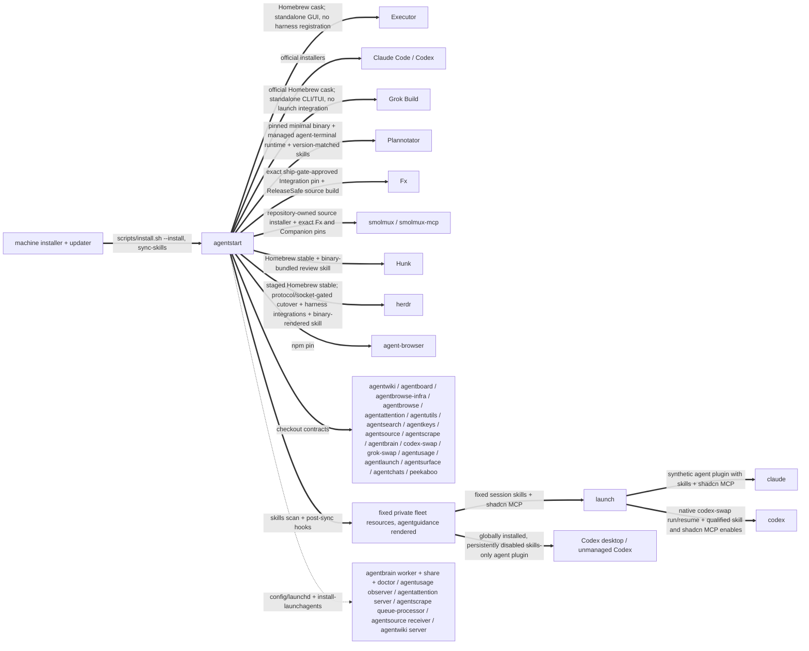
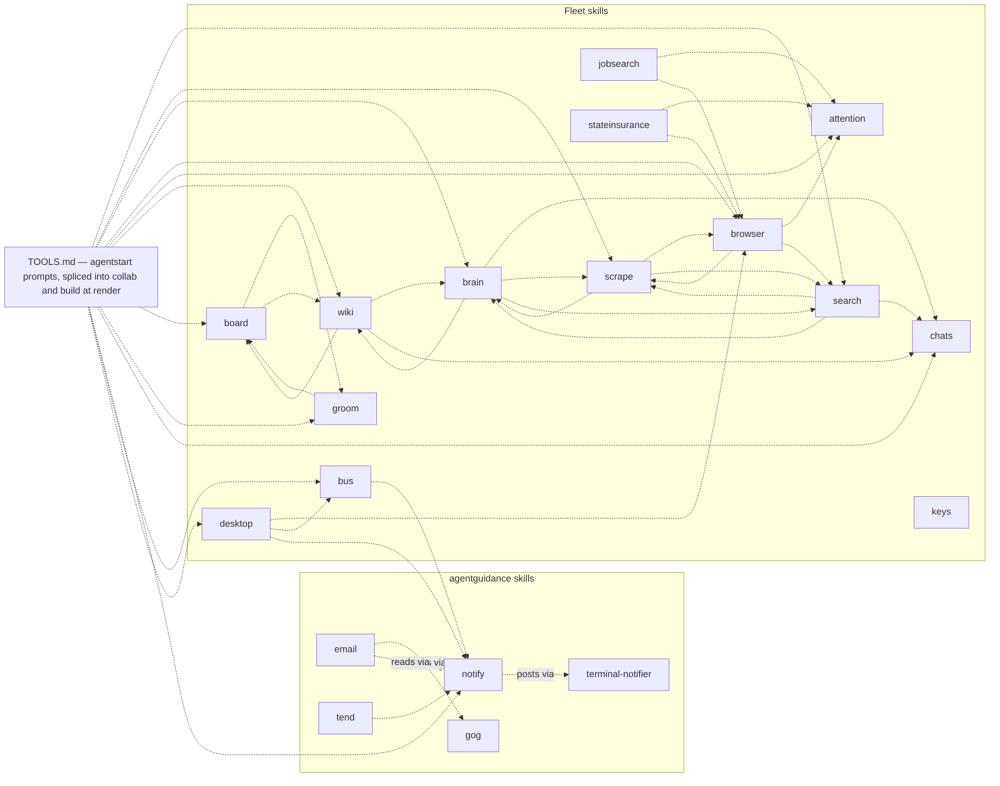

# The fleet map

Every known dependency between the agent apps in `~/code`, with evidence.
Four kinds of edge:

- **calls** (solid): a runtime request or subprocess invocation of another
  tool. Breaking the callee's request, flags, or output breaks the caller.
- **routes** (dashed): a skill deliberately handing work to another skill.
  Breaking the target skill strands the routing.
- **serves** (dotted): a launchd service running fleet code, a tool reading
  another's data on disk, or a tool loading another fleet project's supported
  library surface. Every fleet service is agentstart's; the machine's own
  reverse-DNS services are outside the fleet.
- **pins**: a binary installed at an exact version because a consumer locks
  or resolves it by contract.

## Runtime call graph

```mermaid
flowchart LR
    subgraph harnesses [Harnesses]
        claude[Claude Code]
        codex[Codex CLI]
        fx[Fx]
    end

    subgraph balancing [Launch balancing]
        launch[agentlaunch]
        usage[agentusage]
        claudeSwap[claude-swap]
        swap[codex-swap]
        grokSwap[grok-swap]
    end

    subgraph research [Research pipeline]
        brain[agentbrain]
        scrape[agentscrape]
        browser[agent-browser]
        browse[agentbrowse]
        attention[agentattention]
        jobsearch[Jobsearch]
    end

    source[agentsource]
    tend[agentguidance / tend skill]
    board[agentboard]
    wiki[agentwiki]
    chats[agentchats]
    herdr[herdr — the surface]
    herdrConfig[agentstart / herdr-config]
    surface[agentsurface]
    smolmux[smolmux / smolmux-mcp]
    collab[agentcollab]
    mux[agentmux]

    surface -->|host popup: agentlaunch --x-surface, directives back over stdout| launch
    surface -->|host popup: agentchats search, resume directives back over stdout| chats
    chats -->|conversation describe: stored slug + first-prompt excerpt per row| surface
    surface -->|x-catalog --x-json, slug completions| launch
    surface -->|plugin pane: escape-to-quit agentusage| usage
    surface -->|workspace/worktree create, agent start, tab rename, agent prompt; confirmed topology close| herdr
    herdr -.->|plugin: launch + confirmation popups; tab naming| surface
    herdrConfig -->|config check, default + named reload-config| herdr
    launch -->|balance claude/codex --json| usage
    launch -->|run --share-history| claudeSwap
    launch -->|run / resume --claim| swap
    launch -->|managed launch| claude
    launch -->|managed launch| codex
    swap --> codex
    usage -->|snapshot --json / select --json [--account]| swap
    usage -->|observe --json / select --json [--account] [--reserve-seconds]| grokSwap
    usage -->|list --json / recover| claudeSwap
    source -->|read-only agent.list + workspace.list snapshots| herdr
    tend -->|inactive-worktree safety: events.subscribe + agent list| herdr
    tend -->|optional cross-harness self-wake| surface
    brain -->|extraction and discovery| scrape
    scrape -->|stable session; drives| browser
    browser -->|default provider: launch + close over stdio| browse
    attention -.->|browser processor: agentbrowse/opentui live surface| browse
    jobsearch -->|bounded attention create| attention
    board -->|publish --kind render| wiki
    chats -.->|indexes session stores| harnesses
    harnesses -->|MCP stdio: orientation, creation, UI, and semantic Work tools| smolmux
    harnesses -->|MCP stdio: tools generated from each CLI's own agent contract| contractServers[agentboard / agentwiki / agentbrain / agentsearch / agentscrape / agentkeys / agentbrowse]
    harnesses -->|managed-session MCP stdio: component registry| shadcn[shadcn]
    smolmux -->|authenticated per-Agent Work socket: snapshot, queue, steer, interrupt, and queue edits| fx
    collab -->|sheet calls can launch Agents; Hub invokes agent_message for attached Event Messages| mux
```

## Install and service layer



## Skill routing

An edge `X -.-> Y` means X's runbook names the `Y` skill and routes work to
it. Extracted from the SKILL.md files themselves.



The TOOLS.md node is the widest fan-out in the fleet and this repository is
its origin: `agentguidance/scripts/render` splices
`prompts/agentguidance/TOOLS.md`
into the collab and build skills at their
`<!-- extension-prompt: TOOLS.md -->`
markers, so those skills route to all advertised tools without
their templates naming any of them. That is why the tool-advertisement
policy (the `tool-advertisement-policy` wiki page) governs a real graph
edge, not just prose.

`keys` references no other skill and none reference it — the standalone
shape behind the decision not to advertise it in TOOLS.md. `email` is
unadvertised on the same policy but is not standalone: it routes to
`notify`, so mail work that stalls still reaches the human.

A trap this section has already caught twice: a project's *own* `search`
subcommand (agentboard's and agentwiki's) reads exactly like a reference to
the `search` skill in a bare name-grep. Verify a routing edge from the
sentence around the match, never from the name alone.

## Edges with evidence

### calls

| Caller | Callee | What | Evidence |
| --- | --- | --- | --- |
| agentstart | Executor | installs or upgrades the official Homebrew cask so the local integration GUI is available, but performs no MCP or harness registration; connecting Claude Code, Codex, Fx, or another agent remains a later explicit operator choice | `agentstart/scripts/install.sh`; asserted by `agentstart/tests/validate.sh`; Homebrew cask `executor` |
| agentstart | Grok Build | installs or upgrades the official stable Homebrew cask, exposing the vendor's `grok` command and `agent` alias. This installs only the native CLI/TUI: AgentStart does not add Grok to AgentLaunch or Herdr, and grok-swap remains an observation/selection provider rather than a harness credential activator | `agentstart/scripts/install.sh`; asserted by `agentstart/tests/validate.sh`; Homebrew cask `grok-build` |
| agentstart | Plannotator | installs the pinned release through Plannotator's official `--minimal` path so vendor hooks and ambient skills stay absent, verifies the resulting binary, invokes that exact binary's `install-runtime agent-terminal` contract for the managed WebTUI/PTY sidecar, and copies the same tag's core skills into fixed resources. Removing or changing the runtime subcommand disables the annotate UI's embedded Agent tab even though the CLI itself still launches | `agentstart/scripts/install.sh`; asserted by `agentstart/tests/validate.sh`; runtime contract in `plannotator/packages/server/agent-terminal-runtime.ts` |
| agentstart | agentusage | `install-agent-clis` invokes the checkout's `scripts/install.sh --install`, which installs the claude-swap provider before installing the observer. It no longer writes a `codex-swap` shim, and no longer maintains the fork — both have one owner now | `agentstart/scripts/install-agent-clis`; `agentusage/scripts/install-providers.sh` |
| agentusage | cswax | `scripts/install-providers.sh` invokes `~/code/cswax/scripts/install.sh --install --published` and does nothing else about the claude-swap fork. It previously rebased, gated, and force-pushed `integration` on every unattended converge; that moved to the workshop on 2026-08-25 | `agentusage/scripts/install-providers.sh`; `cswax/MAINTAIN.md` (Consumer); asserted by `cswax/tests/validate.sh` |
| cswax | claude-swap | binds `~/src/claude-swap` to a published `fork/integration` commit and installs it with `uv tool install --force`, refusing a foreign fork remote, a dirty tree, or an unpublished commit, and reporting when integration trails upstream. `/maintain` separately composes the carry heads, gates, and publishes | `cswax/scripts/install.sh`; `cswax/MAINTAIN.md`; `cswax/scripts/reconcile-branches.sh` |
| agentstart | codex-swap | `install-agent-clis` invokes `scripts/install.sh --install`, which writes the `codex-swap` command as a source shim into the checkout and installs the exact stock codex-multi-auth npm pin | `agentstart/scripts/install-agent-clis`; `codex-swap/scripts/install.sh` |
| agentstart | grok-swap | `install-agent-clis` invokes the checkout's `scripts/install.sh --install` immediately before agentusage, so the observer's Grok provider subprocess is present before observation starts. Grok-swap owns account storage, billing observation, and selection; it does not activate the separately installed Grok Build harness, and AgentStart adds no separate service | `agentstart/scripts/install-agent-clis`; `grok-swap/scripts/install.sh`; asserted by `agentstart/tests/validate.sh` |
| agentstart | agentlaunch | `install-agent-clis` invokes `scripts/install.sh --install` after `agentusage`; `scripts/install-agentlaunch-shims` is the external shim contract for bare `claude`/`codex` | `agentstart/scripts/install-agent-clis`; `agentstart/scripts/install-agentlaunch-shims` |
| agentstart | agentsource | `install-agent-clis` invokes the checkout's hardened installer, which runs a frozen Bun install, securely creates or preserves the private webhook secret, atomically links `~/.local/bin/agentsource` to the checkout's TypeScript entrypoint, and records the deployed commit. The explicit `configure-agentsource-webhooks --apply` path discovers this node's Funnel origin and calls `agentsource webhook-configure` to reconcile signed hooks; ordinary install only runs its non-mutating, agent-oriented diagnostic | `agentstart/scripts/install-agent-clis`; `agentstart/scripts/configure-agentsource-webhooks`; `agentsource/scripts/install.sh`; `agentsource/src/cli.ts` |
| agentsource | herdr | each observation scan invokes `herdr agent list` and `herdr workspace list` exactly once, concurrently. Workspace checkout metadata associates agents first, with the agent cwd as a deterministic fallback; unavailable or malformed Herdr output degrades only agent presence and never makes the Git scan fail | `agentsource/src/herdr.ts` (`readHerdrSnapshot`, `attachAgentPresence`); `agentsource/src/git.ts` (`scanProjects`) |
| agentstart | agentutils | `install-agent-clis` invokes the checkout's hardened installer, which runs a frozen Bun install, atomically links `~/.local/bin/agentutils` to the checkout's TypeScript entrypoint, and records the deployed commit; the Editor utility lives at the required `agentutils editor` subcommand and follows the fleet's editable, rerunnable installation contract | `agentstart/scripts/install-agent-clis`; `agentutils/scripts/install.sh`; asserted by `agentstart/tests/validate.sh` and `agentutils/test/install.test.ts` |
| agentstart | agentbrowse-infra | `install-agent-clis` invokes the checkout's hardened command-only installer before Agentbrowse. It links `~/.local/bin/agentbrowse-infra` and records the deployed commit, but never enables Apple services or acquires an image | `agentstart/scripts/install-agent-clis`; `agentbrowse-infra/scripts/install.sh`; asserted by both repositories' installer tests |
| agentstart | agentbrowse | `install-agent-clis` invokes the checkout's hardened installer, which runs a frozen Bun install, atomically links `~/.local/bin/agentbrowse` to the checkout's TypeScript entrypoint, and records the deployed commit. After both Browser commands install, AgentStart links its tracked version-2 deployment config with Artbird first and an already-enabled Apple session second, then links the global agent-browser provider config | `agentstart/scripts/install-agent-clis`; `agentbrowse/scripts/install.sh`; `agentstart/scripts/agentbrowse-config`; `agentstart/config/agentbrowse/config.json`; `agentstart/scripts/agent-browser-config`; `agentstart/config/agent-browser/config.json`; asserted by both repositories' installer tests |
| agentstart | agentattention | immediately after Agentbrowse, `install-agent-clis` invokes Agentattention's hardened installer: frozen dependencies, an atomic editable command link and receipt, plus first-run mode-0600 server/local-client bootstrap. The order satisfies Agentattention's linked `agentbrowse/opentui` browser processor dependency before its resident service can be loaded | `agentstart/scripts/install-agent-clis`; `agentattention/scripts/install.sh`; asserted by both repositories' validation suites |
| agent-browser | agentbrowse | the global `browser.provider` plugin named `agentbrowse` starts the AgentStart-managed `~/.local/bin/agentbrowse provider` through `$HOME` as a short-lived process for manifest, launch, and close requests, bypassing any older same-named command earlier on `PATH`. The provider tries Artbird first and only falls through on classified availability failures to an already-enabled Apple runtime; there is no provider server or configured instance URL | `agentstart/config/agent-browser/config.json`; `agentstart/config/agentbrowse/config.json`; `agentbrowse/cli/provider.ts`; `agentbrowse/README.md` |
| Jobsearch | agentattention | `jobsearch attention create --file` validates one of the three bounded first-party payloads, invokes `agentattention --json create`, verifies the returned contract, title, and payload, then records only the producer-side continuation. The combined skill separately uses Agentattention's read/wait CLI surface to consume authoritative terminal outcomes | `jobsearch/cli/src/verbs/attention.ts` (`defaultAgentattentionRunner`, `commandFor`, `createAttentionRequest`); `jobsearch/.claude/skills/jobsearch/SKILL.md` |
| agentstart | agentlaunch / Codex | builds one fixed private resource tree, renders Claude's session-only `agent` plugin with the shadcn MCP server and Codex's globally installed strictly skills-only `agent` plugin, and persistently name-disables every qualified Codex skill. The canonical shadcn definition is also rendered for AgentLaunch's Codex session config; the full installer removes ambient shadcn plus the retired LiveKit MCP and skill while preserving unrelated MCPs. Portable skill manifests stay bare; only the disposable Codex copy qualifies default prompts. The full installer removes AgentStart-managed entries from Fx-visible ambient roots and the ownership-proven retired capability tree, while the six-hour sync remains unattended-safe | `agentstart/scripts/sync-skills`; `agentstart/scripts/render-capabilities`; `agentstart/scripts/install.sh`; `agentstart/scripts/sync-codex-skill-policy`; `agentstart/config/resources/*`; `agentstart/docs/adr/0002-render-one-private-resource-set.md` |
| agentlaunch | Claude Code / Codex | loads the one fixed resource set. Claude receives the synthetic `agent` plugin with skills and shadcn; native Codex `run`, `resume`, `exec`, and `review` name-enable every qualified `$agent:<skill>` and inject the same shadcn MCP definition through session config, remaining inside codex-swap's ordinary account pin. Utility and unmanaged harness invocations receive neither resource. AgentLaunch owns no App Server, Unix socket, remote TUI, fake provider, projection, or receipt; native Codex therefore owns linked-worktree trust and the complete session lifecycle | `agentlaunch/src/resources.ts`; `agentlaunch/src/launch.ts`; `agentlaunch/docs/adr/0030-use-fixed-resources-with-native-codex.md` |
| Claude Code / Codex | shadcn | managed model sessions start `npx shadcn@latest mcp` over stdio from AgentStart's fixed resource definition. Claude discovers it through the session-only plugin; AgentLaunch translates the same definition into Codex session overrides. Naked harnesses have no shadcn registration, and LiveKit is not part of the fixed set | `agentstart/config/resources/mcp-servers.json`; `agentstart/scripts/render-capabilities`; `agentlaunch/src/resources.ts`; asserted by both repositories' resource tests |
| agentstart | fxnk | invokes `~/code/fxnk/scripts/install.sh --install --sha <pin>` as the required Fx harness installation contract. The tracked Fx Integration consumer pin is an exact commit already approved by fxnk's Local development gate and ship gate; ordinary AgentStart convergence reuses it and never promotes a moving remote tip | `agentstart/scripts/install.sh`, asserted by `agentstart/tests/validate.sh`; `fxnk/scripts/install.sh`; `fxnk/MAINTAIN.md` (Consumer) |
| fxnk | Fx | binds `~/src/fx` to published `fork/integration`, builds ReleaseSafe, atomically installs `~/.local/bin/fx`, and disables the independent auto-upgrader. AgentStart reuses those exact bytes as smolmux's separate development `smolmux-fx`, without another compilation. Fx's repo-local `/maintain` skill separately rebases, gates, and publishes integration | `fxnk/scripts/install.sh`; `agentstart/scripts/install.sh`; `fxnk/skills/maintain/SKILL.md`; receipt at `~/.local/state/fxnk/fx-built-commit` |
| agentstart | smolmux | proves Smolmux's Fx pin equals AgentStart's ship-gate-approved Integration pin, then delegates the entire consumer installation to Smolmux's repository-owned `scripts/install.sh`: the editable `smolmux` and `smolmux-mcp` Bun commands, a distinct `smolmux-fx` copied from fxnk's exact already-gated source build, the exact source-built `smolmux-zmx` Companion pin, and `smolmux doctor`. AgentStart then links the tracked operator config into `~/.config/smolmux/config.toml`; smolmux's key schema stays a strict subset of Herdr's and uses the same `ctrl+space` prefix. Smolmux publishes no binaries; its four-platform hosted CI is post-push observability, while only its current-Mac local gate blocks merging. | `agentstart/scripts/install.sh` (smolmux block); `smolmux/scripts/install.sh`; `smolmux/scripts/local-gate.sh`; `smolmux/scripts/install-companion.sh`; `smolmux/.github/workflows/ci.yml`; `agentstart/config/smolmux/config.toml`; `agentstart/scripts/smolmux-config`; asserted by `agentstart/tests/validate.sh` and `agentstart/tests/smolmux-config.sh` |
| Claude Code / Codex / Fx | smolmux | an MCP host starts `smolmux-mcp` over stdio for the complete eleven-tool agent automation surface. The server resolves the caller's Home and Agent identity for each request, reaches the live Runtime through one private request/response connection, and exposes no CLI control command, Runtime event stream, prompt-paste path, or wait tool | `smolmux/src/mcp.ts`; `smolmux/src/mcp-server.ts`; `smolmux/src/runtime-client.ts`; `smolmux/docs/agent-integration.md`; `smolmux/docs/runtime-bridge.md` |
| Claude Code / Codex / Fx | agentboard / agentwiki / agentbrain / agentsearch / agentscrape / agentkeys / agentbrowse | an MCP host starts `<cli> mcp` over stdio and receives tools GENERATED from that CLI's own agent contract — never a hand-written tool list, so a command added to the contract becomes a tool with no further edit. Each server runs inside the CLI process and dispatches through its own command table: no subprocess, no argv round trip. Only `audience: agent` leaves are exposed, which makes the CLI's owner — not the consumer — the one who decides what an agent may call. The mapping is fixed once in `agentstart/config/agent-contract/MCP.md` rather than invented seven times | `agentstart/config/agent-contract/MCP.md`; `agentboard/src/mcp-tools.ts` (the reference the other six copy); each repository's `src/mcp.ts`, `src/mcp-server.ts`, `src/mcp-tools.ts` and its stdio handshake test |
| agentcollab | agentmux | the Sheet spec language names `mcp__agentmux__agent_launch_claude` as its direct-call example, so a generated Sheet can launch an Agent without another reasoning turn. When `collab_attach` names an Agent, the Sheet sends each matching human Event through its Hub as one visible-CC `mcp__agentmux__agent_message` call with `{ names: [agent], message }`; delivery succeeds only after the Hub decodes the MCP result and observes `results[0].ok === true`, otherwise the Event stays pending in `collab_events`. Renaming either tool, changing the Message argument shape, or removing the per-recipient result breaks this integration while the MCP notification stream remains independent | `agentcollab/src/prompt.ts` (`mcp__agentmux__agent_launch_claude` call example); `agentcollab/src/server.ts` (`DEFAULT_MESSAGE_TOOL`, `detectMessaging`, `Collab.sendEvent`); behavioral coverage in `agentcollab/test/server.test.ts`; callee contracts in `agentmux/src/protocol.ts` (`agent.launch_claude`, `agent.message`) |
| agentstart | every `agent*` CLI | owns `config/agent-contract/schema.json`, the one machine-readable self-description each CLI publishes as `<cli> guide --json`, and `scripts/validate-agent-contract.ts`, which EXECUTES that schema rather than restating it. `--agent-help`, `--agent-teaser`, and `--help` are renders of the contract, not second authorships beside it; thirteen of sixteen CLIs go further and derive their argument parser from it, so a declared flag and an accepted flag cannot disagree. Each repository owns its own conformance test and resolves the validator through AgentStart's checkout | `agentstart/config/agent-contract/{schema.json,README.md,MCP.md,example.json}`; `agentstart/scripts/validate-agent-contract.ts`; `agentstart/scripts/json-schema-subset.ts`; asserted by `agentstart/tests/agent-contract.test.ts` and each repository's own contract test |
| smolmux | Fx | every semantic Work read or mutation crosses Fx's authenticated per-Agent Unix socket: snapshot, queue, steer, interrupt, update, delete, and resume. Smolmux mints and persists the endpoint identity and token when it creates the Agent; Fx owns native admission order and the authoritative post-operation snapshot. Agents predating this binding deliberately cannot acquire it retroactively | `smolmux/src/fx-environment.ts`; `smolmux/src/fx-work-control.ts`; `smolmux/src/agent-manifest.ts`; `fx/src/core/control/work_control.zig`; `fx/src/core/app/app_work_control_runtime.zig` |
| agentstart | Hunk | installs or upgrades the Homebrew formula, resolves the version-matched `hunk-review` skill through `hunk skill path hunk-review`, and copies that bundled skill into the fixed resources. It deliberately never installs the skill from GitHub head, which could teach a newer session API than the local binary accepts | `agentstart/scripts/install.sh` (`install_hunk_skill`), asserted by `agentstart/tests/validate.sh`; `hunk/src/core/run/paths.ts` (`resolveBundledSkillPath`) |
| agentsurface plugin | agentusage | the shared Herdr plugin's `usage` pane entrypoint runs `escape-to-quit agentusage` in a titled 80% popup. AgentStart's `prefix+u` binding opens the entrypoint instead of duplicating an untitled generic popup | `agentsurface/plugin/herdr-plugin.toml`; `agentstart/config/herdr/config.toml` |
| agentlaunch | agentusage | `agentusage balance claude\|codex --json` chooses a balanced account. Real Codex launches add `--claim`; dry runs do not reserve capacity | `agentlaunch/src/balance.ts` (`balanceClaude`, `balanceCodexFamily`) |
| agentlaunch | claude-swap | wraps balanced Claude launches as `cswap run <slot> --share-history -- <native argv>` | `agentlaunch/src/balance.ts` (`balanceClaude`); `agentlaunch/docs/adr/0003-balanced-launches-compose-a-prefix.md` |
| agentlaunch | codex-swap | wraps native Codex opens as `codex-swap run` and native resumes as `codex-swap resume <id>`, with `--claim <lease>` for real launches and `--account <key>` for dry runs or explicit pins. AgentLaunch adds only native harness arguments and session-scoped resource policy; codex-swap owns account selection and lease lifetime without changing the harness process shape | `agentlaunch/src/balance.ts` (`balanceCodexFamily`, `composeCodexFamily`); `agentlaunch/src/launch.ts`; `agentlaunch/docs/adr/0030-use-fixed-resources-with-native-codex.md` |
| agentlaunch | claude / codex | launches the resolved native harness and sets `AGENTLAUNCH_LAUNCH=1`; AgentStart's bare-command shims route to `agentlaunch --x-harness <harness>` and use that sentinel to exec the real binary on descendant launches | `agentlaunch/src/launch.ts`; `agentstart/scripts/install-agentlaunch-shims`; `agentlaunch/docs/adr/0004-shims-route-bare-calls-the-sentinel-breaks-recursion.md` |
| codex-swap | codex-multi-auth | exact npm pin, currently 2.10.0. Codex-swap invokes the package-local forced-account wrapper for native Codex runs and resumes. The installer no longer binds the fleet to the patched fork; 2.10.0 carries upstream pinned-retry fixes #682/#683, including the pin-specific pool-token bypass | `codex-swap/package.json`; `codex-swap/src/ndy/bin-resolver.ts`; `codex-swap/scripts/install.sh`; codex-multi-auth PRs #682/#683 |
| agentusage | claude-swap | `cswap list --json` observes Claude accounts; `cswap recover <slot> --json` repairs due expired tokens; its installer converges the public fork's `main` | `agentusage/src/claude/observe.ts:235`; `src/daemon.ts:78`; `scripts/install-providers.sh` |
| agentusage | codex-swap | `codex-swap snapshot --json` observes Codex accounts with paced polling; `codex-swap select --json [--account <focused-key>] [--claim]` performs ordinary or focus-pinned main-lane selection, with the provider retaining eligibility and atomic lease ownership | `agentusage/src/codex/observe.ts` (`observeCodex`); `agentusage/src/daemon.ts`; `agentusage/src/balance/codex.ts` (`delegateCodexSelect`) |
| agentusage | grok-swap | `grok-swap observe --json` observes every managed xAI account and `grok-swap select --json [--account <focused-key>] [--reserve-seconds <seconds>]` performs ordinary or focus-pinned selection. Agentusage renders the returned billing facts and delegates eligibility, scoring, and reservation ownership to the provider; it never reads Grok credentials itself | `agentusage/src/grok/observe.ts` (`observeGrok`); `agentusage/src/daemon.ts`; `agentusage/src/balance/grok.ts` (`delegateGrokSelect`) |
| agentguidance `tend` skill | herdr, agentsurface | its read-only watcher subscribes to pane and workspace lifecycle events over Herdr's Unix-socket NDJSON API, queries `herdr agent list` once per survey, and treats every live agent status as ownership that blocks a proposal. Git independently supplies linked-worktree and local-main ancestry state. Optional cross-harness self-wake travels through `agentsurface message`; the woken agent routes human notification through `notify`. Tend emits only removal, catch-up, or inspection minisketches and contains no integration, rebase, removal, branch deletion, or push helper | `agentguidance/skills/tend/SKILL.md`; `agentguidance/skills/tend/scripts/watch.ts`; behavioral coverage in `agentguidance/tests/tend.test.ts` |
| agentstart | herdr | installs or upgrades the official stable Homebrew formula, then runs `herdr integration install claude\|codex`, links agentsurface's launcher-pane and tab-naming plugin directory with `herdr plugin link`, and renders the version-matched surface skill from `herdr --skill` into the fixed resources. The full installer narrowly removes the retired AgentStart source binary and build state only when its receipt proves ownership; `~/src/herdr` remains research material and has no scheduled update edge | `agentstart/scripts/install.sh` (`install_or_upgrade_formula herdr`, legacy cleanup, `install_herdr_integrations`, `install_herdr_skill`); asserted by `agentstart/tests/validate.sh` |
| agentstart (`herdr-config`) | herdr | validates every rendered candidate through `HERDR_CONFIG_PATH=<temp> herdr config check`, atomically replaces the managed live config, then reloads the default server and every reachable named session; an unavailable server is nonfatal because its next start reads the validated file | `agentstart/scripts/herdr-config` (`render_candidate`, `reload_live_servers`) |
| agentbrain | agentscrape | evidence pipeline in four argv shapes — `fetch-markdown --markdown`, `fetch-markdown --envelope --allow-private-network --max-content-bytes`, `discover-feed`, `fetch-links --preset x-timeline --limit --max-scrolls` — plus a doctor check; a flag change breaks each shape separately | `agentbrain/src/agentscrape.ts:642,1298-1306,2038,2121-2129`, `src/jobs.ts:736` |
| agentscrape | agent-browser → agentbrowse | resolves `~/.local/bin/agent-browser` first, then PATH, and passes an explicit stable `--session` name without creating, authenticating, or closing it. With the configured Agentbrowse provider that name maps to a durable Browser profile: cookies and storage survive target replacement, so authentication established through the fleet `browser` + `attention` workflow is available to the deliberate Agentscrape call without an origin registry or conduit | `agentscrape/src/browser.ts` (`resolveBrowser`, `runAgentBrowser`); `agentscrape/skills/scrape/SKILL.md:206-229`; `agentstart/config/agent-browser/config.json`; `agentbrowse/cli/provider.ts` |
| agentboard | agentwiki | `agentwiki publish <file> --name agentboard --kind render --json` | `agentboard/src/cli.ts:834-843` |
| agentsurface | agentlaunch | the plugin's `launch` pane runs `agentsurface host -- agentlaunch --x-surface`: the host spawns agentlaunch's interactive form on the popup terminal in the focused pane's cwd with stdout piped — the form renders on stderr and writes session directives to stdout, the whole interface, per the `surface-handoff-protocol` wiki contract and `agentsurface/directive.schema.json`. Realizing a directive rides agentlaunch again through the shim herdr types: the directive's `--x-level` args pass through untouched, and the executor appends `--x-prompt-file <spool path>` for the intent (agentlaunch ADR 0029), because herdr refuses control characters in a shell-typed argument. Separately, `agentlaunch x-catalog --x-json` before slug inference reads each harness's `metadata_level`, and `conversation slug` runs `agentlaunch --x-harness <h> --x-level <metadata_level>` with native non-interactive tokens in the fixed `/tmp/agentsurface/inference` cwd — agentlaunch by name, not the bare shim, because a session's `AGENTLAUNCH_LAUNCH` sentinel would exec the native binary and drop the level | `agentsurface/plugin/herdr-plugin.toml`; `agentsurface/src/host.ts` (`runHost`); `agentsurface/src/directive.ts` (`executeDirective`, `writeIntentFile`); `agentlaunch/src/surface/directive.ts`; `agentsurface/src/catalog.ts` (`loadLaunchCatalog`); `agentsurface/src/conversation/infer.ts` (`composeInference`) |
| agentsurface | herdr | drives the socket API through the CLI (`HERDR_BIN_PATH`, then PATH), split across the host (`workspace list` probe, `pane get` for the opened-over cwd) and the detached `execute-directive` executor it spawns per stdout directive line so the popup closes with the hosted tool: `pane list`/`workspace list` to find a workspace already hosting the project, then `tab create` into it or `workspace create`/`worktree create` (each `--focus`/`--no-focus` by the directive, plus `workspace focus` for a cross-workspace jump), `agent list`, `agent start <opaque-a-token> --kind <harness> --pane <root-pane> -- --x-level <model>:<effort> [--x-prompt-file <state intents/ spool file>]` with the pane-busy ready retry and an `agent_name_taken` re-derive, and `notification show` for failures with no terminal. The intent travels as a spool-file reference, never literal text — herdr types the command into the pane's shell and rejects control characters (`invalid_agent_argument`), so a multi-line intent can only cross as a path; the executor prunes the spool by age. The bare harness command herdr runs is agentstart's shim, so the shim → agentlaunch edge carries balancing, yolo, and the prompt-file expansion; `agent_not_ready` (blocked on a startup dialog) is a soft outcome because the expanded intent rides the native argv and the harness submits it once the dialog clears. The plugin hook uses `pane get` + `workspace get`, plus `worktree list` for the checkout's branch, then `pane report-metadata` to publish the Agent sidebar's contiguous `$project` label on every detection; afterward it polls `pane get` for `agent_session`/`tab_id` and runs `tab rename <tab_id> <slug>`. The message bus (`agentsurface agents` / `message`) adds `agent list` + `tab list` (agents named by their tabs' labels), `pane get` for the sender's own identity from `HERDR_PANE_ID`, and `agent prompt <pane> <prefixed text>` — herdr delivering an agent-to-agent message as typed input (paste + Enter), so a working target's harness queues it and a blocked target rejects it. The generic `agentsurface confirm` boundary adds only exact argv execution after an explicit terminal decision; its three plugin pane entrypoints capture Herdr context, and the internal `close-active` bridge maps only `pane`, `tab`, or `workspace` to the context's id before calling the corresponding public `close` command, leaving every topology rule in Herdr | `agentsurface/src/herdr.ts`, `agentsurface/src/host.ts`, `agentsurface/src/directive.ts`, `agentsurface/src/tab-namer.ts`, `agentsurface/src/bus.ts`, `agentsurface/src/confirm.ts`, `agentsurface/src/close.ts`, `agentsurface/plugin/herdr-plugin.toml`; `agentstart/config/herdr/config.toml` |

### serves / data

| From | To | What | Evidence |
| --- | --- | --- | --- |
| agentstart | agentattention, agentbrain, agentscrape, agentsource, agentusage, agentwiki | installs their commands too, and owns these fleet launch agents outright: agentattention server, agentbrain worker/share/doctor, agentusage observer, agentscrape queue processor, agentsource webhook receiver, and agentwiki server. Labels name noun roles while the manifest records resident, periodic, or queue-triggered lifecycle; every plist enters through the tool's one public binary. The receiver plist names only the private secret's path, never its value. Templates, manifest, rendering, label replacement, and load live here so a service never has two owners racing to render it | `agentstart/config/launchd/*.plist`, `agentstart/scripts/install-launchagents`, asserted by `agentstart/tests/validate.sh` |
| agentattention | agentbrowse | the first-party browser-interaction processor loads Agentbrowse's supported `agentbrowse/opentui` package surface, discovers the attention item's exact Browser target name, embeds `LiveViewRenderable`, and requests/releases control around the human interaction. It never modifies or imports the pinned external agent-browser project | `agentattention/package.json`; `agentattention/src/tui/processors/browser.ts`; `agentbrowse/package.json` (`./opentui` export); `agentbrowse/src/opentui/core.ts` |
| machine installer + updater | agentstart | the only inbound edges from outside the fleet: the installer calls `scripts/install.sh --install` and nothing else about the fleet, because agentstart installs every fleet command and every fleet service and discovers the tailnet bind address itself; the machine's scheduled updater calls only `scripts/sync-skills` by path — unattended convergence refreshes fixed resources but deliberately does not upgrade Herdr while a resident server may still run older protocol bytes | `agentstart/scripts/install.sh` (the documented external interface), `agentstart/scripts/install-agent-clis`, `agentstart/scripts/install-launchagents`, `funk/libexec/funk-update` |
| agentboard | agentwiki | stored data, distinct from the publish call: board items hold agentwiki slugs (`link <ref> --wiki <slug>` / `unlink`), so changing wiki's slug scheme breaks stored links even where publishing never runs | `agentboard/skills/board/SKILL.md:228-232`, reciprocated `agentwiki/skills/wiki/SKILL.md:133-134` |
| agentchats | Claude Code, Codex | owns its session index end to end, with no third-party indexer left in the fleet: readers for the two local transcript stores (`~/.claude/projects/<slug>/<uuid>.jsonl`, `~/.codex/sessions/.../rollout-<stamp>-<uuid>.jsonl`), an incremental ingest, and one SQLite + FTS5 database at `~/.local/state/agentchats/index.db`. The index is derived state — a pruned transcript leaves search, and the whole database rebuilds from the stores with `agentchats index` — so nothing downstream may treat it as authoritative | `agentchats/src/parse/claude.ts:3`; `agentchats/src/parse/codex.ts:2`; `agentchats/src/store/ingest.ts`; `agentchats/src/store/schema.ts:63`; `agentchats/src/store/paths.ts:50`; `agentchats/src/cli/main.ts:427-436`; `agentchats/scripts/install.sh` |
| agentsurface | agentchats | the plugin's `chats` pane runs `agentsurface host -- agentchats search`: the resume picker renders on stderr in the popup, live-queries the local index, and writes one resume session directive to stdout per pick, per the `surface-handoff-protocol` contract. The directive carries `session_id`, the executor's dedupe key: a session already live on the surface is focused (workspace + tab), never resumed a second time. A pick that cannot resume faithfully exits nonzero with the reason, which the host holds on screen | `agentsurface/plugin/herdr-plugin.toml:33-38`; `agentchats/src/tui/app.ts:84` (`runSearch`); `agentchats/src/tui/directive.ts:35-49` (`buildResumeDirective`); `agentsurface/src/directive.ts:65-78` (`startSession`, the `session_id` branch) |
| agentchats | agentsurface | the picker enriches its rows through `agentsurface conversation describe` — the read-only naming surface: JSON lines of {harness, path} in, {path, slug, excerpt} lines out, one subprocess per listing refresh. Slugs come from agentsurface's slug store (written whenever `conversation slug` pays for inference — the tab namer's path); excerpts are first-prompt extraction from the transcript head. A machine without agentsurface, or a failing call, enriches nothing and the rows keep their indexed titles | `agentchats/src/tui/describe.ts:4-11`; `agentsurface/src/conversation/describe.ts:52-87`; `agentsurface/src/conversation/store.ts` |
| agentchats | agentlaunch | a resume directive's `agent.args` are `["--x-resume", <native-session-id>]` — agentlaunch's flag spelling of `x-resume`, added for exactly this path because herdr types only the bare kind command (the shim) plus arguments. The session-id derivation in the picker mirrors agentlaunch's store layouts | `agentchats/src/tui/directive.ts:44` (`buildResumeDirective`); `agentchats/src/tui/resume.ts:37-42` (`deriveSessionId`); `agentlaunch/src/main.ts:202-206` (the `--x-resume` reroute) |
| peekaboo (agentdesk) | the macOS GUI | sessions see and drive the Mac's screen and native apps through the `desktop` skill; peekaboo itself is upstream software installed from the official `steipete/tap` formula by agentdesk's contract, gated on the capability serving — TCC grants (Screen Recording, Accessibility — the human's act) verified and a `--no-remote` screen capture delivered. Its daemon is on-demand; no fleet service supervises it | `agentdesk/scripts/install.sh`; `agentdesk/skills/desktop/SKILL.md` |
| agentkeys | stowed machine configs | audits the interception chain across Karabiner/skhd/Ghostty/tmux/Neovim — files the machine layer stows | `agentkeys` skill description; the machine's stow packages |
| agentboard, agentchats | each other's CLIs | the shared "agent* state dump" bearings convention: one cross-tool contract for workspace-scoped bearings, with a common ~4-chars-per-token `--budget` and silence as the all-clear | `agentchats/bin/agentchats:19-24`, `agentboard/src/brief.ts:140,151-158`, `agentboard/src/contract.ts:576-581` |
| agentstart statusline | claude-swap | the Claude renderer names the balanced account by reading `CLAUDE_CONFIG_DIR`, whose basename claude-swap spells `<n>-<slugified-email>`; renaming that profile directory silently drops the account segment. Codex has no counterpart because codex-swap pins an account by swapping auth in place and exports nothing naming it | `agentstart/config/statusline/claude-statusline.sh` (balanced-account segment); `claude-swap/src/claude_swap/session.py:161-167` |
| agentstart | herdr, agentsurface, agentusage | owns Herdr's live `config.toml` as a render of its tracked behavior config, which carries no palette: Herdr's `terminal` theme follows the terminal. The behavior opens AgentSurface's titled `launch` plugin pane on `prefix+l` from the active pane's cwd and the plugin's titled `usage` pane on `prefix+u`; Funk retains only the machine-owned `agent-mem.sh` referenced by the config. It also replaces Herdr's immediate `prefix+x`, `prefix+shift+x`, and `prefix+shift+d` close actions with the AgentSurface plugin's named confirmation panes; Herdr captures the active topology ids in popup context when each entrypoint opens | `agentstart/config/herdr/config.toml`; `agentstart/scripts/herdr-config`; `agentsurface/plugin/herdr-plugin.toml`; `funk/herdr/.config/herdr/agent-mem.sh` |
| herdr | agentsurface, agentusage | the linked `agentsurface` plugin (registered by agentstart's installer via `herdr plugin link`, manifest in `agentsurface/plugin/`) exposes `agentsurface host -- agentlaunch --x-surface` as the titled 80% session-modal `launch` popup, `agentsurface host -- agentchats search` as the titled 80% `chats` resume-picker popup, `escape-to-quit agentusage` as the titled 80% `usage` popup, and three compact `agentsurface confirm` panes for pane/tab/workspace closure. It runs `agentsurface name-tab` on every `pane.agent_detected` and `pane.agent_status_changed`. The launch (`prefix+l`) and chats (`prefix+h`) bindings pass the active pane's cwd to their popups; opening each close popup captures the active pane, tab, and workspace in `HERDR_PLUGIN_CONTEXT_JSON`, and session-modal input keeps the target stable while the dialog is open. The hook receives the event as `HERDR_PLUGIN_EVENT_JSON`, publishes the `$project` sidebar token on detection (root repository, branch badge, and checked-out branch, for a linked worktree and the repository's own checkout alike), keeps its state under `HERDR_PLUGIN_STATE_DIR`, and names the pane's tab after its conversation once per tab — each hook run one bounded attempt, re-armed by the next status transition when a stalled start (a trust dialog) outlives it | `agentsurface/plugin/herdr-plugin.toml`; `agentstart/config/herdr/config.toml`; `agentstart/scripts/install.sh` (`install_herdr_plugins`) |

### pins

| Binary | Version | Why | Evidence |
| --- | --- | --- | --- |
| Grok Build | official stable Homebrew cask | Homebrew verifies the signed release artifact and gives the native CLI/TUI one managed update path. The installation deliberately stops before AgentLaunch, Herdr, or grok-swap credential activation | `agentstart/scripts/install.sh`; Homebrew cask `grok-build`; asserted by `agentstart/tests/validate.sh` |
| Plannotator | 0.27.9 | the CLI, its `install-runtime agent-terminal` contract, and its core skills move as one pinned release. AgentStart deliberately uses the minimal vendor install to avoid ambient harness integrations, then restores the separately managed runtime through the verified binary | `agentstart/scripts/install.sh` (`plannotator_version` and runtime invocation); `agentstart/tests/validate.sh` |
| agent-browser | 0.33.2 | one pin, two contracts: Agentbrowse implements its provider protocol and its `browser` skill defers command syntax to this build's version-matched guide; Agentscrape resolves the `~/.local/bin/agent-browser` link before PATH and passes stable session names through that provider. An upgrade verifies both consumers | `agentstart/scripts/install.sh` (`agent_browser_version`); `agentbrowse/cli/provider.ts`; `agentbrowse/skills/browser/SKILL.md`; `agentscrape/src/browser.ts` (`resolveBrowser`, `runAgentBrowser`) |
| @native-sdk/cli | 0.7 line | the native-sdk skill documents 0.7 and its agent helpers are version-matched | `agentstart/scripts/install.sh` (`native_sdk_version`) |
| zig | Brewfile-tracked, duplicated in the installer | Native SDK packaging builds against it | `agentstart/scripts/install.sh` |
| zig@0.15 | 0.15 line, keg-only | Terminal Control's libghostty-vt source build requires the older line beside current Zig | `agentstart/scripts/install.sh` |
| Fx | `2768915148c927e0fd87cb87c3cf0001af719a39` on published `fork/integration` | AgentStart tracks the exact Fx Integration consumer pin approved by fxnk's Local development gate and ship gate; fxnk builds only that SHA, binds the checkout, and disables the binary's independent auto-updater. The editable smolmux install requires the same pin and receives a byte-identical `smolmux-fx` copy | `agentstart/scripts/install.sh` (`fx_integration_sha`); `fxnk/MAINTAIN.md` (Gate and Consumer); `fxnk/scripts/install.sh`; receipt at `~/.local/state/fxnk/fx-built-commit` |
| herdr | official stable Homebrew formula, fleet protocol 21 minimum | AgentStart installs or upgrades the formula only while every default/named server socket is proved inactive; otherwise it preserves the installed client bytes. Before cutover it also preserves the compatible source-built client and its build evidence while stable is too old or explicit `AGENTSTART_HERDR_ALLOW_CUTOVER=1` authorization is absent. Only that deliberately authorized inactive run performs the receipt-proved cleanup. Once no legacy binary or evidence remains, ordinary convergence recognizes Homebrew as authoritative, while subsequent formula upgrades require the same explicit inactive-run authorization; a clean machine with neither legacy state nor a formula installs stable normally | `agentstart/scripts/install.sh`; `agentstart/scripts/select-herdr-runtime`; behavioral coverage in `agentstart/tests/herdr-homebrew-cutover.sh` |

The managed claude-swap fork rebases its **`integration` branch** onto upstream on every
install — every patch we carry, merged, and the only ref the installer builds
and binds — gated by that project's own CI steps and published with
`--force-with-lease` only after the gate passes. A failed rebase or gate keeps
the previously bound build bound, publishes nothing, and notifies. The fleet
repo owns its own hardened installer rather than sharing a common helper, which
would invert that ownership. A patch also offered upstream lives on its own
branch and is **not** moved by this — refreshing an open PR is a separate
operation against a different audience. Whether a fork is wired at all is a
declared constant in the owning installer, so retiring it is an edit and a
rerun; a binding hand-written into the installed shim is unwired by the next
install, which is how the codex-multi-auth one was lost once. The Fx and
zmx and claude-swap forks are owned by workshop repositories (`fxnk`, `zmax`,
`cswax`) instead of an installer: each workshop's `MAINTAIN.md` is that fork's
contract, the shared `maintain` skill (agentguidance) is the cycle, and the
workshop's consumer step binds the result — fxnk's installer, zmax's move of
smolmux's Companion pin, cswax's `uv tool install`. The `fork-rebase-policy` wiki
page is the overview of the arrangement.

| Fork | Integration branch | Owner | Gate |
| --- | --- | --- | --- |
| `~/src/claude-swap` | `integration` | `cswax` via `/maintain` and `scripts/install.sh --install`, called by `agentusage/scripts/install-providers.sh` | all three of upstream's CI jobs (Ubuntu, macOS, macOS keychain contract), plus the fork's CI green on the exact candidate |
| `~/src/fx` | `integration` | `fxnk` via `/maintain` and `scripts/install.sh --install --sha` | fxnk's exact-SHA Local development gate and ship gate |
| `~/src/zmx` | `integration` | `zmax` via `/maintain` and `scripts/pin-companion.sh` (→ `smolmux/companion.json`) | `zig fmt --check`, `zig build test`, bats, a `-Dcompanion` ReleaseFast build, smolmux's suite against it |

Codex-swap no longer binds `~/src/codex-multi-auth`: it uses the exact stock
npm pin. Open upstream PRs #664 and #665 address helper cleanup for the retired
per-TUI app-server topology and are no longer needed by this fleet.

### routes (skill → skill)

| From | Routes to | Notable natures |
| --- | --- | --- |
| board | groom, wiki | bulk reshaping is groom's; renders publish through wiki (see the calls edge). Board's `search` is its own subcommand, not the search skill |
| groom | board | one item is board; several at once is groom |
| brain | chats, scrape, search, wiki | checked before any web search — search is paid per call; ingestion is scrape-fed. Brain also has an own-`search` subcommand; the skill edge is genuine independently (`agentbrain/skills/brain/SKILL.md:32,172-173,382,415`) |
| scrape | brain, browser, search | scrape wants a URL in hand; finding URLs is search; interaction is browser |
| search | brain, chats, scrape | check brain first — the answer is often already local |
| browser | attention, scrape, search | human-only interaction with the prepared live target is attention; fetching public content is scrape; finding pages is search (`agentbrowse/skills/browser/SKILL.md`) |
| jobsearch | attention, browser | the combined work-round skill loads attention for every human handoff and browser before interactive pages; its producer workflow hands only exact live Browser targets to Agentattention (`jobsearch/.claude/skills/jobsearch/SKILL.md`; `jobsearch/.claude/skills/references/attention-workflow.md`) |
| stateinsurance | attention, browser | the project work-round skill routes bounded questions, document approvals, and exact-target MyMaineConnection interaction to attention while browser owns the stable `mainecare` session, persistent profile, and live-target handoff (`stateinsurance/.claude/skills/stateinsurance/SKILL.md`; `stateinsurance/AGENTS.md`) |
| desktop | browser, bus, notify | anything inside a web page is browser's; a peer agent's pane is messaged over bus, never clicked; an input takeover is announced through notify (`agentdesk/skills/desktop/SKILL.md`) |
| wiki | board, brain, chats | the durable home the others cite into. Wiki's `search` is its own subcommand, not the search skill |
| GUIDELINES.md / TOOLS.md (this repo) | search, scrape, brain, browser, attention, desktop, terminal-control, wiki, board, groom, chats, notify, bus | spliced into collab and build at render — TOOLS advertises the routes, while GUIDELINES also requires terminal-control instead of raw shell backgrounding for PTY work |
| bus | notify | a blocked bus target is waiting on the operator, so a message that matters escalates to a human notification instead of more retries (`agentsurface/skills/bus/SKILL.md`) |
| email (agentguidance) | notify | a lapsed credential or consent screen needs the human, who is not reading the transcript — the stall is announced, not waited in (`agentguidance/skills/email/SKILL.md`) |

## Checked and absent

Edges that were looked for and do not exist — recorded so the next audit
does not re-suspect them:

- agentbrain → agentsearch: no reference anywhere in `agentbrain/src`;
  ingestion is purely scrape-fed (checked 2026-08-09).
- active fleet → Agentweb: no runtime, service, checkout-install, skill-routing,
  or pinned-binary edge remains after the Agentscrape migration. Remaining
  mentions are the one-time ownership-guarded retirement path and dated
  historical update notes (checked 2026-08-29).

Last verified: 2026-08-09, twice — an initial first-hand sweep, then an
independent second sweep that removed two false routing edges (own-`search`
subcommands), added the conduit and TOOLS.md edges, and re-confirmed both
absences above. Updated 2026-08-12 for the de-Orca topology: AgentLaunch owns
bare harness launch balancing, AgentStart retires AgentBus launch agents and
adapters, and TOOLS.md no longer advertises the retired bus skill. Updated
again 2026-08-12 for the orchestrator doctrine unification: the new
agentguidance orchestrate skill wields collab and build through shared
fragments. Updated again 2026-08-12 for the fleet service
taxonomy: noun-role labels, explicit lifecycle metadata, and one public binary
per tool replace daemon/command-shaped labels and separate `*d` executables.
Updated 2026-08-15 for the surface abstraction: herdr (external,
homebrew-core) becomes the orchestrator doctrine's reference launch surface —
AgentStart renders its shipped skill from the binary, and the orchestrate
doctrine binds it by name. The `land-vs-place` and new launch-surface wiki
pages carry the ruling. Updated 2026-08-16 for the first AgentSurface
integration: `agentsurface launch` composes herdr (workspace/worktree
create, agent start) with agentlaunch's new read-only `x-catalog`, and the
managed herdr config gains the `prefix+l` popup binding. Updated again
2026-08-16 for the second integration: `agentsurface conversation slug`
runs metadata completions through `agentlaunch --x-level <metadata_level>`
(the catalog's new per-harness cheap pair), the agentsurface herdr plugin
names tabs from `pane.agent_detected` hooks, agentstart links that plugin
and adopts the agentsurface checkout contract, and the retired-integration
cleanup stops treating the reborn `agentsurface` command link as retired.
Updated again 2026-08-16 for AgentStart's Herdr config ownership: AgentStart
replaces Funk as the live Herdr config owner, and its helper validates and
live-reloads the generated config. Updated again 2026-08-16 to make the
existing AgentSurface plugin own the launcher's title and popup geometry, with
the managed keybinding opening that pane entrypoint from the active pane's cwd.
Updated 2026-08-19: the theme manager is gone. Tinty, its Herdr templates, its
Homebrew tap and formula, and the generated Ghostty theme were all removed, and
`herdr-tinty` became `herdr-config` — a plain render of the tracked behavior
config. Ghostty runs its built-in default colors, Herdr's `terminal` theme
follows the terminal, and no layer names a color of its own.
Updated 2026-08-17 for the third AgentSurface integration, the message bus:
`agentsurface agents`/`message` speak herdr's `agent list`, `tab list`,
`pane get`, and `agent prompt`, so agents on the surface message each other
by tab-label names or session ids with herdr as the delivery path. The bus
gained its skill the same day: `bus` joins TOOLS.md's advertisements and
routes to `notify` for blocked-target escalation; `message --wait-unblocked`
retries a blocked delivery until its deadline.
Updated 2026-08-17 again for the desktop capability: peekaboo (upstream,
`steipete/tap`, repo openclaw/Peekaboo) joins through the new agentdesk
checkout as a skill over third-party software, installed by its own contract
from AgentStart's installer, with the `desktop` skill advertised in TOOLS.md and routing
to `browser`, `bus`, and `notify`. The `computer-use` name stays retired (an
Orca-era skill the full install still removes); the capability re-lands as
`desktop`.
Updated 2026-08-17 to make the AgentSurface plugin the shared home for fleet
TUIs bound to popups: its new `usage` pane runs `agentusage` through the
escape-to-close wrapper under the title `Agent Usage`, while
AgentStart's `prefix+u` binding opens that pane entrypoint.
Updated 2026-08-18 for the inverted launch integration: the one-screen
launch form moves into agentlaunch as `--x-surface`, taking the roots and
priming config, the drafts, and project-frequency ordering with it, and
agentsurface becomes the generic surface host — `agentsurface host --
<tool>` names a per-run sink in `AGENTSURFACE_DIRECTIVES`, tails it, and
realizes each session directive as a detached `execute-directive`. The
protocol (strict schema, hard version gate, `directive.schema.json`) is
owned by agentsurface and ruled by the new `surface-handoff-protocol` wiki
page; the plugin's `launch` pane now runs the host over agentlaunch's form,
and a future resume app plugs in the same way. Revised the same day: the
directive channel moved from a host-named sink file to the tool's own
stdout — the form renders on stderr, the host pipes and reads stdout, the
`AGENTSURFACE_DIRECTIVES` env var is gone — and the activator, after a
brief life as an `x-surface` subcommand, settled back to the `--x-surface`
flag: surface emission is a modality of agentlaunch's one job, not a
second command.
Updated 2026-08-21 for Hunk: AgentStart installs the Homebrew-stable review TUI
and copies its bundled `hunk-review` skill into the then-current common capability pack from
`hunk skill path`, keeping the agent session commands matched to the installed
binary instead of independently tracking GitHub head.
Updated again 2026-08-21 for the managed Fx fork: PRs #242, #244, and #245
coexist on published `integration`; AgentStart rebases and gates that one ref,
builds the system binary from it, and disables Fx's separate dev-channel
auto-updater so the binding remains authoritative.
Updated 2026-08-22 for guarded Herdr topology closes: AgentSurface adds a
generic fail-closed terminal confirmation that executes exact argv only after
an explicit decision, and AgentStart replaces Herdr's immediate pane, tab, and
workspace close bindings with session-modal confirmations on the same keys.
Updated 2026-08-24 for capability-pack composition: AgentStart collects the
default `common` pack, AgentLaunch projects it and optional session packs into
managed harnesses without moving native histories, and Codex standalone App
Servers register extra roots while suppressing the desktop compatibility
aliases by name. Codex keeps the `-c` flags before a subcommand and the
ones after it in separate sets and a subcommand carrying its own discards the
global ones, so a caller that appends flags — codex-swap does — silently drops
a policy placed in front of the subcommand.
Updated 2026-08-25 for fxnk's exact-SHA installer contract: AgentStart now
tracks the ship-gate-approved Fx Integration consumer pin, passes it on every
convergence, and never mistakes the current remote tip for an approval. Also
2026-08-25: claude-swap's fork moved to the `cswax` workshop, so agentusage
consumes it and no unattended converge can rewrite or publish a fork.
Updated 2026-08-26 for agentsource: the read-only Git attention TUI joins the
editable fleet CLI installation through its checkout-owned installer.
Updated again 2026-08-26 for AgentUtils Editor: the chromeless human-and-agent
text editor joins the same editable fleet CLI installation through its
checkout-owned installer. Updated 2026-08-29 for the AgentUtils clean-break
rename: AgentStart installs the `agentutils` checkout and command, while the
existing Surface is the required `editor` subcommand.
Updated 2026-08-27 for agentbrowse: agent-browser now starts its short-lived
Artbird provider over standard I/O by default, while AgentStart installs the
editable provider command and owns the linked global provider configuration.
The provider returns the Browser target's CDP URL dynamically; no service or
static provider-instance URL is part of this edge.
Updated again 2026-08-27 after a stale Bun-global `agentbrowse` shadowed the
managed link: the provider command now resolves `~/.local/bin/agentbrowse`
through `$HOME` rather than relying on `PATH` order.
Updated 2026-08-28 for the local Smolmux release path: AgentStart installs one
serialized Mac builder that reuses Smolmux's repository-owned gates for native
arm64 and Rosetta x86_64, combines only completed hosted Linux artifacts, and
keeps hosted-run cancellation, public Blob verification, latest-only pruning,
and exact tagging behind the explicit publication command.
Updated again 2026-08-28 for Herdr config convergence: activating a validated
render reloads the default server and every reachable named session, keeping
all live Herdr processes on the same tracked policy.
Updated again 2026-08-27 for Agentsource webhook ingress: AgentStart owns the
resident receiver service and the explicit Funnel/GitHub convergence path,
while ordinary installation performs only a silent-on-health diagnostic that
hands incomplete authorization back to an agent with human-only steps clearly
separated. Agentsource owns stable-secret creation, HMAC verification, and the
installed repository-hook reconciliation subcommand.
Updated 2026-08-28 for Agentsource agent presence: each observation takes one
read-only agent and workspace snapshot from Herdr, then associates agents with
known primary checkouts and linked worktrees without guessing provenance.
Updated 2026-08-28 for the Agentattention foundation: AgentStart installs it
immediately after Agentbrowse and exclusively owns its resident server; the
browser processor consumes Agentbrowse's supported OpenTUI library surface
without changing the pinned external agent-browser dependency. Its tool-owned
`attention` skill also joins the common TOOLS.md advertisements.
Updated again 2026-08-28 for browser skill ownership: Agentbrowse now owns the
fleet's `browser` runbook, resolves each stable agent-browser session to its
current exact Browser target for Agentattention handoff, and defers changing
agent-browser command syntax to the binary's version-matched core guide.
At that checkpoint Agentweb still kept its legacy runtime for unmigrated callers
but exported no skill.
Updated again 2026-08-28 for the local Browser fallback: AgentStart installs
agentbrowse-infra before Agentbrowse, owns the locked Artbird-first and
already-enabled-Apple-second deployment config, and names the short-lived
agent-browser provider `agentbrowse`. Installation never enables Apple or
acquires its image.
Updated again 2026-08-28 for the first downstream migration: Jobsearch now
creates only bounded Agentattention items, retains only producer-side domain
continuations, and routes its one cross-harness work-round skill through the
fleet-owned `attention` and `browser` capabilities.
Updated again 2026-08-28 for Stateinsurance: its cross-harness project skill
keeps benefits-case facts in the repository, gives all human-item lifecycle to
Agentattention, and uses Agentbrowse's durable `mainecare` Browser profile plus
exact live-target handoff instead of a separate headed-browser path.
Updated 2026-08-28 to replace the 2026-08-24 capability-pack design with one
fixed private resource set. AgentLaunch no longer owns a Codex App Server,
socket, remote TUI, or fake provider: native `codex-swap run` and `resume`
restore Codex's own linked-worktree trust behavior. The globally installed
skills-only `agent` plugin stays inert by persistent qualified-name disables,
and managed AgentLaunch sessions enable those names in their later session
layer.
Updated 2026-08-29 to retire Agentweb after its last caller migrated. AgentStart
no longer installs its checkout, broker service, command wrappers, or
Agentscrape conduit environment; a marker-guarded one-time convergence removes
only the owned broker plist, wrappers, and receipt while retaining private
state and foreign occupants. Agentscrape now reuses an explicitly named stable
agent-browser session, which the configured Agentbrowse provider maps to a
durable Browser profile. Agentbrowse and Agentattention own browser automation,
authentication persistence, and human handoff; the external agent-browser pin
remains unchanged and immutable to this phase.
Updated again 2026-08-29 for smolmux's MCP-only automation surface: MCP hosts start
the eleven-tool stdio server, smolmux forwards semantic Work operations through
Fx's authenticated per-Agent socket, and the former CLI control, duplex Bus,
prompt-paste, wait, and event-stream paths have no runtime edge left in the
fleet.
Updated 2026-08-30 for Plannotator: AgentStart keeps vendor installation
minimal so fixed resources remain authoritative, then invokes the pinned
binary's managed agent-terminal runtime installer and carries the same tag's
core skills. The complete install and pin edges are now recorded here.
Updated 2026-08-31 for codex-swap PR #3: the downstream consumer now pins the
official codex-multi-auth 2.10.0 release, which contains upstream #682/#683's
pinned retry safeguards and pin-specific pool-token bypass; the temporary fork
remains dormant behind `NDY_FORK_ACTIVE=0`.
Updated 2026-08-31 to retire the former third harness: its launcher, account
provider, session index, statusline, fixed-resource projection, Herdr
integration, and pinned utility no longer have active fleet edges. AgentStart's
full convergence retains only a one-time exact-target cleanup path for the
previously managed installation and state roots.
Updated 2026-09-01 to rebuild session search inside the fleet: the
third-party indexer is gone, and agentchats now owns the whole path — its own
transcript readers, incremental ingest, and SQLite + FTS5 index under
`~/.local/state/agentchats`, installed by its checkout contract from
AgentStart's installer. The surface edges are unchanged in shape: AgentSurface
still hosts the picker on `prefix+h` and realizes its resume directives,
the picker still enriches rows through `agentsurface conversation describe`,
and `--x-resume` still carries the session to agentlaunch. TOOLS.md
re-advertises `chats`, and agentguidance's watch-requests now names
`agentchats resume <source_path> --shell`.
Updated 2026-09-01 for the agentguidance skill retirement: orchestrate,
prompt, resource-create, resource-update, story, and watch-requests are
deleted at their source, and with them every edge they carried — the
resource skills' agentbrain dependency, story's agentwiki publication,
watch-requests' chats and notify routes, and orchestrate's collab, build,
and herdr wielding. TOOLS.md now splices into collab and build only.
AgentStart filters all six from the additive sync and removes their
fixed-resource residue on a full install; the orchestrator dispatch
vocabulary retired with them, leaving Surface defined only by what tend
observes.
Updated 2026-09-02 to move shadcn from ambient harness configuration into the
fixed fleet resources: Claude receives it from the session-only plugin and
Codex from AgentLaunch's session overrides. Full convergence removes the
ambient shadcn entries and removes, rather than carries forward, the retired
LiveKit MCP and skill; unrelated ambient MCPs remain native harness state.
Updated 2026-09-03 for agentcollab's explicit agentmux dependency: the Sheet's
direct-call example follows `agent_launch_claude`, and attached Sheet Events
invoke unified `agent_message` with a one-recipient `names` list through the
Hub. Delivery requires `results[0].ok`; an unavailable or unsuccessful Message
tool leaves the Event pending and does not affect MCP Event notifications.
Updated 2026-09-04 for grok-swap: AgentStart installs its checkout contract
immediately before AgentUsage, which observes Grok billing and delegates
multi-account selection and short-lived reservations to the provider. There is
deliberately no AgentLaunch or fleet-service edge yet.
Updated again 2026-09-04 for Grok Build: AgentStart installs the official
stable Homebrew cask so the native `grok` CLI/TUI is available for direct
experimentation and account-specific model discovery. It does not connect the
harness to grok-swap, AgentLaunch, or Herdr.
